# 03 - Revisión de arquitectura y flujo de eventos

Estado: COMPLETO (Parte A y Parte B).
Fecha: 2026-08-05.
Alcance: solo lectura del repositorio; ningún archivo de aplicación fue modificado.
Rama analizada: `feat/remove-unkown-types` (con cambios locales sin commitear en el frontend).

---

## Parte A - Revisión de arquitectura

### A.1 Mapa de la arquitectura real

Es un monolito modular Python + un SPA, con una integración externa (n8n) que
**escribe directamente en la base de datos de la aplicación**. Esa última pieza
es la que define casi todo lo demás.

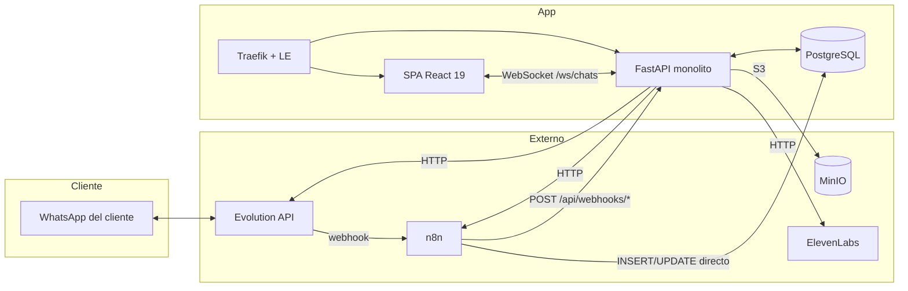

Piezas reales, verificadas:

- **Entrada HTTP**: `backend/main.py:222` monta 18 routers. La autorización se
  aplica por router en el `include_router` (`backend/main.py:256-279`), no
  dentro de cada endpoint: `chats`, `suggestions`, `tts` piden sesión;
  `settings` y `whatsapp` piden admin; `webhooks` y `media` (upload) usan
  `verify_webhook_token`.
- **WebSocket**: un único endpoint `/ws/chats` definido dentro de `main.py`
  (`backend/main.py:302-325`), con el registro de conexiones en memoria
  (`backend/services/ws_manager.py:6-57`).
- **Workers en background**: cinco tareas asyncio arrancadas en el `lifespan`
  (`backend/main.py:195-199`): `watch_chats`, `watch_task_reminders`,
  `watch_automations`, `watch_message_outbox`, `watch_scheduled_messages`. Todas
  viven **dentro del mismo proceso que sirve la API**. No hay Celery, ni RQ, ni
  cron externo, ni broker.
- **Persistencia**: SQLAlchemy 2 async sobre asyncpg, engine y sessionmaker
  globales perezosos (`backend/db/session.py:26-45`). Modelos ORM en
  `backend/db/models.py`. No hay capa de repositorio: los servicios abren
  sesiones directamente con `get_sessionmaker()()`.
- **Migraciones**: dos sistemas conviviendo. `backend/migrations/*.sql`
  (001–023, histórico, ya no se aplica automáticamente) y
  `backend/alembic/versions/` (12 revisiones, cadena lineal desde
  `eca1f1c0b41a` baseline). Las aplica `backend/scripts/migrate.py` bajo un
  advisory lock antes de arrancar la app; el arranque **aborta** si el esquema
  no está en la revisión head (`backend/main.py:65-94`).
- **Frontend**: React 19 + TanStack Query. Toda la lógica de tiempo real está
  concentrada en `frontend/src/hooks/useChats.ts` (un WebSocket con heartbeat,
  watchdog y reconexión; ver `useChats.ts:102`, `:318-537`), con polling de 60 s
  como fallback cuando el socket está caído (`useChats.ts:550,560,578`).
- **Despliegue**: `compose.yml` (dev, sin base local: apunta a la de
  producción), `compose.prod.yml`, `compose.bluegreen.yml` +
  `scripts/deploy-bluegreen.sh`, y Traefik con archivo dinámico
  `traefik/dynamic/active.yml`. MinIO y PostgreSQL viven fuera de estos compose
  (`compose.db.yml` y red externa `dermicapro-data`).

### A.2 Capas y dónde vive la lógica de negocio

La intención declarada es routers finos / servicios gordos, y en general se
cumple, pero con tres excepciones importantes:

1. **Lógica de negocio en los routers.** `backend/routers/chats.py` (791
   líneas) no es un adaptador: renderiza variables CRM de plantillas
   (`chats.py:98-117`), valida mensajes interactivos renderizados
   (`chats.py:119`), decide fallbacks de plantilla, verifica números en
   WhatsApp (`chats.py:312`) y arma payloads de outbox. `routers/templates.py`
   (437 líneas) y `routers/automations.py` (287) tienen el mismo problema en
   menor grado.
2. **Lógica de negocio en los webhooks.** `backend/routers/webhooks.py:304-361`
   implementa a mano la fan-out de broadcasts por chat, el agrupado de estados y
   la sincronización de lectura. Es orquestación de dominio dentro de un
   controlador.
3. **`db_service.py` es un god-module.** 2001 líneas y ~90 funciones públicas
   (`backend/services/db_service.py`) que mezclan cuatro dominios distintos:
   chats/mensajes, leads/kanban/actividad, tags y **usuarios**
   (`db_service.py:1897-2001`: `get_user_by_email`, `create_user`,
   `count_active_admins`, `seed_admin_if_needed`). No es acceso a datos puro:
   contiene reglas (`CUSTOMER_SERVICE_WINDOW` en `db_service.py:32`, ventanas de
   reconciliación `OUTGOING_ANALYSIS_WINDOW` y `OUTGOING_RECONCILE_WINDOW` en
   `:1570` y `:1638`, el algoritmo de búsqueda con `unaccent` y ranking en
   `:205-347`).
4. **`automation_service.py` es el segundo god-module**: 2737 líneas que
   contienen CRUD de reglas, validación de flujos visuales, motor de ejecución,
   handlers de acciones, descubridores de eventos, el watcher y hasta un backfill
   de datos de arranque (`automation_service.py:2647`).

Las reglas de dominio están **duplicadas entre backend y frontend** por
construcción: el pipeline de estados vive en `backend/db/models.py:36-49`
(`LeadStage`) y en `frontend/src/domain/leadStageMeta.ts`; el catálogo de
automatizaciones en `backend/domain_types.py` y
`frontend/src/domain/automationCatalog.ts`. No hay generación de tipos desde
OpenAPI, así que la coherencia es manual (esto ya está reconocido en las reglas
del proyecto, pero es deuda estructural: cada cambio de enum toca 4-5 archivos).

### A.3 Fronteras de servicios, dependencias e inyección

**Grafo de dependencias entre servicios** (extraído de los imports reales):

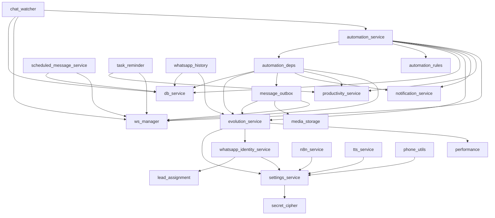

Observaciones:

- **No hay ciclos reales a nivel de módulo**, pero sí **dos ciclos latentes
  resueltos con imports diferidos**, que son la señal de que las fronteras están
  mal trazadas:
  - `backend/services/auth_service.py:58` importa `db_service` dentro de la
    función, con el comentario literal `# evita ciclo`.
  - `backend/services/auth_service.py:111` importa `settings_service` dentro de
    `verify_webhook_token`.
  - `backend/services/db_service.py:1694` importa `media_storage` dentro de
    `_fill_media_dimensions` (aquí el motivo es evitar cargar Pillow/ffmpeg en
    frío, pero el efecto es el mismo: la dependencia no se ve en el grafo).
- **`ws_manager` es una dependencia transversal de casi todo.** Ocho servicios
  llaman a `manager.broadcast(...)` directamente. No hay un bus de eventos
  interno: cada servicio decide cuándo y qué emitir. Eso hace que el contrato de
  mensajes del WebSocket esté definido implícitamente por ~15 call sites
  repartidos por el backend y consumido en un único `switch` gigante del
  frontend (`frontend/src/hooks/useChats.ts:149-300`).
- **Inyección de dependencias: existe en un solo lugar.**
  `backend/services/automation_deps.py` define `AutomationDeps`, un dataclass
  congelado con 17 colaboradores sustituibles, precisamente para poder testear el
  motor. El propio archivo admite el problema en su docstring
  (`automation_deps.py:10-12`: "es también la señal de que `_execute_action` hace
  demasiado"). El resto del backend usa **imports a nivel de módulo + singletons
  globales** (`settings`, `manager`, `_engine`, `_http_client`,
  `_effective_cache`). FastAPI `Depends` se usa solo para autenticación
  (`get_current_user`, `require_admin`, `verify_webhook_token`), nunca para
  inyectar servicios ni sesiones de base.
- **Estado global en proceso, no compartido**: al menos cinco cachés/registros
  in-memory sin coordinación entre réplicas:
  `ws_manager._connections`, `settings_service._effective_cache` (TTL 30 s,
  `settings_service.py:70-73`), `auth_service._user_cache` (TTL 15 s),
  `evolution_service._capabilities_cache`, `message_outbox._wakeup` (el propio
  código lo advierte en `message_outbox.py:36-38`) y `automation_service._wake`.

### A.4 Configuración y secretos

Modelo de dos niveles, razonablemente resuelto:

- `backend/config.py` define `Settings` (pydantic-settings) con `.env` como
  origen. Es la capa base.
- `backend/services/settings_service.py` define `SETTING_DEFS`
  (`settings_service.py:33-68`) como fuente de verdad de qué claves son
  editables desde la UI, y `_effective_values()` (`:100-116`) resuelve
  `valor de DB or valor de env`. Lo guardado en `app_settings` gana.
- Los secretos se cifran con AES-GCM (`services/secret_cipher.py`) y nunca
  vuelven al navegador: `list_settings()` devuelve `value: None` para las
  entradas `secret=True` (`settings_service.py:151`).
- `migrate_settings_encryption()` corre en cada arranque (`main.py:181`) y
  normaliza filas históricas de forma idempotente.

Problemas concretos:

1. **`SETTINGS_ENCRYPTION_KEY` es opcional** (`config.py:71`) y se deriva de
   `SECRET_KEY` si falta. Rotar `SECRET_KEY` (documentado como "invalida todas
   las sesiones") **también dejaría ilegibles todos los secretos cifrados** en
   instalaciones que no definieron la clave maestra. Ese acoplamiento no está
   señalado en el código.
2. **El token de webhook entrante es opcional en la práctica**:
   `verify_webhook_token` (`auth_service.py:105-118`) hace `if not expected:
   return` — si `inbound_webhook_token` no está configurado, **todos los
   endpoints de `/api/webhooks/*` y el upload de media quedan abiertos**. Es un
   fail-open deliberado para no romper instalaciones, pero es la superficie más
   sensible del sistema (inserta mensajes, cambia etapas de lead, dispara
   automatizaciones).
3. **La conexión a PostgreSQL va sin TLS por defecto** (`database_ssl:
   "prefer"`, `config.py:19`) contra una base externa. El propio código lo
   documenta como situación actual y lo registra en el log
   (`main.py:111-135`). Es una decisión consciente pero es una exposición real:
   credenciales y contenido de mensajes de clientes en claro.
4. La caché de settings tiene TTL de 30 s y se invalida solo localmente
   (`settings_service.py:94-97`); con blue-green o más de una réplica, un cambio
   de API key tarda hasta 30 s en propagarse al resto.

### A.5 Modelo de datos y migraciones

**Normalización.** El núcleo está razonablemente normalizado, y la parte más
crítica ya fue arreglada: `leads.id` es un UUID interno
(`db/models.py:57-62`) y los identificadores de WhatsApp viven en
`whatsapp_identities` (`db/models.py:114-145`) con unicidad
`(instance, jid)`. Eso resuelve el problema de LID vs JID telefónico sin
duplicar leads.

Restos de desnormalización y columnas legacy que siguen vivas:

- `leads.remote_jid` mapeado como `legacy_remote_jid` con `unique=True`
  (`db/models.py:65`) — todavía es una restricción única global, lo que es un
  problema directo para multi-tenant.
- `leads.vendedor` (texto) conviviendo con `leads.vendedor_id` (FK)
  (`db/models.py:69-72`).
- `leads.cached_suggestion` / `cached_suggestion_at` (JSONB) — caché de una
  respuesta de n8n guardada dentro de la tabla de entidad
  (`db/models.py:92-93`).
- Contadores desnormalizados sin invariante declarado: `contador_noshow`,
  `toques_seguimiento`, `fecha_ultimo_toque` (`db/models.py:106-109`).
- Cuatro columnas JSONB en `wsp_messages` (`analysis`, `payload`, `reactions`,
  más `quoted_wa_message_id`). Las reacciones se guardan **dentro** del mensaje
  reaccionado como lista JSON (`db/models.py:196-200`); funciona para 1:1 pero
  no es consultable ni auditable.

**Índices y claves.** Están mejor de lo esperable, y las decisiones están
documentadas en el propio modelo:

- `idx_wsp_messages_wa_message_id` es **UNIQUE parcial** sobre
  `wa_message_id IS NOT NULL` (`db/models.py:218-223`): es lo que da
  idempotencia real a los reenvíos de webhook de Evolution. Buena decisión.
- `idx_wsp_messages_chat_cursor (chat_id, sent_at DESC, id DESC)`
  (`db/models.py:203-208`) sostiene la paginación por cursor.
- `uq_automation_execution_rule_event (rule_id, event_key)` UNIQUE
  (`db/models.py:634`) es la base de la deduplicación de todos los triggers.
- `uq_automation_executions_manual_active_per_lead`, único parcial sobre
  `start_source='manual' AND status IN ('scheduled','running')`
  (`db/models.py:642-647`): impide dos flujos manuales activos por lead.
- Índices únicos parciales bien usados en plantillas
  (`uq_templates_global_shortcut_lower` / `uq_templates_personal_shortcut_owner`,
  `db/models.py:485-497`).

Huecos detectados:

- `message_outbox` tiene `idx_message_outbox_pending (status, next_attempt_at,
  id)`, pero la consulta de reclamo `_claim_batch` usa un `NOT EXISTS`
  correlacionado sobre el mismo chat (`message_outbox.py:250-270`). Con backlog
  grande ese anti-join se vuelve caro; `idx_message_outbox_chat_order` ayuda pero
  el plan depende de estadísticas.
- `_discover_timed_events` (`automation_service.py:2574-2583`) hace un
  `DISTINCT ON (chat_id) ... ORDER BY chat_id, sent_at DESC` sobre `wsp_messages`
  con un `lookback` de hasta 3 días de gracia
  (`OVERDUE_LOOKBACK_GRACE_MINUTES = 4320`, `:96`). El comentario dice que usa
  `idx_wsp_messages_sent_at`, **pero ese índice no está declarado en
  `db/models.py`** — no pude verificar si existe realmente en la base (podría
  venir de un `.sql` histórico). Si no existe, esa consulta escanea la tabla de
  mensajes cada 60 segundos.
- `app_settings` es una tabla clave-valor global de una sola fila por clave
  (`db/models.py:300-309`): sin dimensión de organización.
- `lead_tags.name` y `users.email` tienen unicidad **global**
  (`db/models.py:330`, `:316`).

**Migraciones problemáticas.**

- **Coexisten dos sistemas de migración.** `backend/migrations/001..023.sql` y
  Alembic. La revisión baseline (`eca1f1c0b41a`, 489 líneas) representa el
  esquema que ya existía; `scripts/migrate.py` detecta una base poblada sin
  `alembic_version` y hace `stamp` en vez de ejecutar. Es una solución correcta,
  pero el resultado es que **el esquema real de producción no es reproducible
  desde cero solo con Alembic** y que un lector nuevo no sabe cuál de los dos
  directorios es la verdad.
- `a5b229ee1c70_deriva_aplicada_a_mano_en_produccion.py` — el nombre lo dice:
  hubo cambios aplicados manualmente en producción que hubo que reconciliar.
- `b7a2c9d41e08_objetos_que_n8n_necesita.py` — migración cuya única razón de
  ser es mantener contentos objetos que consume un sistema externo. Confirma que
  el esquema es un contrato compartido.
- `6d1f0a9c3e42_lead_id_interno.py` (180 líneas) es la migración de PK de
  `leads` a UUID; toca todas las FK. Es la más riesgosa aplicada hasta ahora y
  es exactamente el tipo de operación que habrá que repetir para
  `organization_id`.
- `backfill_automation_state()` (`automation_service.py:2647-2711`) es una
  **migración de datos que corre en cada arranque de la aplicación**, no en
  Alembic. Es idempotente, pero recorre todas las ejecuciones `task_due` sin
  límite (`:2676-2680`) en cada boot.

### A.6 Frenos para el pivot multi-tenant

El plan (`docs/multi-tenant-saas-plan.md`) es correcto en su diagnóstico. Lo que
sigue son los puntos donde la arquitectura **actual** lo va a frenar, ordenados
por severidad, con el detalle que el plan no baja a nivel de archivo.

1. **No hay capa de acceso a datos donde inyectar el scope.** El plan (§3.3)
   propone "un helper de repositorio que exige el org_id en cada consulta". Hoy
   ese helper no tiene dónde vivir: `db_service.py` tiene ~90 funciones que
   construyen `select()` a mano, y otros 8 servicios abren sus propias sesiones
   con `get_sessionmaker()()` y escriben SQLAlchemy directo (`message_outbox`,
   `scheduled_message_service`, `automation_service`, `notification_service`,
   `productivity_service`, `internal_notes_service`, `media_library_service`,
   `settings_service`). Añadir `organization_id` significa auditar **cada
   consulta del backend**, sin ningún punto de estrangulamiento. Esta es la
   razón real de que la Etapa 1 del plan esté marcada como "Alto" riesgo.
2. **Los workers no tienen contexto de tenant y son globales por diseño.**
   `watch_message_outbox`, `watch_scheduled_messages`, `watch_automations`,
   `watch_task_reminders` y `watch_chats` reclaman trabajo de toda la base sin
   filtro. Peor: `evolution_service._config()` resuelve **una sola instancia
   global** desde `settings_service` (`evolution_service.py:61-76`), así que el
   worker de outbox no tiene forma de saber por qué instancia mandar. Multi-tenant
   obliga a que `MessageOutbox` lleve la instancia/credencial resuelta, o a
   resolverla por `organization_id` en cada envío.
3. **`chat_watcher` no escala a multi-tenant en su forma actual.**
   `fetch_chat_signature()` + `fetch_latest_message()`
   (`chat_watcher.py:19-26`) calculan **una firma global de toda la tabla** y
   toman **el último mensaje del sistema entero**. Con varias organizaciones,
   `fetch_latest_message()` devuelve el mensaje de otra org y se dispara
   `trigger_inbound_message` sobre él. Este componente hay que reescribirlo, no
   parametrizarlo.
4. **El WebSocket es un broadcast global en memoria.** `ConnectionManager`
   (`ws_manager.py:20-43`) envía a todos los sockets sin filtro. El plan lo
   reconoce (§3.6), pero además hay un problema que el plan no menciona: el
   registro es **in-process**, así que ni siquiera hoy funciona con más de una
   réplica. Multi-tenant + SaaS implica escalar horizontalmente, y eso obliga a
   introducir Redis pub/sub o `LISTEN/NOTIFY` antes o a la vez que el scoping por
   org. Igual problema con `_wakeup` del outbox y `_wake` de automatizaciones.
5. **Restricciones únicas globales que hay que redefinir**: `users.email`
   (`db/models.py:316`), `leads.remote_jid` (`:65`), `lead_tags.name` +
   `uq_lead_tags_name_lower` (`:330,337`), `media_assets.media_url` (`:517`),
   `uq_templates_global_shortcut_lower` (`:485`) y `app_settings.key` (`:308`).
   Todas pasan a necesitar `organization_id` en la clave. Cada una es una
   migración con backfill sobre tablas con datos.
6. **`app_settings` es global y `Settings` es un singleton de proceso.** Toda la
   config de Evolution/n8n/ElevenLabs se resuelve por
   `settings_service.get_effective(...)` sin parámetro de tenant. Convertirlo en
   per-org obliga a cambiar la firma de `_config()` en `evolution_service`,
   `n8n_service` y `tts_service`, y a repensar la caché `_effective_cache`
   (que hoy es un dict plano por clave, `settings_service.py:71`).
7. **La deduplicación de automatizaciones usa claves globales.**
   `uq_automation_execution_rule_event (rule_id, event_key)` sirve porque
   `rule_id` ya es específico de la regla, así que **este sí sobrevive** al
   pivot. Pero `event_key` se construye a partir de `wa_message_id`
   (`automation_service.py:2429`) y los IDs de WhatsApp **no son globalmente
   únicos entre instancias**: dos organizaciones pueden ver el mismo `key.id`.
   Con `idx_wsp_messages_wa_message_id` como UNIQUE global
   (`db/models.py:218-223`), el mensaje de la org B sería **rechazado
   silenciosamente** como duplicado del de la org A. Este es un fallo de
   aislamiento y de pérdida de datos que el plan no identifica.
8. **n8n escribe en la base.** Ya está en el plan (§3.2, §5) como el mayor
   riesgo y coincido. Añado un detalle: la app **depende de que n8n rellene
   `wa_message_id`** para su propia idempotencia, y `webhooks.py:87-119` ya
   contempla que n8n llame sin body y cae a `fetch_latest_message()`. Ese
   fallback es incorrecto en multi-tenant (devuelve el último mensaje global).
9. **Sin trazas por tenant ni por request.** No hay `request_id`,
   `correlation_id` ni structlog; todo es `logging` estándar con mensajes
   formateados. En SaaS, depurar "a esta organización no le llegó el mensaje" sin
   correlación es muy caro.

Lo que **sí** está listo y hay que preservar: el modelo de identidad
(`whatsapp_identities`, ya con columna `instance` — solo falta meterla en la
unicidad junto a `organization_id`), el patrón `AutomationDeps` (es el molde
para inyectar contexto de tenant en el motor), el versionado de flujos
(`automation_flow_versions`), y el hecho de que `leads.id` ya sea UUID.

### A.7 Arquitectura objetivo y camino incremental

No propongo rewrite. Propongo introducir **tres costuras** que hoy no existen y
que son prerrequisito tanto de multi-tenant como de escalar a más de un proceso.

**Objetivo (pragmático):**

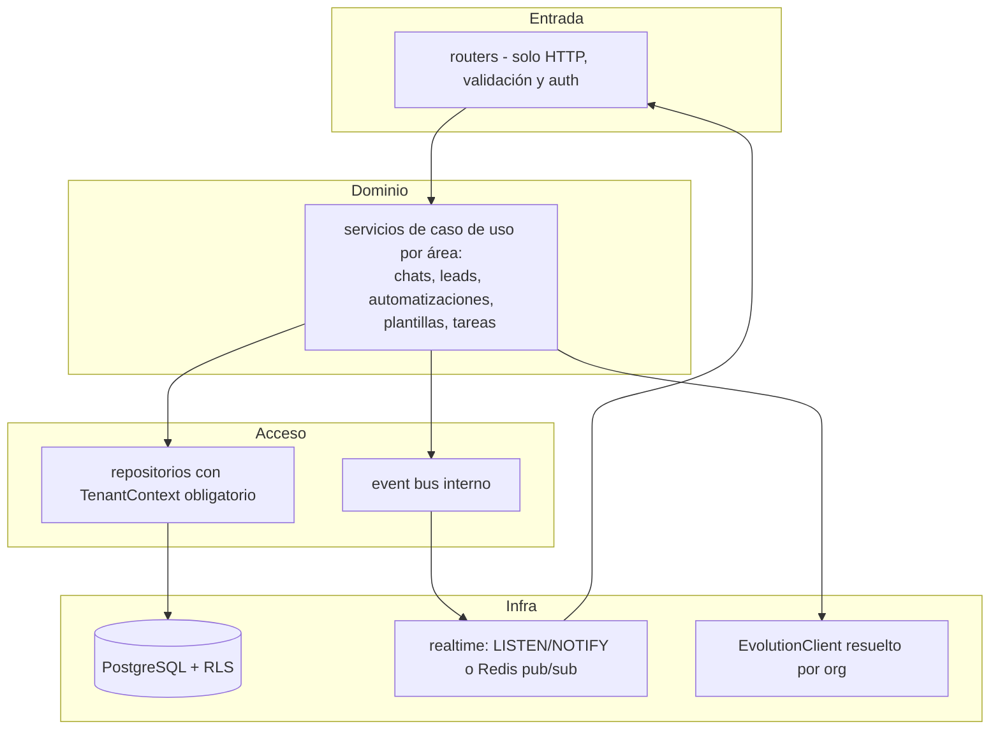

Las tres costuras:

1. **`TenantContext` + repositorios.** Un objeto pequeño resuelto por un
   `Depends` de FastAPI a partir del JWT, y propagado explícitamente a los
   servicios (igual que `AutomationDeps` propaga colaboradores hoy). Los
   workers lo construyen a partir de la fila que reclaman, no de un global.
2. **Event bus interno.** Reemplaza los ~15 `manager.broadcast(...)` dispersos
   por `bus.publish(ChatUpdated(org_id=..., chat_id=..., reason=...))`. El
   transporte (in-memory hoy, `LISTEN/NOTIFY` o Redis mañana) queda detrás. Esto
   arregla de un golpe: el filtrado por org, el multi-réplica y el contrato
   implícito del WebSocket.
3. **`EvolutionClient` como objeto, no como módulo de funciones sueltas.**
   `evolution_service` pasa de 20 funciones que resuelven config global a una
   clase instanciada con `(url, api_key, instance)`. `message_outbox` la
   construye a partir del `organization_id` del job.

**Camino incremental** (cada etapa es desplegable sola y no cambia el
comportamiento observable salvo donde se indica):

| # | Etapa | Qué toca | Por qué va aquí | Riesgo |
|---|---|---|---|---|
| 0 | **Event bus + realtime fuera de proceso** | `ws_manager`, los 15 call sites de broadcast, `_wake`/`_wakeup` | Es lo único que hoy **ya está roto** (blue-green corre dos backends: ver A.8). No requiere tocar el esquema. Deja la costura donde después entra el filtro por org. | Bajo-Medio |
| 1 | **Partir `db_service` por área y meter todo detrás de repositorios** | `db_service.py` → `repositories/{chats,leads,tags,users}.py`; los 8 servicios que abren sesión propia | Sin esto la Etapa "scoping" del plan no tiene dónde apoyarse. Puramente mecánico, cubrible con los tests existentes. | Bajo (mucho volumen) |
| 2 | **`EvolutionClient` instanciable** | `evolution_service.py`, `message_outbox`, `automation_deps`, `whatsapp.py` | Prerrequisito de "una instancia por org" (plan §3.4). Se puede hacer hoy con un único cliente global construido desde settings. | Bajo |
| 3 | **Etapa 0 del plan** (organizations, users.organization_id, org en el JWT, `TenantContext`) | Alembic + `auth_service` + un `Depends` | Igual que en el plan. Ahora `TenantContext` tiene a quién dárselo (los repositorios de la Etapa 1). | Bajo |
| 4 | **Scoping de datos** (Etapa 1 del plan) | migración con backfill + repositorios exigen org_id + tests de aislamiento | Es el grueso. Con las Etapas 1-3 hechas, la superficie de auditoría baja de "todo el backend" a "los repositorios". | Alto |
| 4b | **Unicidad de `wsp_messages.wa_message_id` a `(organization_id, wa_message_id)`** | migración | Punto A.6.7. **Debe ir en la misma ventana que la 4**, o se pierden mensajes entre orgs. | Alto |
| 5 | **Workers con contexto de org** | los 5 watchers; reescribir `chat_watcher` (que hoy no tiene arreglo parametrizando) | El outbox y `scheduled_messages` ya reclaman fila por fila con `SKIP LOCKED`, así que solo necesitan leer el org_id de la fila. | Medio |
| 6 | **Evolution/n8n por org y RLS como red de seguridad** | `app_settings` → `organization_settings`; políticas RLS | Igual que las etapas 2-3 del plan. RLS al final, como hardening. | Medio-Alto (externo) |

Dos recomendaciones adicionales, independientes del pivot:

- **Sacar `backfill_automation_state()` del arranque** (`main.py:193`) y
  convertirlo en migración Alembic o comando de `scripts/`. Hoy es trabajo
  ilimitado en el camino crítico del boot.
- **Decidir qué pasa con `backend/migrations/*.sql`**: o se archivan
  explícitamente (`backend/migrations/README.md` diciendo "histórico, no
  aplicar") o se borran. Tener dos sistemas de migración vivos es una trampa
  para quien venga después.

### A.8 Nota transversal: la aplicación ya corre en más de un proceso

Merece sección propia porque afecta a toda la Parte B.

`scripts/deploy-bluegreen.sh:118-155` levanta el color nuevo
(`$compose_target up -d --build`), espera al health check, reescribe
`traefik/dynamic/active.yml`, verifica, y **solo entonces** baja el color viejo
(`$(compose_for "$active") down`). Durante esa ventana (mínimo el tiempo de
build + health check + `sleep 2`) hay **dos backends completos corriendo contra
la misma base**, cada uno con sus cinco watchers y su propio `ws_manager`.

Consecuencias verificables:

- Los broadcasts emitidos por el color nuevo **no llegan** a los clientes
  conectados al viejo, y viceversa. Los clientes del color que se va a apagar
  ven la UI congelada hasta que el socket se cae y reconectan (el watchdog de
  `useChats.ts:102` los rescata, con el fallback de polling de 60 s).
- Los watchers que reclaman con `FOR UPDATE SKIP LOCKED` (`message_outbox`,
  `scheduled_message_service`, `process_due_automation_executions`,
  `claim_due_reminders`) **están protegidos**: no duplican trabajo.
- `watch_chats` **no** está protegido: cada proceso mantiene su propio
  `last_signature` (`chat_watcher.py:16`) y ambos emitirán `chats_updated` y
  llamarán a `trigger_inbound_message`. Lo salva la idempotencia por `event_key`,
  no el diseño.
- `_release_stale_executions` (`automation_service.py:2614`) y
  `_recover_stale_jobs` (`message_outbox.py:239`) pueden reclamar como "colgado"
  el trabajo que el otro proceso está ejecutando ahora mismo, si tarda más que
  el umbral (5 min outbox, 15 min automatizaciones).

---

## Parte B - Revisión del flujo de eventos

Nota previa: **no existe ningún broker de mensajes**. Todo lo que aquí se llama
"cola" es una tabla de PostgreSQL reclamada con `SELECT ... FOR UPDATE SKIP
LOCKED`, y todo lo que se llama "evento" es o una fila de tabla o un
`manager.broadcast(...)` en memoria. Esa elección es defendible para el tamaño
actual, y en general está bien ejecutada; los problemas están en los bordes.

### B.1 Mensaje entrante de WhatsApp

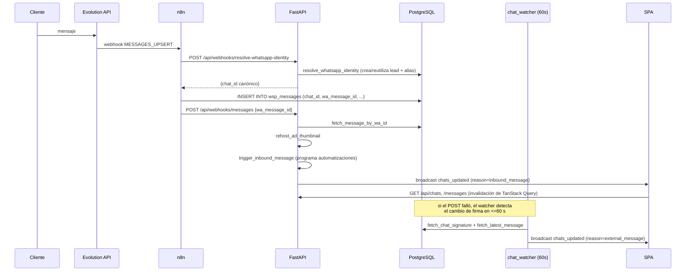

Archivos: `backend/routers/webhooks.py:36-119`,
`backend/services/whatsapp_identity_service.py`,
`backend/services/db_service.py:1242-1276`,
`backend/services/chat_watcher.py:14-31`.

- **Garantía de persistencia: at-least-once con deduplicación efectiva.** El
  reenvío de webhook de Evolution está cubierto por el índice UNIQUE parcial
  `idx_wsp_messages_wa_message_id` (`db/models.py:218-223`). El comentario del
  modelo dice explícitamente que se puso porque Evolution reenvía. Correcto.
- **Garantía de notificación a la UI: at-least-once, con duplicados
  esperados.** El webhook de n8n y `chat_watcher` pueden anunciar el mismo
  insert; el frontend deduplica el badge con `lastNotifiedMessageIdRef`
  (`useChats.ts:494-500`), pero solo contra el **último** id notificado, no
  contra un conjunto.
- **Punto de pérdida real:** si n8n hace el INSERT y **no** llama a
  `/api/webhooks/messages`, el mensaje existe pero nadie lo ve hasta que
  `chat_watcher` lo detecte. Ventana: hasta 60 s
  (`chat_watcher.py:11`). Y `chat_watcher` solo adjunta **el último mensaje
  global** (`fetch_latest_message`, `db_service.py:1242`): si entraron tres
  mensajes de tres chats distintos en ese minuto, solo se dispara
  `trigger_inbound_message` para uno. Los otros dos los recupera
  `_discover_recent_inbound_messages` (ventana de 5 minutos, cada 60 s,
  `automation_service.py:2408-2431`) — pero la notificación de escritorio de
  esos dos **se pierde definitivamente**.
- **Fallback peligroso:** si n8n llama sin `wa_message_id`, el webhook cae a
  `fetch_latest_message()` (`webhooks.py:103-104`) y anuncia *el último mensaje
  de la base*, que puede ser de otro chat. El propio código lo reconoce
  (`db_service.py:1256-1261`). Hoy es un caso raro; en multi-tenant es una fuga.
- **`fetch_chat_signature()` es un `COUNT(*) + MAX(sent_at)` sobre toda
  `wsp_messages` cada 60 segundos** (`db_service.py:1210-1215`). No usa índice
  útil para el count. Es la consulta que peor va a envejecer del sistema. Además
  la firma es ciega a un borrado+inserción que deje el mismo count y el mismo
  max.
- **Orden:** no hay riesgo. Los broadcasts son solo señales de invalidación; el
  orden real lo determina `sent_at, id` al releer (`fetch_messages`,
  `db_service.py:1331`).
- **Si el proceso muere a mitad:** el mensaje ya está en la base (lo escribió
  n8n en su propia transacción). Se pierde el broadcast y, si murió antes de
  `trigger_inbound_message`, la programación de la automatización — que se
  recupera sola por `_discover_recent_inbound_messages` **si el reinicio ocurre
  dentro de los 5 minutos**. Pasados 5 minutos, ese mensaje ya no dispara
  automatizaciones nunca. Ventana estrecha pero real.
- **Falta de trazabilidad:** el webhook no registra nada en el caso feliz; solo
  loguea si el `wa_message_id` es desconocido (`webhooks.py:100`). No hay forma
  de reconstruir "cuántos mensajes entraron y cuántos se anunciaron".

### B.2 Mensaje saliente y outbox

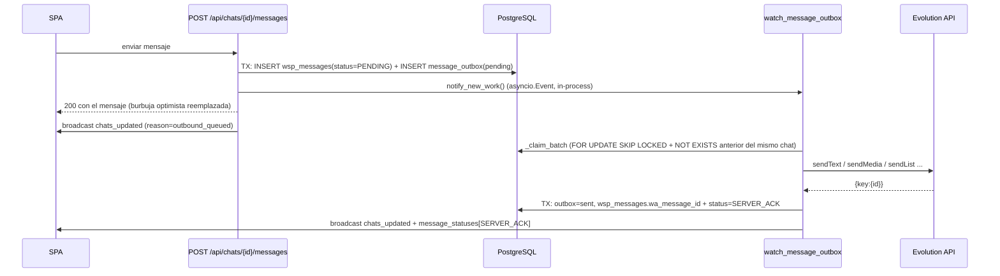

Archivos: `backend/services/message_outbox.py:143-188` (encolado),
`:250-285` (reclamo), `:288-322` (éxito), `:325-369` (fallo),
`:511-523` (bucle).

- **Garantía: at-least-once hacia WhatsApp.** El envío HTTP y el `_mark_sent`
  están en pasos separados; no hay forma de hacerlos atómicos contra un sistema
  externo. Es la elección correcta (mejor duplicar que perder), pero la
  consecuencia debe estar asumida: **el cliente puede recibir el mismo mensaje
  dos veces**.
- **Orden: garantizado estrictamente por chat.** `_claim_batch`
  (`message_outbox.py:252-270`) excluye cualquier job cuyo chat tenga un job
  anterior en `pending` o `processing`. Es la mejor decisión de diseño de todo
  el sistema de eventos. Nota: los envíos de automatizaciones también pasan por
  aquí (`automation_deps.py:74`), así que comparten esa serialización; las
  reacciones no (`automation_deps.py:75`, documentado y justificado).
- **Idempotencia: no hay clave de idempotencia hacia Evolution.** No se envía
  ningún `idempotency-key` ni se reutiliza un id de cliente, así que un
  reintento genera un `wa_message_id` nuevo y una segunda burbuja en el teléfono
  del cliente.
- **Punto de fragilidad principal — trabajo `processing` huérfano.**
  `_recover_stale_jobs()` se llama **una sola vez, al arrancar el worker**
  (`message_outbox.py:512`), y solo recupera jobs con `updated_at` de más de 5
  minutos (`:240`). Escenario concreto:
  1. El worker toma un job y lo pone en `processing`.
  2. El proceso muere (deploy, OOM, `docker restart`) 10 segundos después.
  3. Al reiniciar, `_recover_stale_jobs` corre con `cutoff = ahora - 5 min`; el
     job tiene `updated_at` de hace 10 segundos → **no lo recupera**.
  4. Como nunca se vuelve a llamar dentro del bucle, el job queda en
     `processing` para siempre.
  5. Y como `has_earlier_unsent` incluye `processing`, **toda la cola de
     salida de ese chat queda bloqueada indefinidamente**: los mensajes
     siguientes que escriba el vendedor se guardan como `PENDING` y no salen
     nunca.

  Solo se desbloquea con otro reinicio que ocurra más de 5 minutos después. El
  contraste es revelador: `automation_service._release_stale_executions()` sí
  corre periódicamente dentro del bucle (`automation_service.py:2720`). Aquí
  falta exactamente eso.
- **Bloqueo en cabecera de cola (head-of-line) por fallo:** un mensaje que
  falla se reagenda con backoff `2^attempts` (`:329`), y mientras tanto todos
  los mensajes posteriores de ese chat esperan. Con `MAX_ATTEMPTS = 3` el
  bloqueo máximo es ~14 s, aceptable. Al agotarse queda `failed` y libera.
- **Acoplamiento temporal:** `notify_new_work()` es un `asyncio.Event`
  in-process (`message_outbox.py:39`). Con blue-green o más de una réplica, el
  proceso que atienda el POST puede no ser el que corre el worker; entonces el
  mensaje espera al poll de 1 segundo. El propio código lo documenta
  (`:36-38`). Impacto bajo hoy, pero es el mismo patrón que rompe el WebSocket.
- **Si el proceso muere a mitad:** ver arriba. Además, si muere *después* de
  que Evolution aceptó el mensaje pero *antes* de `_mark_sent`, el mensaje se
  entregó al cliente pero en el CRM figura `PENDING`, y si algún día se recupera
  el job, se reenvía.

### B.3 Confirmación de estado de entrega

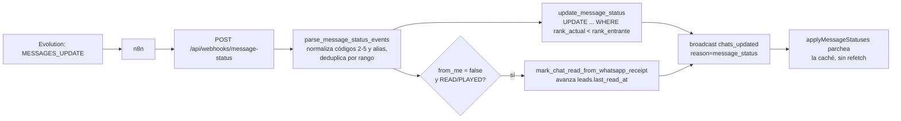

Archivos: `backend/routers/webhooks.py:304-361`,
`backend/services/message_status_service.py:127-157`,
`backend/services/db_service.py:1082-1121` y `:1131-1173`,
`frontend/src/hooks/useChats.ts:453-470`.

Este es **el flujo mejor construido del sistema**:

- **Idempotencia real y monótona.** `update_message_status` compara rangos
  dentro del propio `WHERE` (`db_service.py:1107-1113`), así que un webhook
  repetido o fuera de orden no puede hacer retroceder `READ` a `DELIVERY_ACK`.
  Devuelve `None` cuando no aporta nada, y eso evita el broadcast inútil.
- **Deduplicación dentro del lote** conservando el estado más avanzado
  (`message_status_service.py:145-150`).
- **Marca de agua correcta** en la sincronización de lectura: usa el `sent_at`
  del mensaje, no la hora actual (`db_service.py:1131-1140`), para que un recibo
  tardío no marque como vistos mensajes posteriores.
- **El frontend no refetchea** en `reason=message_status`, solo parchea la caché
  (`useChats.ts:453-466`), decisión explícitamente documentada.

Puntos débiles:

- **At-most-once y sin reconciliación.** Si el webhook de estado nunca llega
  (n8n caído, evento perdido en Evolution), el mensaje se queda en `SERVER_ACK`
  para siempre. No hay ningún job que reconsulte estados a Evolution. El
  vendedor ve un tilde de menos indefinidamente.
- **La lectura desde la app es best-effort silenciosa.** `read_chat`
  (`chats.py:768-791`) marca leído localmente aunque Evolution falle, y solo
  deja un `logger.warning`. Es la decisión correcta de producto, pero implica
  que **los tildes azules del cliente pueden divergir permanentemente** del
  estado del CRM, sin reintento.
- **Fan-out N+1 de broadcasts:** `webhooks.py:338-351` emite un broadcast por
  cada `chat_id` distinto del lote, dentro de un bucle secuencial, y cada
  `broadcast` hace `gather` sobre todos los sockets con timeout de 2 s
  (`ws_manager.py:24-31`). Un lote de estados de 50 chats con sockets lentos
  puede tener al webhook colgado ~100 s.

### B.4 Automatizaciones

Es el flujo más complejo y, paradójicamente, el más robusto frente a caídas,
porque **todo el estado intermedio está en la base**.

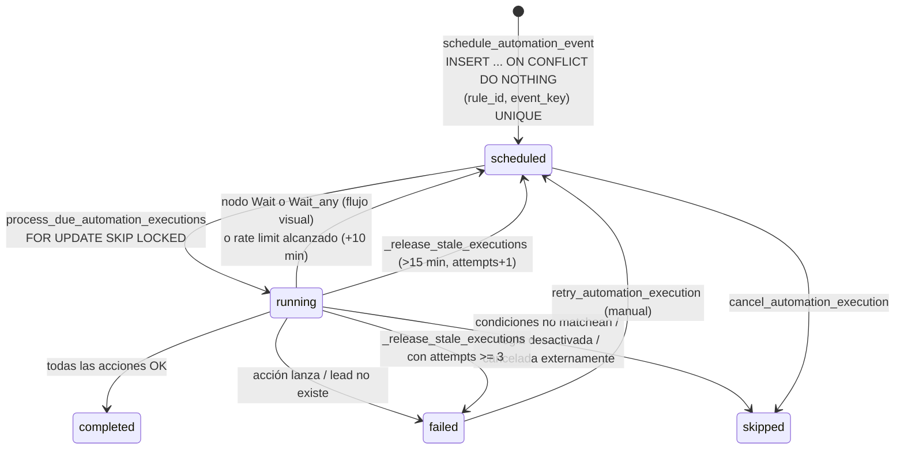

Descubridores de eventos (todos dentro de `watch_automations`, housekeeping cada
60 s, `automation_service.py:2714-2736`):

| Descubridor | Qué mira | Clave de deduplicación |
|---|---|---|
| `trigger_inbound_message` (`:1280`) | mensaje entrante en caliente | `message:{wa_message_id}` |
| `_discover_recent_inbound_messages` (`:2408`) | últimos 5 min de mensajes de cliente | idem (red de seguridad) |
| `trigger_stage_changed` (`:1262`) | última fila de `lead_activity` | `stage:{activity_id}` |
| `trigger_lead_created` (`:1246`) | idem | `lead:{activity_id}` |
| `_discover_timed_events` (`:2527`) | silencios de vendedor/cliente y tareas vencidas | `overdue:{msg_id}` / `silence:{anchor}` / `task:{id}:{due_at}` |
| `_discover_wait_any_replies` (`:2461`) | reanuda pausas por respuesta o por READ/PLAYED | no crea ejecuciones, adelanta `scheduled_for` |
| `start_manual_flow_execution` (`:1186`) | click del vendedor | `manual:{uuid4}` + índice único parcial por lead |

Garantías:

- **Programación: exactly-once por evento.** El `ON CONFLICT DO NOTHING` sobre
  `(rule_id, event_key)` (`automation_service.py:1162-1164`) es sólido, y el
  diseño de las claves está bien pensado: la de `task_due` se ancla al `due_at`
  para que editar el título no re-dispare (`:2548-2553`), y la de
  `customer_response_overdue` se ancla al último mensaje **del cliente** para
  evitar el goteo infinito de follow-ups (`:2585-2598`). Ese segundo comentario
  describe un bug real que ya ocurrió; la solución es correcta.
- **Ejecución: at-least-once por acción, con ventana estrecha.**
  `action_results` se persiste **después de cada acción** (`:2347`,
  `:2003-2011`), así que al reanudar se salta lo ya hecho. Pero si el proceso
  muere entre "Evolution aceptó el mensaje" y "se guardó el resultado", esa
  acción se repite. Con los envíos ahora pasando por el outbox
  (`automation_deps.py:74`), la repetición produce una segunda fila en
  `message_outbox` y por tanto un segundo WhatsApp.
- **Esperas: durables.** Un nodo `Wait` no bloquea nada: persiste
  `scheduled_for` y devuelve el control (`:2015-2034`). Esto es lo que hace que
  un flujo de "espera 3 días" sobreviva a cualquier reinicio. Muy bien resuelto.
- **Cancelación: cooperativa, con carrera.** `cancel_automation_execution`
  (`:467`) pone `skipped`; `_save_execution` (`:2246-2275`) se niega a pisar una
  fila `skipped` y devuelve `False`, y el motor corta. Pero la comprobación
  ocurre **después** de ejecutar la acción: entre el `commit` de la cancelación y
  el siguiente `_save_execution`, una acción más puede haberse ejecutado (y
  enviado un WhatsApp). No es evitable sin un chequeo previo a cada acción; hoy
  ni siquiera se hace ese chequeo previo.
- **Reintentos: dos mecanismos distintos y fáciles de confundir.**
  `attempts` solo se incrementa en `_release_stale_executions` (`:2636`), es
  decir, cuenta **interrupciones**, no fallos. Un fallo de acción va directo a
  `failed` sin reintento automático (`:2350-2362`); solo se recupera con el
  botón de reintento manual. El nombre `MAX_EXECUTION_ATTEMPTS` sugiere lo
  contrario.
- **Rate limiting:** cuenta ejecuciones `completed` de la última hora y reagenda
  +10 min (`:2278-2290`, `:2305-2315`). Como no cancela, un pico sostenido puede
  acumular ejecuciones reagendándose en bucle sin cota superior de tiempo.
- **Latencia de reanudación de `wait_any`: hasta 60 s**, porque
  `_discover_wait_any_replies` solo corre en el housekeeping
  (`:2719-2724`). Para un flujo tipo "si responde, seguí por acá", el cliente
  puede esperar un minuto a que el bot reaccione. Además ese descubridor tiene
  `.limit(200)` sin cursor (`:2480`): con más de 200 ejecuciones en pausa, las
  restantes nunca se evalúan en ese ciclo (y el orden no está definido, así que
  no hay garantía de que roten).
- **`_discover_timed_events` no tiene índice comprobable.** Ver A.5: el
  `DISTINCT ON (chat_id)` sobre `wsp_messages` con 3 días de ventana corre cada
  60 s y el índice que el comentario nombra (`idx_wsp_messages_sent_at`) no está
  declarado en `db/models.py`.
- **Si el proceso muere a mitad:** el estado sobrevive. `_release_stale_executions`
  devuelve a `scheduled` cualquier `running` de más de 15 minutos y suma
  `attempts`; a los 3 la marca `failed` y notifica. Es el único worker con
  autorreparación dentro del bucle. Coste: hasta 15 minutos de parálisis para
  esa ejecución.

### B.5 Mensajes programados

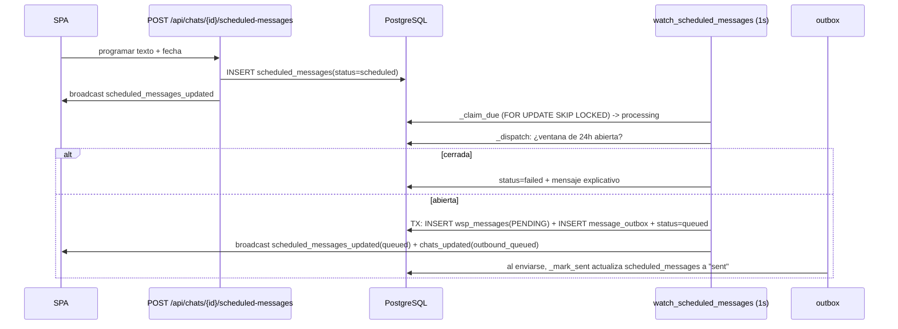

Archivos: `backend/services/scheduled_message_service.py:141-249`,
`backend/services/message_outbox.py:305-322` (cierre del ciclo).

- **Garantía: at-most-once en la práctica**, porque el reclamo pasa por
  `processing` antes de crear nada y `_dispatch` re-verifica
  `status == "processing"` (`:171`).
- **Regla de negocio correcta y bien ubicada:** la ventana de 24 h se comprueba
  **en el momento del envío**, no al programar (`:174-191`). Es lo que debe ser.
- **Misma fragilidad que el outbox:** `_recover_stale()` solo se llama al
  arrancar el worker (`:232`) y con cutoff de 5 minutos. Un crash entre el
  reclamo y el dispatch deja el mensaje programado en `processing` hasta el
  siguiente reinicio que ocurra >5 min después. Aquí el daño es menor (no
  bloquea a otros), pero el mensaje puede salir horas tarde — o, si la ventana
  de 24 h se cerró mientras tanto, fallar.
- **Cancelación:** solo permitida en `scheduled` o `failed` (`:121-122`). Una
  vez en `processing`/`queued` no hay marcha atrás, ni siquiera cuando el job de
  outbox todavía no salió. Es conservador pero deja al vendedor sin salida en la
  ventana entre el claim y el envío real.
- **Acoplamiento de estados entre dos tablas:** `message_outbox._mark_sent`
  actualiza `scheduled_messages` por `queued_message_id`
  (`message_outbox.py:305-309`). El outbox "sabe" de mensajes programados. Es un
  acoplamiento invertido: la capa genérica conoce a un caso particular.

### B.6 Notificaciones

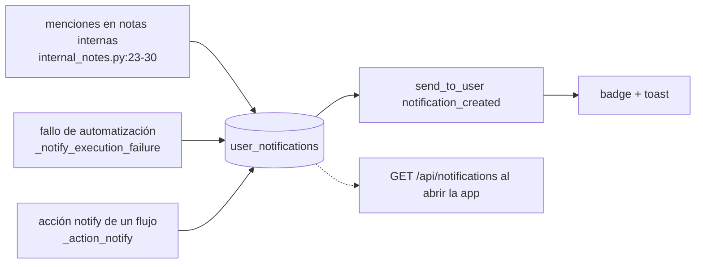

- **Durables por diseño.** La fila se inserta siempre
  (`notification_service.py:28-54`); el push por WebSocket es
  **best-effort at-most-once**. Si el usuario está desconectado no pasa nada
  malo: lo ve en la campana al volver. Correcto.
- **Sin deduplicación.** `UserNotification` no tiene índice único sobre
  `(user_id, source_id)` (`db/models.py:409-427`), pese a que `source_id` se
  construye como clave lógica: `f"execution-failed:{execution.id}"`
  (`automation_service.py:1872`). Una ejecución que falla, se reintenta y vuelve
  a fallar genera **notificaciones duplicadas**.
- **`send_to_user` mide mal la entrega.** Devuelve `True` si `send_json` no
  lanzó (`ws_manager.py:50-54`), lo cual no significa que el navegador lo haya
  recibido. Para notificaciones da igual (hay fila); para recordatorios de
  tareas **no** da igual (ver B.7).
- **Sin retención ni límite.** No hay purga de `user_notifications`; la tabla
  crece indefinidamente.

### B.7 Tareas y recordatorios

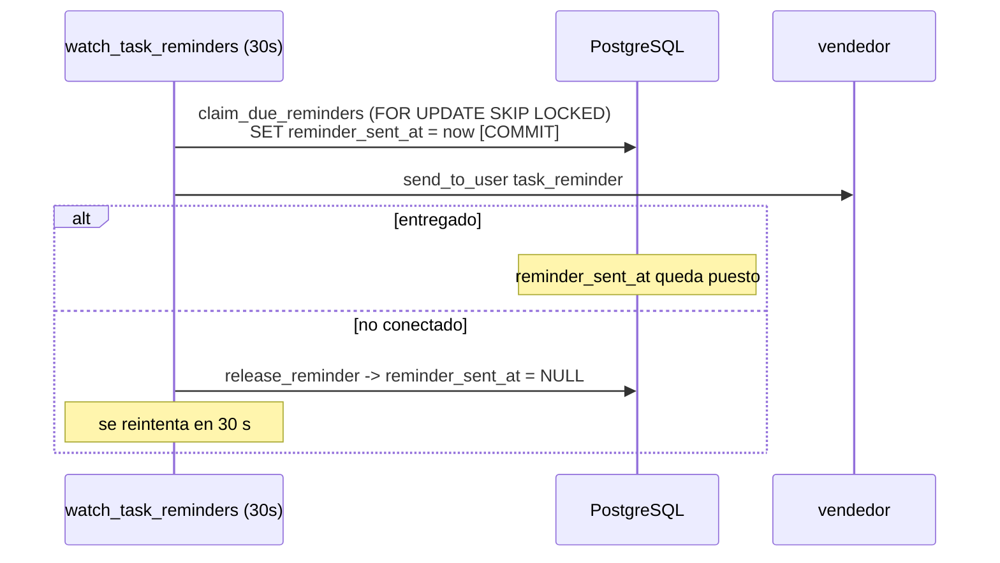

Archivos: `backend/services/task_reminder.py:10-26`,
`backend/services/productivity_service.py` (`claim_due_reminders`,
`release_reminder`).

Este es, junto con B.2, **el flujo más frágil del sistema**:

- **El recordatorio no se persiste en ningún lado.** No crea una fila en
  `user_notifications`; es un evento puramente efímero por WebSocket
  (`task_reminder.py:14-17`). Si el vendedor tiene la pestaña cerrada, se
  reintenta cada 30 s indefinidamente (bien); pero si el vendedor está conectado
  y el evento se pierde en la red, **se pierde para siempre** porque
  `reminder_sent_at` ya quedó marcado.
- **Pérdida garantizada ante crash:** el `COMMIT` de `claim_due_reminders`
  ocurre **antes** del envío. Si el proceso muere entre el commit y el
  `send_to_user`, el recordatorio figura como enviado y nunca se entrega. No hay
  ninguna red de seguridad: no hay `_release_stale` para recordatorios.
- **`send_to_user` como criterio de entrega es incorrecto en multi-proceso.**
  Durante un blue-green, el vendedor está conectado al color viejo y el worker
  del color nuevo devuelve `False` → `release_reminder` → reintento. Eso
  funciona por accidente. Pero si está conectado a los dos (reconexión en
  curso), puede recibirlo dos veces.
- **Falta de trazabilidad total:** no se loguea qué recordatorio se entregó ni a
  quién; si un vendedor dice "no me llegó el aviso", no hay forma de comprobarlo.

El resto de eventos de tareas (`tasks_updated`, `routers/tasks.py:42,62`) son
broadcasts globales sin `chat_id`: **todos los vendedores refetchean su lista de
tareas cada vez que cualquiera crea o completa una tarea**.

### B.8 WebSockets y entrega a la UI

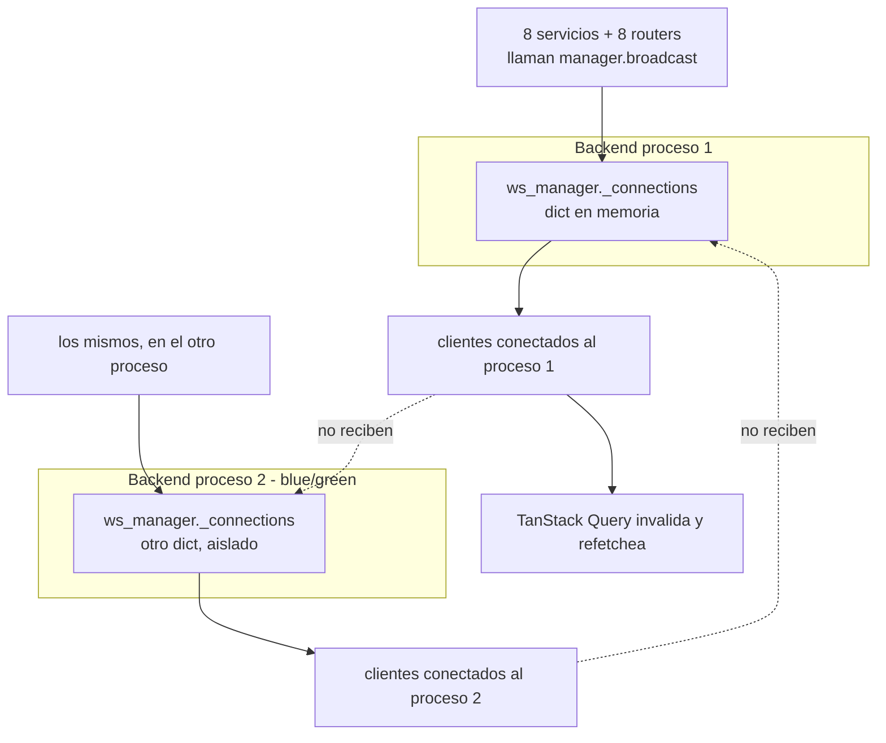

- **Autenticación correcta:** el socket lee la cookie de sesión y cierra con
  4401 si no hay usuario (`main.py:303-308`).
- **Sin filtrado de ningún tipo.** Todo `broadcast` va a todos los usuarios
  conectados, incluidos eventos con `chat_id` de leads que no son suyos
  (`ws_manager.py:20-43`). Hoy es aceptable (una sola organización, todos ven
  todo); en multi-tenant es una fuga directa.
- **Sin persistencia ni replay.** Un cliente que se reconecta no recibe lo que
  se perdió. La compensación es el `refetchInterval: 60_000` cuando el socket
  está caído (`useChats.ts:550,560,578`) y la invalidación total al reconectar.
  Funciona, pero implica que **la ventana de desactualización máxima es de 60
  segundos**, no de milisegundos.
- **Heartbeat bien hecho:** ping del cliente cada N ms, `pong` del servidor
  (`main.py:313-321`), y watchdog que fuerza reconexión si no llega ningún dato
  (`useChats.ts:102`). Esto resuelve el caso clásico de socket zombi.
- **Detección de sockets muertos:** `broadcast` cierra explícitamente los que
  fallaron, en vez de solo desregistrarlos (`ws_manager.py:36-43`), con un
  comentario que explica por qué. Buena decisión.
- **Contrato implícito y frágil:** hay ~15 formas distintas de `chats_updated`
  distinguidas por un campo `reason` de texto libre, definidas en 30 call sites
  del backend y consumidas por un `switch` en `useChats.ts:149-300`. No hay
  ningún esquema compartido ni test de contrato. Añadir un `reason` nuevo en el
  backend y olvidarse del frontend es silencioso: el frontend cae al caso
  genérico y refetchea de más.
- **Amplificación de tráfico:** varios `reason` invalidan `['chats']`,
  `['unread-count']`, `['chat', id]`, `['messages', id]`, `['lead-activity']`,
  `['kanban']` y `['dashboard']` a la vez (`useChats.ts:455-483`). Un evento
  puede desencadenar 6-7 GET **por cada vendedor conectado**.

### B.9 Resumen de garantías, acoplamientos y observabilidad

**Tabla de garantías (verificadas en código, no aspiracionales):**

| Flujo | Persistencia | Entrega a la UI | Idempotencia | Orden | Autorreparación |
|---|---|---|---|---|---|
| Entrante WhatsApp | at-least-once (UNIQUE `wa_message_id`) | at-least-once, duplicados posibles | sí, a nivel DB | irrelevante (se relee ordenado) | `chat_watcher` 60 s (parcial) |
| Saliente / outbox | at-least-once hacia Evolution | at-least-once | **no** (sin clave de idempotencia) | **estricto por chat** | **solo al arrancar, con cutoff 5 min** |
| Estado de entrega | at-most-once | at-most-once | sí, monótona | irrelevante (rango) | **ninguna** |
| Automatizaciones | exactly-once al programar; at-least-once por acción | at-most-once | sí (`event_key`) | secuencial dentro del flujo | sí, cada 60 s |
| Mensajes programados | at-most-once | at-most-once | sí (estado `processing`) | delegado al outbox | **solo al arrancar** |
| Notificaciones | durable | at-most-once (con campana como respaldo) | **no** (sin único por `source_id`) | n/a | n/a (la fila persiste) |
| Recordatorios de tareas | **ninguna** | at-most-once | no | n/a | **ninguna** |

**Acoplamientos temporales.**

1. **Todo depende de que el proceso siga vivo entre dos commits.** Los cinco
   workers están en el mismo proceso que la API: un pico de latencia HTTP, una
   petición lenta a Evolution o el GC del event loop retrasan las esperas de
   automatizaciones y el despacho del outbox por igual. No hay aislamiento de
   recursos.
2. **`_wake` / `_wakeup` son eventos in-process.** Con más de un proceso, la
   latencia degrada silenciosamente de "inmediato" a "hasta 1 s" (outbox) o
   "hasta 10 s" (automatizaciones). No hay métrica que lo delate.
3. **`chat_watcher` asume que un solo proceso mantiene `last_signature`.** Con
   dos procesos hay broadcasts duplicados.
4. **Las cachés de settings y de usuario (30 s y 15 s) hacen que un cambio de
   configuración o una desactivación de usuario tarden en propagarse** y que
   distintos procesos operen con valores distintos durante ese lapso.
5. **`_release_stale_*` con umbrales fijos (5 y 15 minutos) asumen que ninguna
   operación legítima dura más.** Un envío de media grande a Evolution con
   `timeout` alto podría superar los 5 minutos y ser reclamado como huérfano
   mientras sigue corriendo → doble envío.

**Trabajo en background sin persistencia.** Solo dos casos, pero ambos importan:

- Los recordatorios de tareas (B.7): el único evento del sistema que puede
  desaparecer sin dejar rastro.
- Los broadcasts de WebSocket en general: no hay cola de salida ni reintento;
  la reconexión + refetch es la única recuperación.

Todo lo demás (outbox, mensajes programados, ejecuciones de automatización,
notificaciones) tiene respaldo en tabla. Eso es un acierto arquitectónico
importante que conviene reconocer.

**Observabilidad: el punto más flojo.**

- No hay `request_id` ni `correlation_id`. Un mensaje entrante pasa por n8n →
  webhook → automatización → outbox → Evolution y **no hay ningún identificador
  que atraviese esa cadena**. Reconstruir el recorrido de un mensaje concreto
  exige hacer `grep` por `wa_message_id` y esperar que aparezca.
- No hay métricas. Existe `services/performance.py` y una cabecera
  `Server-Timing` con `db;dur` y contadores de consultas
  (`main.py:225-246`) — que es más de lo habitual —, pero es **por respuesta
  HTTP**, no agregado. No hay contadores de: profundidad de la cola de outbox,
  edad del job más viejo, ejecuciones fallidas por hora, sockets conectados,
  recordatorios no entregados. Ninguno de los problemas descritos en B.2 y B.7
  sería visible hasta que alguien se queje.
- No hay health check de los workers. `/health/ready` (`main.py:287-299`)
  comprueba la base y el almacenamiento de media, pero **no comprueba que las
  cinco tareas de background sigan vivas**. Si una lanza una excepción no
  capturada fuera de su `try` (por ejemplo en `_recover_stale_jobs` durante el
  arranque), la tarea muere en silencio, `/health/ready` sigue devolviendo 200 y
  el blue-green promociona un backend sin outbox.
- El logging es de nivel `WARNING`/`EXCEPTION` en los caminos de error y casi
  nada en los caminos felices. Está razonablemente puesto donde importa
  (`message_outbox.py:499-503` sí registra cada envío con su duración), pero es
  texto libre, no estructurado.

**Los tres arreglos de mayor relación valor/esfuerzo, en orden:**

1. Mover `_recover_stale_jobs()` y `_recover_stale()` **dentro** de sus bucles,
   con un umbral acorde al timeout real de Evolution (`message_outbox.py:512`,
   `scheduled_message_service.py:232`). Son dos líneas y eliminan el bloqueo
   permanente de cola de un chat.
2. Persistir los recordatorios de tareas como `user_notifications` antes de
   intentar el push (`task_reminder.py:13-21`), igual que hace todo lo demás.
3. Añadir al `/health/ready` una comprobación de que las cinco tareas de
   background no están `done()`, y exponer la profundidad y edad de
   `message_outbox` como métrica.

---

## Anexo: qué no pude verificar

Cosas que afirmo con menos confianza, o que no pude comprobar leyendo el
repositorio:

- **Índices realmente existentes en producción.** Solo pude leer los declarados
  en `backend/db/models.py` y en las migraciones. Concretamente, no encontré
  `idx_wsp_messages_sent_at` declarado en ninguna parte pese a que
  `automation_service.py:2572` lo nombra. Puede existir en la base creado a
  mano (la migración `a5b229ee1c70_deriva_aplicada_a_mano_en_produccion.py`
  confirma que ha habido cambios manuales). **Verificar con `\d wsp_messages`
  antes de sacar conclusiones sobre el coste de `_discover_timed_events`.**
- **El workflow de n8n.** No está en el repositorio salvo dos exports sueltos y
  sin commitear en la raíz (`automatic - notificaciones automaticas citas.json`,
  `evolution-enviar mensaje.json`). Todo lo que digo sobre qué hace n8n está
  inferido de los webhooks que la app expone y de
  `docs/n8n-normalizacion-wsp-messages.md`. En particular **no pude confirmar si
  n8n siempre manda `wa_message_id`** en `/api/webhooks/messages`, que es de lo
  que depende que el fallback peligroso de `webhooks.py:103` se use o no.
- **Si `SETTINGS_ENCRYPTION_KEY` está definida en producción.** El riesgo de
  A.4.1 (rotar `SECRET_KEY` deja ilegibles los secretos) solo aplica si **no**
  lo está. `backend/.env` no está en el repositorio.
- **Si `INBOUND_WEBHOOK_TOKEN` está configurado en producción.** Del mismo modo,
  el fail-open de `auth_service.py:105-118` solo es explotable si está vacío.
- **La duración real de la ventana de solapamiento del blue-green.** Depende del
  tiempo de build y del health check; el script no impone un máximo
  (`scripts/deploy-bluegreen.sh:125-155`).
- **El comportamiento bajo carga.** No ejecuté nada: ni tests, ni la aplicación,
  ni consultas contra la base. Las afirmaciones sobre coste de consultas son
  lecturas de plan a ojo, no mediciones.
- **`frontend/src` tiene cambios locales sin commitear** en 19 archivos, entre
  ellos `useChats.ts`. Lo que leí es el estado del árbol de trabajo, no el de
  ninguna rama publicada.
- **No revisé en profundidad**: `media_storage.py` / MinIO, `whatsapp_history.py`
  (importación de histórico desde Evolution), `dashboard_service.py`,
  `tts_service.py`, ni la capa de tests (`backend/tests/`). Si el informe debe
  cubrirlos, hace falta una segunda pasada.
