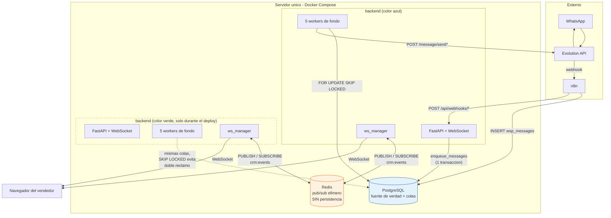

# 07 - Análisis de una posible capa de mensajería (colas / eventos)

Fecha: 2026-08-05. Alcance: `backend/services/message_outbox.py`, `chat_watcher.py`,
`automation_service.py`, `task_reminder.py`, `scheduled_message_service.py`, `ws_manager.py`.

Documentos relacionados: [analisis-almacenamiento-mensajes.md](../analisis-almacenamiento-mensajes.md),
[multi-tenant-saas-plan.md](../multi-tenant-saas-plan.md),
[03-arquitectura-y-flujo-de-eventos.md](03-arquitectura-y-flujo-de-eventos.md).

> **Adelanto de la conclusión** (sección 4): no hace falta un broker. Hay que
> arreglar el outbox de PostgreSQL (idempotencia + recuperación periódica) y
> añadir **solo** Redis como bus de pub/sub para el fan-out de WebSocket entre
> procesos. Todo lo demás es sobre-ingeniería para el tamaño de este producto.

---

## 1. Diagnóstico: qué falla hoy por no tener broker

El backend es un único proceso FastAPI que, además de servir la API y el
WebSocket, arranca cinco bucles de fondo en su `lifespan`
(`backend/main.py:195-199`). Cada uno reclama trabajo de una tabla de
PostgreSQL con `FOR UPDATE SKIP LOCKED`. No hay broker, no hay proceso
worker separado, y el estado de tiempo real (`ws_manager`) vive en memoria.

Lo que eso rompe hoy, ordenado por daño real:

### 1.1 Reenvío de mensajes ya entregados (pérdida de idempotencia)

`backend/services/message_outbox.py:493-508`: el POST a Evolution y la
escritura del resultado están bajo el mismo `try`.

```python
response, delivered_content = await _send_payload(job["chat_id"], payload)
await _mark_sent(job, response, delivered_content)   # si esto falla...
...
except Exception as exc:
    await _mark_failed(job, exc)                     # ...se cuenta como fallo de ENVÍO
```

Si Evolution entrega el mensaje y luego falla la escritura en Postgres (caída
de conexión, timeout, reinicio del contenedor entre las dos líneas), el job
vuelve a `pending` y se reintenta hasta `MAX_ATTEMPTS = 3`
(`message_outbox.py:28`). El cliente recibe el mismo mensaje tres veces.

No hay forma de detectarlo porque **no hay clave de idempotencia**: el modelo
`MessageOutbox` (`backend/db/models.py:227-252`) no tiene ningún campo que
registre "ya se intentó despachar esto", y la API de Evolution 2.3 no acepta un
id de mensaje provisto por el cliente — se confirma en
`docs/evolution-api-2.3-mensajes/send-text.md` y `opciones-comunes.md`, donde el
único `key.id` que se manda es el del mensaje **citado**, no el nuevo. El
`wa_message_id` real solo se conoce leyendo la respuesta
(`message_outbox.py:63-65`), es decir, después del punto de fallo.

Un broker **no arregla esto**. Kafka, RabbitMQ y NATS son todos at-least-once
en este escenario: el efecto secundario (el POST a un tercero) no participa de
la transacción del broker. El problema es de diseño del handler, no de
transporte.

### 1.2 Jobs zombis que bloquean la cola de un chat para siempre

`_recover_stale_jobs()` (`message_outbox.py:239-247`) devuelve a `pending` los
jobs en `processing` más viejos de 5 minutos. Se llama **una sola vez, al
arrancar** (`message_outbox.py:512`).

Combinado con la garantía de orden por chat de `_claim_batch()`
(`message_outbox.py:250-285`), donde un job solo se reclama si no hay ninguno
anterior del mismo `chat_id` en `pending` o `processing`:

```python
earlier.chat_id == MessageOutbox.chat_id,
earlier.id < MessageOutbox.id,
earlier.status.in_(("pending", "processing")),
```

...un crash mientras un job está en `processing` **bloquea permanentemente toda
la cola de salida de ese chat**. Ningún mensaje posterior a ese lead sale hasta
el siguiente reinicio del backend. El vendedor ve sus burbujas en `PENDING`
indefinidamente, sin error, sin alerta.

Es una asimetría evidente frente al resto del sistema: automatizaciones sí
tiene recuperación periódica —`_release_stale_executions()` corre cada 60 s
dentro del housekeeping de `watch_automations()`
(`backend/services/automation_service.py:2614-2645` y `:2714-2726`)— y además
lleva contador de reclamos con corte definitivo a `FAILED`. El outbox no tiene
nada de eso. `scheduled_message_service.py:130-138` tiene el mismo defecto:
`_recover_stale()` solo se invoca en `watch_scheduled_messages()` al arrancar
(`scheduled_message_service.py:232`).

### 1.3 El despliegue blue-green corta trabajo en vuelo y parte el tiempo real

`scripts/deploy-bluegreen.sh` levanta el color destino, espera health, reescribe
`traefik/dynamic/active.yml`, y recién después hace `down` del color anterior
(líneas 118-155). Durante esa ventana **los dos backends corren a la vez**,
cada uno con sus cinco workers, contra la misma base
(`compose.db.yml` mantiene PostgreSQL en un proyecto aparte, precisamente para eso).

Consecuencias concretas:

- `SKIP LOCKED` evita el doble-reclamo, así que no hay doble envío por esta vía.
  Bien.
- Pero el `down` del color viejo mata jobs en `processing` que quedan zombis
  según 1.2. El nuevo color ya corrió su `_recover_stale_jobs()` **antes** de
  que el viejo muriera, así que nadie los recupera: se quedan colgados hasta el
  *siguiente* despliegue. **Cada deploy puede dejar chats con la salida
  bloqueada.**
- `ws_manager` es un `dict[WebSocket, int]` en memoria del proceso
  (`backend/services/ws_manager.py:8`). Los clientes conectados al color azul no
  reciben nada de lo que emita el verde y viceversa. Durante el solape, un
  vendedor puede tener el chat abierto sin recibir mensajes entrantes, o ver
  estados de entrega que nunca cambian.

### 1.4 Recordatorios de tareas que se pierden sin rastro

`watch_task_reminders()` (`backend/services/task_reminder.py:10-26`) marca
`reminder_sent_at` en la transacción de reclamo
(`backend/services/productivity_service.py:115-149`) y **después** intenta
entregar por WebSocket. Si `send_to_user` devuelve `False` se libera
(`productivity_service.py:152-160`), lo cual cubre el caso "usuario
desconectado". Pero:

- Si `send_to_user` devuelve `True` porque el socket aceptó el `send_json` y
  el navegador se cierra en ese instante, el recordatorio está consumido y no
  vuelve.
- Con dos colores activos, el color A puede reclamar el recordatorio de un
  usuario cuyo socket está en el color B: `send_to_user` devuelve `False` y se
  libera correctamente — pero entra en un bucle de reclamar/liberar cada 30 s
  mientras dure el solape.
- No hay fila persistida del aviso. `notification_service.py` sí guarda
  historial de notificaciones, pero el recordatorio de tarea no pasa por ahí.

### 1.5 Imposibilidad de escalar horizontalmente (aunque no haga falta todavía)

El propio código lo documenta. `message_outbox.py:32-39`:

> "Es in-process: vale mientras la API corra en un solo proceso. Con varias
> réplicas hace falta LISTEN/NOTIFY de PostgreSQL; el poll se conserva como
> respaldo."

Es una limitación bien acotada y con degradación aceptable (se pierde el
despertar inmediato, queda el poll de 1 s). El bloqueante real para escalar no
es el outbox: es `ws_manager` con broadcast global en memoria y **76 puntos de
llamada** repartidos en 16 archivos:

```
16 routers/chats.py       11 routers/templates.py   8 routers/webhooks.py
 8 routers/automations.py  6 services/automation_service.py
 5 routers/media_library.py 5 routers/internal_notes.py
 4 services/message_outbox.py ... (76 en total)
```

Ese número es la clave de toda la recomendación: **el fan-out es el único punto
que impide correr dos procesos, y se puede arreglar en un solo archivo** sin
tocar los 76 emisores.

### 1.6 Backpressure: no existe, y no se nota

No hay ningún límite de tasa hacia Evolution. `_claim_batch()` toma hasta
`WORKER_CONCURRENCY = 4` jobs por ronda (`message_outbox.py:29`) y los procesa
con `asyncio.gather` (`message_outbox.py:517`); si hay 500 mensajes encolados
salen a razón de 4 en paralelo tan rápido como Evolution responda. WhatsApp
tiene límites antispam propios y una ráfaga puede costar el número.

Hoy no duele porque el volumen es diminuto (sección 2), pero es deuda real: la
única "protección" es el bucle serializado por chat, que no limita el agregado.

### 1.7 Lo que sí funciona y no hay que romper

Para no tirar el bebé con el agua:

- **Esperas durables de automatizaciones.** El estado del flujo vive en
  `automation_executions.flow_state` y el reloj es `scheduled_for`
  (`automation_service.py:1105-1170`). Una espera de 3 días sobrevive a
  reinicios, despliegues y caídas. Ningún broker de la lista hace esto bien:
  RabbitMQ necesita delayed-message plugin o TTL+DLX, Redis necesita sorted
  sets, Kafka directamente no lo soporta. **Esto ya está mejor resuelto que con
  un broker.**
- **Deduplicación por `event_key`.** `ON CONFLICT DO NOTHING` sobre el índice
  único `(rule_id, event_key)` (`automation_service.py:1164-1166`) hace que un
  mismo mensaje entrante descubierto por tres caminos distintos —webhook de n8n
  (`routers/webhooks.py:87`), `chat_watcher` (`chat_watcher.py:26`) y
  `_discover_recent_inbound_messages()` (`automation_service.py:2408-2432`)—
  produzca una sola ejecución. Es exactly-once real, garantizado por una
  restricción de la base.
- **Orden estricto por conversación** en el outbox, garantizado por el
  `EXISTS` de `_claim_batch()`, y correcto incluso entre procesos porque lo
  media la base, no la memoria.
- **Reconciliación de ecos.** `routers/webhooks.py` `/outgoing` descarta los
  ecos de los propios envíos y conserva los salientes externos (teléfono,
  Kommo). Esa maquinaria es reutilizable para verificar entregas dudosas.

---

## 2. Requisitos reales del negocio

Antes de comparar tecnologías hay que fijar el orden de magnitud, porque es lo
que descarta la mitad del catálogo sin discusión.

### 2.1 Volumen

Datos medidos, de `docs/analisis-almacenamiento-mensajes.md` (2026-07-28,
tomados de la base de producción):

| Métrica | Valor |
|---|---|
| Mensajes totales en `wsp_messages` | 1 128 |
| Tamaño de la tabla con índices | ~2 MB |
| Longitud media de `content` | 252 caracteres |

Mil cien mensajes **en total, históricos**. Eso es del orden de decenas de
mensajes al día. El pico realista de un CRM de WhatsApp con un puñado de
vendedores es de unos pocos mensajes por minuto en hora punta.

Proyección con el pivot a multi-tenant
([multi-tenant-saas-plan.md](../multi-tenant-saas-plan.md), tenant =
organización, una instancia de Evolution por org): con 50 organizaciones
activas y cada una 10x el volumen actual, se llega a **~500x el tráfico de
hoy**, es decir unos pocos miles de mensajes al día y picos de quizá
5-10 mensajes/segundo.

Para calibrar: PostgreSQL con `FOR UPDATE SKIP LOCKED` sobre una tabla con
índice adecuado sostiene del orden de **miles de jobs por segundo** en un
servidor modesto. Estamos tres órdenes de magnitud por debajo del punto donde
la elección de transporte empieza a importar.

**El cuello de botella nunca va a ser la cola. Va a ser Evolution API y los
límites de WhatsApp.**

### 2.2 Latencia aceptable por caso de uso

| Caso de uso | Camino actual | Latencia hoy | Requisito real |
|---|---|---|---|
| Mensaje saliente del vendedor | `enqueue_messages` → `notify_new_work()` → outbox → Evolution | ~0 ms de espera en cola + latencia de Evolution | < 1 s percibido. Ya se cumple: el `asyncio.Event` de `message_outbox.py:39` despierta el worker al instante y el frontend pinta burbuja optimista |
| Mensaje entrante → pantalla | n8n → INSERT → `POST /api/webhooks/messages` → `manager.broadcast` | ~0 ms (push del webhook) | < 2 s. Se cumple **si el vendedor está en el mismo proceso que emite**. Es lo que rompe blue-green |
| Respaldo si el webhook falla | `chat_watcher` polling | hasta 60 s (`chat_watcher.py:11`) | Aceptable: es red de seguridad |
| Automatización inmediata | `schedule_automation_event` → `_wake` → `process_due_automation_executions` | instantáneo, poll de respaldo 10 s (`automation_service.py:78`) | < 30 s. Sobra |
| Automatización con delay | `scheduled_for` en la base | precisión de ~10 s | minutos. Sobra |
| Mensaje programado | `watch_scheduled_messages`, poll 1 s | ~1 s | < 60 s. Sobra con margen |
| Recordatorio de tarea | poll 30 s (`task_reminder.py:26`) | hasta 30 s | < 1 min. Se cumple |

**Ninguna necesidad de latencia justifica un broker.** El caso más exigente
(saliente del vendedor) ya está resuelto con un `asyncio.Event` in-process, y su
sustituto multi-proceso natural es `LISTEN/NOTIFY` de PostgreSQL, que da la
misma latencia sin infraestructura nueva.

### 2.3 Orden

- **Por conversación: obligatorio y estricto.** Si un vendedor manda tres
  mensajes seguidos, deben llegar en ese orden. Ya está garantizado
  (`message_outbox.py:250-285`) y además el `sent_at` se desplaza por
  microsegundos para desempatar en clientes antiguos
  (`message_outbox.py:168-169`).
- **Entre conversaciones: irrelevante.** Se procesan en paralelo a propósito.
- **Automatizaciones: irrelevante entre ejecuciones**, y dentro de una ejecución
  el orden lo impone el propio flujo secuencial de nodos.

Este requisito es el que más penaliza a los brokers genéricos: reproducir
"orden estricto por clave con paralelismo entre claves" en RabbitMQ obliga a
una cola por chat o a consistent hashing; en Kafka obliga a particionar por
`chat_id` y aceptar que un chat lento bloquea toda su partición. En Postgres
son ocho líneas de `EXISTS` que ya están escritas y funcionan.

### 2.4 At-least-once vs exactly-once

| Flujo | Semántica necesaria | Estado |
|---|---|---|
| Envío a WhatsApp | **Efectivamente-una-vez desde el punto de vista del cliente.** Un duplicado es visible para el cliente final y daña la credibilidad comercial | **Roto** (1.1) |
| Automatizaciones | Exactly-once por evento | Resuelto con `event_key` único |
| Recordatorios | At-least-once con acuse | Parcialmente roto (1.4) |
| Broadcast de WebSocket | At-most-once, fire-and-forget | Correcto por diseño: el frontend resincroniza al reconectar (`ws_manager.py:36-43`) |

Punto central: **ningún broker del mercado ofrece exactly-once sobre un efecto
secundario externo**. El "exactly-once" de Kafka es transaccional dentro de
Kafka; una llamada HTTP a Evolution queda fuera. La solución es siempre
idempotencia en el consumidor. Como aquí el consumidor es propio y el efecto es
un POST, la idempotencia hay que construirla igual — con o sin broker. Por eso
introducir uno para "arreglar los duplicados" sería un error de diagnóstico.

### 2.5 Esperas largas en automatizaciones

Los flujos visuales incluyen nodos `wait` y `wait_any` con esperas que pueden
ser de días (`_wait_seconds`, `automation_service.py:123-132`; normalización de
`wait_any` en `:680-715`). Hoy son filas en `automation_executions` con
`scheduled_for` en el futuro, con estado de flujo serializado y recuperación de
huérfanas.

Esto es un **scheduler durable**, no una cola. Es la razón número uno por la que
un broker no encaja: los brokers son buenos moviendo mensajes rápido, y malos
guardando un mensaje tres días con estado asociado que además debe ser
consultable y cancelable desde la UI
(`cancel_scheduled_system_executions`, `automation_service.py:444`) y visible en
el listado de ejecuciones (`list_automation_executions`, `:352`). Una tabla
relacional hace las cuatro cosas; un broker, ninguna.

### 2.6 Impacto del pivot a multi-tenant

Del plan (etapa 4, "Tiempo real + workers"):

> "`ws_manager` deja de hacer broadcast global: agrupa sockets por org y emite
> solo a los de la misma organización. (Hoy una org vería los eventos de otra.)"

Dos observaciones que cambian la decisión:

1. **El aislamiento por organización es un problema de filtrado, no de
   transporte.** Se resuelve añadiendo `organization_id` al registro de sockets
   y a cada payload emitido — dentro de `ws_manager`. Que el transporte sea
   memoria, Redis o NATS es ortogonal.
2. **Multi-tenant no multiplica el trabajo por worker de forma peligrosa.** Los
   workers ya recorren toda la base; añadir `organization_id` a las consultas
   no cambia el orden de magnitud. Lo que sí cambia es que **un tenant ruidoso
   puede monopolizar los 4 slots del outbox**. Eso se arregla añadiendo
   `organization_id` al `ORDER BY`/reparto del claim, no cambiando de
   tecnología.
3. Lo que **sí** empuja hacia varios procesos es que con N organizaciones habrá
   que poder correr 2-3 réplicas del backend por disponibilidad. Y ahí vuelve
   el único bloqueante real: el fan-out de WebSocket.

### 2.7 Requisitos operativos (restricción dura)

- Un solo servidor, Docker Compose, sin equipo de plataforma. El README y
  `compose.prod.yml`/`compose.db.yml` describen un despliegue de una máquina con
  Traefik, PostgreSQL propio y n8n en otra VPS.
- El proyecto ya ha invertido en endurecer PostgreSQL: TLS obligatorio sin
  interruptor, `pg_hba.conf` montado en solo lectura, sin puerto publicado a
  Internet (`compose.db.yml`). **Cada servicio con estado que se añada duplica
  ese trabajo de seguridad y respaldo.**
- No hay observabilidad más allá de logs y las cabeceras `Server-Timing` del
  middleware (`main.py:222-247`). No hay Prometheus, ni tracing, ni
  alerting. Un broker sin observabilidad es una caja negra que falla en
  silencio — exactamente el problema que se quiere resolver.

---

## 3. Evaluación comparada de opciones

Criterio de evaluación, en este orden: (1) ¿resuelve los fallos de la sección 1?
(2) ¿cuánto código de este repo hay que reescribir? (3) ¿cuánto cuesta operarlo
en un Compose de un servidor? (4) ¿cuándo dejaría de servir?

### (a) Seguir con PostgreSQL como cola, arreglando lo roto

**Qué implica.** Cuatro cambios acotados:

1. Separar el envío de la persistencia en `_process_job`
   (`message_outbox.py:493-508`) y añadir columnas de idempotencia al modelo
   `MessageOutbox` (`db/models.py:227-252`) mediante una migración nueva.
2. Llamar a `_recover_stale_jobs()` periódicamente dentro del bucle
   (`message_outbox.py:511-523`), como ya hace automatizaciones en
   `watch_automations()` (`automation_service.py:2714-2726`). Idéntico en
   `scheduled_message_service.py:231-249`.
3. Persistir el recordatorio de tarea antes de intentar entregarlo, apoyándose
   en `notification_service.py` que ya tiene historial.
4. `LISTEN/NOTIFY` para sustituir el `asyncio.Event` in-process cuando se pase a
   varias réplicas (`message_outbox.py:32-39` ya lo tiene identificado).

**Encaje con este código.** Perfecto: es el diseño que ya tiene, corregido. Cero
conceptos nuevos, cero dependencias nuevas.

**Coste operativo.** Cero. La base ya existe, ya está respaldada
(`db/backups` montado en `compose.db.yml`), ya tiene TLS, ya está monitorizada
por el healthcheck. Las colas se inspeccionan con `SELECT`, que es la mejor
herramienta de debugging que existe para este tamaño de sistema. Los mensajes en
vuelo aparecen en los mismos backups que los datos de negocio: **una restauración
deja el sistema consistente**, cosa que con un broker externo no es cierta.

**Esfuerzo de migración.** Bajo. Una migración de esquema aditiva, cambios
localizados en 3-4 archivos, sin tocar los 76 puntos de broadcast ni el
frontend. Reversible.

**No resuelve.** El fan-out de WebSocket entre procesos. Esa pieza necesita algo
compartido entre procesos, y `LISTEN/NOTIFY` sirve técnicamente (es pub/sub
real) pero cada réplica consumiría una conexión dedicada de PostgreSQL y el
límite de payload de `NOTIFY` es 8000 bytes — suficiente para los eventos
actuales, que son punteros (`{"type": "chats_updated", "chat_id": ...}`), pero
frágil si algún día se empuja el mensaje completo.

**Cuándo deja de servir.** Cuando el polling de las colas empiece a competir por
IOPS con las consultas de negocio. Con los intervalos actuales (1 s outbox, 1 s
programados, 10 s automatizaciones, 30 s recordatorios, 60 s chat_watcher) y N
réplicas, son unas pocas consultas por segundo. **A este volumen, y a 500x este
volumen, no llega.** El punto real de ruptura está en decenas de miles de jobs
por minuto o en necesitar retención/replay de eventos para analítica.

### (b) Redis + librería de colas (RQ, arq, Celery, Dramatiq)

**Qué implica.** Sustituir las tablas de jobs por colas Redis y reescribir los
cinco workers como tareas de la librería.

**Encaje con este código.** Malo, y por una razón de fondo: **se perdería la
atomicidad entre "guardar el mensaje" y "encolar el envío"**. Hoy
`enqueue_messages` inserta la fila de `wsp_messages` y la de `message_outbox` en
la misma transacción (`message_outbox.py:156-186`); es literalmente el patrón
transactional outbox. Con Redis aparece la ventana clásica: commit en Postgres,
crash antes del `LPUSH`, y el mensaje queda guardado pero nunca sale. Se cambia
un bug de duplicados por un bug de pérdidas.

Además hay que reimplementar a mano lo que la base da gratis: el orden estricto
por chat (Redis no tiene "una clave a la vez" nativo; haría falta una cola por
chat o locks), la deduplicación por `event_key` (hoy es un índice único), y las
esperas de días (sorted sets, con su propia recuperación).

Celery en particular es un mal encaje adicional: su modelo es síncrono con pool
de procesos, mientras aquí todo es `async` sobre SQLAlchemy asyncio. `arq` es
async-nativo y sería la opción menos mala, pero sigue sin resolver los tres
puntos anteriores.

**Coste operativo.** Un servicio más, con estado. Si se usa como cola de trabajo
hay que decidir persistencia (AOF/RDB), incluirlo en la estrategia de respaldo, y
asumir que un restore desde backup deja Redis y Postgres desincronizados. Con
`maxmemory` mal configurado, Redis descarta jobs en silencio.

**Esfuerzo de migración.** Alto: los cinco workers, el modelo de datos de
`message_outbox` y `automation_executions`, y toda la UI que lista ejecuciones
(`routers/automations.py`, `AutomationsPage.tsx`).

**Cuándo dejaría de servir.** Nunca por rendimiento a esta escala. El problema es
que empieza a estorbar desde el primer día.

**Matiz importante y decisivo.** Redis **como pub/sub efímero** —no como cola—
es una cosa completamente distinta y sí encaja: sin persistencia, sin garantías
de entrega, sin backups, para propagar los eventos de WebSocket entre procesos.
Es exactamente el caso de uso para el que el pub/sub de Redis es bueno, y es
donde está el único agujero que Postgres no cubre bien. Ver sección 4.

### (c) RabbitMQ

**Qué implica.** Broker AMQP con exchanges, colas durables, ack/nack, DLX.

**Encaje.** Es la herramienta correcta para el problema equivocado. RabbitMQ
brilla con enrutado complejo (topic exchanges, fan-out a múltiples consumidores
heterogéneos, RPC). Aquí hay **un** consumidor por tipo de trabajo y **cero**
enrutado: el outbox lo consume el outbox.

Los requisitos duros encajan mal:
- Orden por conversación: exige una cola por `chat_id` (miles de colas, cada una
  con su overhead de Erlang) o el plugin `consistent-hash-exchange` con número
  fijo de particiones — que es reimplementar Kafka a mano.
- Esperas de días: plugin `delayed-message-exchange` (no es core, tiene límites
  conocidos de escala) o TTL+DLX, que no permite cancelar ni consultar una
  espera pendiente. La UI de automatizaciones dejaría de poder listar y cancelar
  ejecuciones programadas.

**Coste operativo.** El más alto de la lista para un servidor único. La JVM no,
pero sí la VM de Erlang: ~200-300 MB de RSS en reposo, gestión de vhosts,
usuarios y permisos, plugin de management para poder ver algo, política de
memoria y disco (`vm_memory_high_watermark` — cuando se cruza, RabbitMQ aplica
backpressure bloqueando publishers, y si nadie lo monitoriza el síntoma es que
la app se cuelga sin error claro). Más un servicio con estado a respaldar.

**Esfuerzo.** Muy alto.

**Cuándo tendría sentido.** Si hubiera consumidores heterogéneos escritos en
lenguajes distintos que necesitan enrutado por patrón, o si hubiera que
federar entre regiones. Nada de eso está en el roadmap.

### (d) NATS / JetStream

**Qué implica.** Broker ligero con streams persistentes, consumidores con
política de ack, y deduplicación nativa por `Nats-Msg-Id`.

**Encaje.** Es la opción **técnicamente más elegante** de las tres con broker,
y merece una consideración seria:
- Un solo binario Go, ~15-20 MB de imagen, decenas de MB de RAM. Coste operativo
  muchísimo menor que RabbitMQ o Kafka.
- Deduplicación por `Nats-Msg-Id` dentro de una ventana configurable: es
  exactamente lo que falta en el outbox... **salvo que no lo es**. Deduplica
  *publicaciones*, no *efectos secundarios*. El problema de 1.1 es que el POST a
  Evolution ya ocurrió; NATS no puede saberlo.
- Core NATS es además un pub/sub excelente para el fan-out de WebSocket.
- Cliente Python `nats-py` es async-nativo, encaja con el stack.

**Por qué aún así no.** Tres razones:
1. **Resuelve el 20% del problema y añade el 100% del servicio.** De los cuatro
   fallos de la sección 1, NATS solo ayuda con 1.3 (fan-out). Los otros tres
   (idempotencia, jobs zombis, recordatorios) hay que arreglarlos igual en el
   código de la aplicación.
2. **Duplicaría el estado.** O bien se mantienen las tablas y NATS es solo
   notificación (entonces es un Redis pub/sub con más ceremonia), o bien se
   mueve el estado a JetStream y se pierde la atomicidad con la transacción de
   negocio, además de las esperas consultables.
3. **Nadie del equipo lo opera hoy.** Ese es un coste real: un stream mal
   configurado (retención, `max_age`, límite de mensajes) descarta datos en
   silencio, y no hay observabilidad instalada para detectarlo.

**Cuándo tendría sentido.** Si el sistema se descompusiera en varios servicios
que necesitan comunicarse (por ejemplo, un servicio de ingesta separado del CRM
en el escenario multi-tenant con decenas de instancias de Evolution). Ahí NATS
sería la primera opción a evaluar, por delante de RabbitMQ y de Kafka.

### (e) Kafka / Redpanda

**Encaje.** Ninguno. Kafka es un log distribuido para retención y replay de
flujos de eventos de alto volumen. Aquí:
- El volumen es de ~1 100 mensajes históricos totales. Kafka se dimensiona en
  MB/s.
- El modelo de consumo (un job, procesarlo, marcarlo, borrarlo) es antitético al
  log inmutable: no se puede "borrar" un mensaje procesado, ni reintentar uno
  concreto sin bloquear su partición.
- El orden por chat obligaría a particionar por `chat_id`; con pocas particiones,
  un chat con un mensaje que falla bloquea a todos los chats de su partición —
  un head-of-line blocking mucho peor que el actual.
- Reintentos con backoff exigen el patrón de topics de reintento escalonados
  (`retry-5s`, `retry-1m`, `retry-10m`, `dlq`), que es media docena de topics
  extra a mantener.

**Coste operativo.** Prohibitivo para un servidor. Incluso Redpanda, que elimina
ZooKeeper/KRaft y es un binario C++, quiere memoria dedicada y disco rápido
reservado. Es el servicio más caro de operar del listado.

**Cuándo tendría sentido.** Cuando exista un requisito de *analítica* sobre el
flujo de eventos (data warehouse, replay histórico para reentrenar modelos,
event sourcing como fuente de verdad). Es un requisito de producto que hoy no
existe, y llegado el caso se resuelve con CDC desde Postgres, no reemplazando la
cola.

### Tabla resumen

| Opción | Arregla 1.1 idempotencia | Arregla 1.2 zombis | Arregla 1.3 fan-out | Preserva orden por chat | Preserva esperas largas | Servicios nuevos | Esfuerzo | Veredicto |
|---|---|---|---|---|---|---|---|---|
| (a) Postgres arreglado | Sí (en el handler) | Sí | **No** | Gratis, ya está | Gratis, ya está | 0 | Bajo | Base de la recomendación |
| (a) + Redis pub/sub | Sí | Sí | **Sí** | Gratis | Gratis | 1 sin estado | Bajo | **Recomendado** |
| (b) Redis como cola | Hay que construirla | Sí | Sí | Hay que construirlo | Hay que construirlas | 1 con estado | Alto | No |
| (c) RabbitMQ | Hay que construirla | Sí | Sí | Doloroso | Plugin, y sin UI | 1 con estado | Muy alto | No |
| (d) NATS/JetStream | Hay que construirla | Sí | Sí | Doloroso | Se pierde la consulta | 1 con estado | Alto | No hoy |
| (e) Kafka/Redpanda | Hay que construirla | No (peor) | Sí | Con head-of-line | No | 1 pesado | Prohibitivo | No |

Obsérvese la primera columna: **ninguna opción resuelve el bug crítico por sí
sola.** Todas requieren el mismo arreglo en el handler. Eso solo ya decide el
debate.

---

## 4. Recomendación

> **Arreglar el outbox de PostgreSQL y añadir Redis exclusivamente como bus de
> pub/sub efímero para el fan-out de WebSocket entre procesos. Ningún broker de
> colas.**

En orden de prioridad:

1. **Idempotencia en el outbox** (arregla 1.1, el bug crítico). Separar el POST
   de la persistencia y añadir un estado intermedio verificable. No requiere
   ninguna tecnología nueva.
2. **Recuperación periódica de jobs zombis** (arregla 1.2). Mover
   `_recover_stale_jobs()` dentro del bucle, con contador de reclamos y corte a
   `failed`, copiando el patrón que automatizaciones ya tiene.
3. **Redis pub/sub detrás de `ws_manager`** (arregla 1.3 y desbloquea el
   escalado horizontal y el multi-tenant). Un único archivo tocado; los 76
   emisores no se enteran.
4. **Persistir el recordatorio antes de entregarlo** (arregla 1.4).
5. **`LISTEN/NOTIFY` para despertar el outbox entre réplicas** — solo cuando
   efectivamente haya más de una réplica permanente.

### Por qué esta y no otra

- **El bug crítico no es un problema de transporte.** Se reenvía un mensaje
  porque el handler confunde "falló el envío" con "falló el guardado". Ningún
  broker distingue esas dos cosas por ti. Comprar infraestructura para arreglarlo
  sería tratar el síntoma.
- **Las partes difíciles ya están bien resueltas y en la tecnología correcta.**
  Orden estricto por clave con paralelismo entre claves, deduplicación por clave
  de negocio, y esperas durables de días consultables y cancelables desde la UI:
  esas tres cosas son *difíciles* en cualquier broker y *triviales* en una tabla
  relacional. El diseño actual acertó.
- **El outbox transaccional es un patrón, no un apaño.** Insertar el mensaje y
  su job de envío en la misma transacción (`message_outbox.py:156-186`) es la
  forma canónica de evitar la desincronización entre base de datos y cola.
  Introducir un broker *rompería* esa propiedad y habría que reintroducir un
  outbox para recuperarla — es decir, se acabaría con el diseño actual **más**
  un broker.
- **Solo hay un agujero que Postgres no llena cómodamente**, y es el pub/sub
  entre procesos. Redis lo hace en una línea, sin estado, sin backups, y si se
  cae la aplicación sigue funcionando en modo degradado (cada proceso sirve a
  sus propios clientes, que es exactamente el comportamiento de hoy).
- **El presupuesto operativo es un servidor y ninguna persona de plataforma.**
  Todo servicio con estado que se añada hay que asegurarlo, respaldarlo,
  monitorizarlo y restaurarlo de forma coherente con Postgres. El proyecto ya
  hizo ese trabajo una vez (TLS obligatorio, sin puertos publicados, backups
  montados); hacerlo dos veces sin necesidad es coste puro.

### Qué se sacrifica

Es importante ser explícito, porque hay renuncias reales:

1. **No hay replay de eventos.** Un job procesado se marca y desaparece de la
   cola. Si mañana hiciera falta reprocesar todos los mensajes de un mes con
   lógica nueva, hay que escribir un script contra `wsp_messages`, no rebobinar
   un topic. Aceptable: no existe ese requisito y la fuente de verdad
   (`wsp_messages`) sí es completa.
2. **Cada worker sigue haciendo polling.** Consultas periódicas contra Postgres
   incluso sin trabajo. A 500x el volumen actual sigue siendo ruido, pero es
   carga que un broker push no tendría.
3. **Redis pub/sub no garantiza entrega.** Si Redis se reinicia, se pierden los
   eventos en tránsito de ese instante. Es aceptable **solo** porque los eventos
   de WebSocket ya son fire-and-forget por diseño: el frontend resincroniza al
   reconectar (`ws_manager.py:36-43` cierra el socket a propósito para forzar
   reconexión, y `useChats.ts` refetchea). **No se debe meter nada por ese canal
   que no se pueda perder.**
4. **Los workers siguen en el proceso de la API.** Un flujo de automatización
   pesado compite por el event loop con las peticiones HTTP. Se puede separar
   más adelante con una variable de entorno (`RUN_WORKERS=false`) sin cambiar
   arquitectura; se contempla en la fase 5.
5. **Se conserva el acoplamiento a PostgreSQL.** Si algún día se quisiera un
   consumidor en otro lenguaje, tendría que hablar SQL. Poco probable y
   perfectamente viable.

---

## 5. Diseño de la solución recomendada

### 5.1 Topología



Puntos clave de la topología:

- **PostgreSQL sigue siendo el único componente con estado.** Redis no guarda
  nada que no se pueda perder; se configura explícitamente sin AOF ni RDB.
- **Redis no está en el camino crítico del envío.** Si Redis cae, los mensajes
  se siguen enviando; solo se degrada el tiempo real entre procesos al
  comportamiento actual (cada proceso sirve a sus propios sockets).
- El color verde durante el deploy comparte cola y bus, así que el solape deja
  de ser una partición del tiempo real.

### 5.2 Nombres de canales

Un solo canal Redis y un solo `LISTEN/NOTIFY` de Postgres. Deliberadamente
pocos: multiplicar canales por tipo de evento obligaría a tocar los 76 puntos de
emisión.

| Canal | Tecnología | Uso | Persistencia |
|---|---|---|---|
| `crm:events` | Redis pub/sub | Fan-out de todo lo que hoy pasa por `manager.broadcast` | Ninguna |
| `crm:events:user:{user_id}` | Redis pub/sub | Sustituto de `manager.send_to_user` | Ninguna |
| `crm:events:org:{org_id}` | Redis pub/sub | Fase multi-tenant: reemplaza a `crm:events` | Ninguna |
| `outbox_new_work` | Postgres `NOTIFY` | Despertar el worker del outbox entre réplicas | N/A |
| `automation_wake` | Postgres `NOTIFY` | Sustituto multi-proceso del `_wake` de `automation_service.py` | N/A |

Colas (tablas existentes, no se renombran):

| Tabla | Rol | Reclamo |
|---|---|---|
| `message_outbox` | Cola de envíos a WhatsApp, serializada por `chat_id` | `FOR UPDATE SKIP LOCKED` + `EXISTS` de orden |
| `automation_executions` | Cola + scheduler durable de automatizaciones | `FOR UPDATE SKIP LOCKED` sobre `scheduled_for <= now` |
| `scheduled_messages` | Scheduler de mensajes programados | Igual |
| `lead_tasks` (con `remind_at`) | Scheduler de recordatorios | Igual |

### 5.3 Esquema de eventos del bus

El formato del sobre envuelve el payload **que ya se emite hoy**, sin
modificarlo. Esto es lo que permite no tocar los 76 emisores: `ws_manager` es
quien envuelve al publicar y desenvuelve al recibir.

```json
{
  "envelope_version": 1,
  "origin": "backend-blue-7f3a2c1",
  "published_at": "2026-08-05T14:22:07.481Z",
  "target": {"kind": "broadcast"},
  "payload": { }
}
```

- `origin`: identificador único del proceso. Sirve para que un proceso **ignore
  sus propias publicaciones** y no entregue el evento dos veces a sus sockets.
- `target.kind`: `broadcast` | `user` | `org`. Con `user` lleva `user_id`; con
  `org` lleva `organization_id`.
- `payload`: exactamente el `dict` que hoy recibe `manager.broadcast(...)`.

Ejemplos con payloads reales del repositorio:

**Saliente confirmado por Evolution** (`message_outbox.py:311-316`):

```json
{
  "envelope_version": 1,
  "origin": "backend-blue-7f3a2c1",
  "published_at": "2026-08-05T14:22:07.481Z",
  "target": {"kind": "broadcast"},
  "payload": {
    "type": "chats_updated",
    "chat_id": "8f2b1c44-0e11-4a7d-9c3e-5b6a7d8e9f01",
    "reason": "outbound_message",
    "message_statuses": [{"id": 1174, "status": "SERVER_ACK"}]
  }
}
```

**Entrante notificado por n8n** (`routers/webhooks.py:87-116`):

```json
{
  "envelope_version": 1,
  "origin": "backend-green-9a4d8e2",
  "published_at": "2026-08-05T14:23:11.902Z",
  "target": {"kind": "broadcast"},
  "payload": {
    "type": "chats_updated",
    "reason": "inbound_message",
    "chat_id": "8f2b1c44-0e11-4a7d-9c3e-5b6a7d8e9f01",
    "latest_message": {
      "id": 1175,
      "chat_id": "8f2b1c44-0e11-4a7d-9c3e-5b6a7d8e9f01",
      "sender": "cliente",
      "content": "Hola, quiero informacion del HIFU 12D",
      "message_type": "text",
      "sent_at": "2026-08-05T14:23:11.500000Z",
      "wa_message_id": "3EB0C431D2A1F8E9A7B2",
      "status": "DELIVERY_ACK"
    }
  }
}
```

**Cambio de etapa desde el agente de n8n** (`routers/webhooks.py:262-272`):

```json
{
  "envelope_version": 1,
  "origin": "backend-blue-7f3a2c1",
  "published_at": "2026-08-05T14:24:02.115Z",
  "target": {"kind": "broadcast"},
  "payload": {
    "type": "chats_updated",
    "chat_id": "8f2b1c44-0e11-4a7d-9c3e-5b6a7d8e9f01",
    "reason": "stage_changed",
    "lead_stage_updated": {
      "chat_id": "8f2b1c44-0e11-4a7d-9c3e-5b6a7d8e9f01",
      "stage": "calificado"
    }
  }
}
```

**Recordatorio de tarea dirigido a un usuario** (`task_reminder.py:14-17`):

```json
{
  "envelope_version": 1,
  "origin": "backend-blue-7f3a2c1",
  "published_at": "2026-08-05T14:30:00.004Z",
  "target": {"kind": "user", "user_id": 4},
  "payload": {
    "type": "task_reminder",
    "task": {
      "task_id": 512,
      "lead_id": "8f2b1c44-0e11-4a7d-9c3e-5b6a7d8e9f01",
      "lead_name": "Maria Quispe",
      "title": "Llamar para confirmar cita",
      "assigned_user_id": 4,
      "due_at": "2026-08-05T15:00:00.000000Z"
    }
  }
}
```

**Fase multi-tenant** — el mismo evento, acotado a una organización:

```json
{
  "envelope_version": 1,
  "origin": "backend-blue-7f3a2c1",
  "published_at": "2026-08-05T14:24:02.115Z",
  "target": {"kind": "org", "organization_id": "c1d2e3f4-a5b6-4c7d-8e9f-0a1b2c3d4e5f"},
  "payload": {"type": "chats_updated", "reason": "inbound_message", "chat_id": "..."}
}
```

**Nota de diseño deliberada:** el payload de `crm:events` debe seguir siendo un
*puntero* (tipo de evento + identificadores +, como mucho, el último mensaje),
no el estado completo. Es lo que hace que perder un evento sea recuperable: el
frontend refetchea. Si en el futuro se empujan estados completos por este canal,
la falta de garantías de Redis pasa de aceptable a peligrosa.

### 5.4 Claves de orden

| Flujo | Clave de orden | Mecanismo | Estado |
|---|---|---|---|
| Envío a WhatsApp | `chat_id` | `EXISTS` de `_claim_batch` (`message_outbox.py:250-285`) | Ya implementado y correcto |
| Automatizaciones | ninguna entre ejecuciones; secuencial dentro del flujo | `scheduled_for` + flujo de nodos | Ya implementado |
| Mensajes programados | ninguna | `scheduled_at, id` (`scheduled_message_service.py:149`) | Ya implementado |
| Eventos de WebSocket | ninguna | Fire-and-forget; el frontend resincroniza | Correcto por diseño |

No hay nada que cambiar aquí. Se documenta para que ningún refactor futuro rompa
el `EXISTS` del outbox por accidente — es la única garantía de orden del sistema
y no está cubierta por un test evidente.

### 5.5 Reintentos, backoff y dead-letter

**Estado actual** (`message_outbox.py:325-369`): 3 intentos, backoff
`2 ** attempts` segundos (2 s, 4 s, 8 s), agotado el crédito el job pasa a
`failed`, el mensaje a `FAILED` y se emite un `chats_updated`. Reintento manual
disponible desde la UI vía `retry_failed_message` (`message_outbox.py:191-224`).

**Cambios propuestos:**

1. **Distinguir errores permanentes de transitorios.** Hoy un 400 de Evolution
   ("número inválido", "fuera de la ventana de 24 h") consume los 3 intentos con
   sus esperas antes de rendirse. Un 4xx que no sea 408/429 debería ir
   directamente a `failed`; solo 5xx, timeouts y errores de red merecen
   reintento.
2. **Backoff con jitter y tope.** `2 ** attempts` con 3 intentos es razonable,
   pero al subir `MAX_ATTEMPTS` a 5 (recomendado para tolerar cortes de
   Evolution de algunos minutos) queda 2/4/8/16/32 s; conviene un tope de 60 s y
   un jitter aleatorio del ±20 % para que una caída de Evolution no genere una
   estampida sincronizada al volver.
3. **Respetar `Retry-After` en 429.** Evolution puede devolverlo; hoy se ignora.
4. **Dead-letter explícito.** El estado `failed` **ya es** la dead-letter queue,
   y es mejor que la de cualquier broker: la fila conserva el payload íntegro,
   `last_error`, `attempts` y se reencola con un clic desde la UI. Lo que falta
   no es la cola, es la **visibilidad**: hoy nadie mira `SELECT * FROM
   message_outbox WHERE status='failed'`. Ver 5.7.

**Reintentos del bus de eventos:** ninguno, a propósito. Si el `PUBLISH` a Redis
falla, se registra a nivel `warning` y se sigue: la entrega local a los sockets
del propio proceso ya ocurrió, y el resto de procesos se resincronizarán en el
siguiente refetch. **Nunca se debe hacer que un fallo de Redis rompa una
petición HTTP.**

### 5.6 Idempotencia y deduplicación

Este es el corazón del arreglo. Tres niveles:

**Nivel 1 — Entrada de eventos: ya resuelto.** `event_key` con
`ON CONFLICT DO NOTHING` sobre el índice único `(rule_id, event_key)`
(`automation_service.py:1164-1166`) hace que los tres descubridores del mismo
mensaje entrante produzcan una sola ejecución. No tocar.

**Nivel 2 — Envío a WhatsApp: hay que construirlo.** El diseño propuesto separa
el envío de la persistencia y añade un estado verificable. Migración nueva
`backend/migrations/024_message_outbox_idempotencia.sql` (siguiente número libre
tras `023_quoted_messages.sql`) más su revisión de Alembic:

```sql
ALTER TABLE message_outbox
  ADD COLUMN dispatch_key   uuid,        -- generado al encolar, estable entre reintentos
  ADD COLUMN dispatched_at  timestamptz, -- se escribe ANTES del POST a Evolution
  ADD COLUMN dispatch_result jsonb;      -- respuesta cruda de Evolution, si llego a leerse
```

Y el handler pasa de un `try` a tres fases explícitas:

- **Fase A (antes del POST).** Transacción corta: `dispatched_at = now()`,
  `attempts += 1`. Si el proceso muere después de esto, al recuperar el job se
  sabe que **pudo haberse enviado**.
- **Fase B.** POST a Evolution. Un fallo aquí (timeout, 5xx, red) → `_mark_failed`
  con backoff. Un fallo de red **no** limpia `dispatched_at`.
- **Fase C.** Persistir el resultado, con su propio reintento en memoria (3
  intentos, 500 ms de espera) antes de rendirse. Si aun así falla, el job queda
  con `dispatched_at` puesto y sin `wa_message_id`, listo para verificación.
- **Fase D (verificación, solo en recuperación).** Un job que vuelve a `pending`
  con `dispatched_at` no nulo **no se reenvía a ciegas**. Antes se comprueba si
  el mensaje ya salió, por dos vías que el repositorio ya tiene:
  1. **La reconciliación de ecos.** `reconcile_outgoing_message`
     (`routers/webhooks.py:190-210`) recibe de n8n los salientes `fromMe`. Si el
     eco de ese mensaje ya llegó, hay una fila con `wa_message_id` y el job se
     cierra como enviado sin repetir el POST.
  2. **`chat/findMessages` de Evolution**, que ya se usa en
     `services/whatsapp_history.py`. Buscar en la ventana de los últimos N
     minutos un saliente con el mismo contenido hacia el mismo JID.

  Si ninguna de las dos confirma la entrega y han pasado más de X minutos, el
  job se marca `needs_review` en vez de reenviarse. **Es preferible un mensaje no
  enviado y visible que un mensaje enviado tres veces.**

**Nivel 3 — Bus de eventos.** Cada proceso ignora los sobres cuyo `origin`
coincide con el suyo (evita entrega doble a los sockets locales). No hace falta
más deduplicación: los eventos son idempotentes por naturaleza (el frontend
refetchea; recibir `chats_updated` dos veces es inocuo).

### 5.7 Observabilidad y alertas

Es la carencia más subestimada del sistema actual: **todos los fallos descritos
en la sección 1 son silenciosos.** Un job zombi bloqueando un chat no genera
ninguna señal.

**Endpoint de métricas.** Añadir `GET /health/queues` (junto a `/health` y
`/health/ready` en `main.py:274-298`), protegido con `require_admin`:

```json
{
  "outbox": {
    "pending": 3,
    "processing": 1,
    "failed": 0,
    "needs_review": 0,
    "oldest_pending_age_seconds": 2.1,
    "oldest_processing_age_seconds": 4.0,
    "blocked_chats": 0
  },
  "automations": {"scheduled_due": 0, "running": 2, "failed_last_hour": 0},
  "scheduled_messages": {"due_unprocessed": 0, "stale_processing": 0},
  "task_reminders": {"pending_overdue": 0},
  "ws": {"local_connections": 7, "bus": "redis:connected", "bus_lag_ms": 3}
}
```

Las cuatro consultas clave, para ejecutar a mano hoy mismo:

```sql
-- Jobs zombis: el sintoma de 1.2
SELECT chat_id, id, attempts, updated_at
FROM message_outbox
WHERE status = 'processing' AND updated_at < now() - interval '5 minutes';

-- Chats con la salida bloqueada por un zombi
SELECT DISTINCT chat_id FROM message_outbox
WHERE status = 'pending' AND chat_id IN (
  SELECT chat_id FROM message_outbox
  WHERE status = 'processing' AND updated_at < now() - interval '5 minutes');

-- Dead letter: envios definitivamente fallidos
SELECT id, chat_id, attempts, left(last_error, 120), updated_at
FROM message_outbox WHERE status = 'failed' ORDER BY updated_at DESC;

-- Antiguedad del trabajo mas viejo sin despachar
SELECT max(now() - next_attempt_at) FROM message_outbox
WHERE status = 'pending' AND next_attempt_at <= now();
```

**Alertas** (umbrales iniciales, a calibrar con datos reales):

| Señal | Umbral | Severidad | Significa |
|---|---|---|---|
| `outbox.oldest_pending_age_seconds` | > 120 | Crítica | Los vendedores están mandando mensajes que no salen |
| `outbox.blocked_chats` | > 0 | Crítica | Un zombi está bloqueando una conversación (1.2) |
| `outbox.needs_review` | > 0 | Crítica | Un envío quedó en duda; requiere ojo humano |
| `outbox.failed` (nuevos en 1 h) | > 3 | Alta | Evolution caído o mal configurado |
| `automations.failed_last_hour` | > 5 | Media | Reglas rotas |
| `ws.bus` != `connected` | inmediato | Media | Tiempo real degradado entre procesos |
| `scheduled_messages.due_unprocessed` | > 0 durante 5 min | Alta | El worker de programados está parado |

**Trazabilidad.** Propagar un `correlation_id` desde el `wa_message_id` del
entrante hasta la ejecución de automatización y el job de outbox que produce,
incluyéndolo en los logs de las tres etapas. Sin esto, reconstruir "por qué este
lead recibió este mensaje" exige leer tres tablas a mano.

**Lo que ya existe y hay que aprovechar.** El middleware de `main.py:222-247`
emite `Server-Timing` con desglose de base de datos y llamadas externas, y
registra las peticiones de más de 1 s. Extender el mismo patrón a los workers
(loggear cada ciclo que tarde más de N segundos) es barato y no requiere
infraestructura.

---

## 6. Plan de migración incremental

Ordenado por dolor, no por elegancia. Cada fase es independiente, desplegable y
reversible por su cuenta.

### Fase 0 — Instrumentar antes de tocar (medio día)

**Por qué primero.** No se puede saber si el arreglo funcionó sin una línea base,
y ahora mismo no hay ninguna visibilidad de si hay jobs zombis en producción.

- Ejecutar a mano las cuatro consultas de 5.7 contra producción y anotar los
  resultados. Es probable que ya haya zombis colgados.
- Añadir `GET /health/queues` protegido con `require_admin`. Solo lectura, cero
  riesgo.
- Añadir logs `warning` cuando un ciclo de worker supere umbral.

**Pruebas.** Ninguna funcional; el endpoint no cambia comportamiento.
**Reversión.** Revertir el commit.
**Éxito.** Se sabe cuántos zombis hay y cuál es la antigüedad típica de la cola.

### Fase 1 — Recuperación periódica de jobs zombis (medio día) — **empezar aquí**

**Por qué antes que la idempotencia.** Es el fallo con mayor impacto de negocio
(un chat mudo indefinidamente, sin error visible), el arreglo es de unas pocas
líneas, y el patrón ya está validado en el propio repositorio.

- En `watch_message_outbox()` (`message_outbox.py:511-523`), llamar a
  `_recover_stale_jobs()` cada 60 s en vez de solo al arrancar. Copiar el
  esquema de housekeeping de `watch_automations()`
  (`automation_service.py:2714-2726`).
- Añadir contador de reclamos: un job recuperado más de N veces pasa a `failed`
  con error explícito, en lugar de reciclarse eternamente. Es exactamente lo que
  hace `_release_stale_executions()` con `MAX_EXECUTION_ATTEMPTS`
  (`automation_service.py:2614-2628`).
- Aplicar el mismo cambio a `scheduled_message_service.py:231-249`.

**Convivencia.** Ninguna necesaria: el cambio es compatible con la versión
anterior corriendo en paralelo (`SKIP LOCKED` protege).
**Pruebas.** Test que inserta un job en `processing` con `updated_at` antiguo y
verifica que vuelve a `pending`; test que verifica que agotados los reclamos
pasa a `failed`.
**Reversión.** Revertir el commit; el estado en la base sigue siendo válido.
**Riesgo.** Bajo con una salvedad importante: recuperar un zombi **hoy** puede
reenviar un mensaje ya entregado, porque la fase 2 aún no existe. Mitigación:
desplegar la fase 1 con la recuperación en modo *solo alerta* (loggea y expone
en `/health/queues` pero no reencola) hasta que la fase 2 esté lista. Si la fase
0 revela zombis existentes, resolverlos a mano revisando la conversación.

### Fase 2 — Idempotencia del outbox (2-3 días) — **el bug crítico**

- Migración `backend/migrations/024_message_outbox_idempotencia.sql` con
  `dispatch_key`, `dispatched_at`, `dispatch_result`, y su revisión Alembic
  correspondiente. Aditiva y nullable: la versión anterior del código las ignora.
- Reescribir `_process_job` (`message_outbox.py:493-508`) en las fases A/B/C/D
  de 5.6.
- Clasificar errores de Evolution: extender `EvolutionApiError` para distinguir
  permanente de transitorio, y no gastar reintentos en 4xx.
- Implementar la verificación de la fase D usando `chat/findMessages`
  (`whatsapp_history.py`) y la reconciliación de ecos ya existente.
- Añadir el estado `needs_review` y exponerlo en `/health/queues`.
- Activar la recuperación real de la fase 1.

**Convivencia.** Las columnas nuevas son nullable y el código viejo no las lee.
Durante un blue-green, un job encolado por el color viejo lo puede procesar el
nuevo (verá `dispatched_at` NULL y lo tratará como envío fresco, que es
correcto).
**Pruebas.**
- Test con Evolution simulado que devuelve 200 pero con `_mark_sent` forzado a
  fallar: verificar que **no** se reenvía.
- Test de crash entre fase A y B: el job queda con `dispatched_at`, y la
  recuperación entra en verificación en vez de reenviar.
- Test de 4xx permanente: `failed` al primer intento, sin backoff.
- Test de orden por chat: sigue respetándose tras los cambios (protege el
  `EXISTS`, que hoy no tiene test evidente).
- Prueba manual en un chat real de pruebas: cortar la red a Postgres justo
  después del POST y comprobar que el cliente recibe **un** mensaje.
**Reversión.** Revertir el código; las columnas quedan y no molestan. La
migración no se revierte.
**Riesgo.** Medio. Es el camino crítico del producto. Desplegar en horario de
bajo tráfico y vigilar `/health/queues` la primera hora.

### Fase 3 — Redis pub/sub para el fan-out de WebSocket (1-2 días)

- Añadir el servicio a `compose.prod.yml` y `compose.yml`:

```yaml
  redis:
    image: redis:7-alpine
    # Sin persistencia a proposito: este Redis no guarda nada que no se pueda
    # perder. Es un bus efimero, no una cola. Si se cae y vuelve vacio, el
    # sistema sigue correcto (cada proceso sirve a sus propios sockets, que es
    # el comportamiento de hoy).
    command: >
      redis-server
      --save ""
      --appendonly no
      --maxmemory 128mb
      --maxmemory-policy allkeys-lru
    restart: unless-stopped
    # Sin puertos publicados: solo lo alcanzan los contenedores de la red.
    healthcheck:
      test: ["CMD", "redis-cli", "ping"]
      interval: 15s
      timeout: 3s
      retries: 3
```

  Nota de topología: debe ir en la red compartida (como PostgreSQL en
  `compose.db.yml`), **no dentro del proyecto de cada color**, o cada color
  tendría su propio Redis y no se resolvería nada.

- Reescribir `ws_manager.py` (58 líneas) para que:
  - `broadcast()` entregue a los sockets locales **y** publique el sobre en
    `crm:events`.
  - Una tarea de fondo esté suscrita y, al recibir un sobre con `origin`
    distinto del propio, lo entregue a los sockets locales.
  - `send_to_user()` haga lo análogo con `crm:events:user:{id}`.
  - **Degradación explícita:** si Redis no está disponible, se registra un
    `warning` una vez por minuto y se sigue funcionando en modo local. Un fallo
    de Redis nunca debe romper una petición HTTP ni un envío.
- Bandera de configuración `REDIS_URL`: vacía = modo local (comportamiento
  actual). Permite desplegar el código antes de levantar el servicio.
- **Los 76 puntos de llamada no se tocan.**

**Convivencia.** Perfecta. Con `REDIS_URL` vacío es el comportamiento de hoy. Un
color con Redis y otro sin él coexisten: el que no lo tiene simplemente no
recibe eventos remotos, que es el estado actual.
**Pruebas.** Test con dos instancias de `ConnectionManager` compartiendo un
Redis (o un doble en memoria) verificando que un `broadcast` en A llega a los
sockets de B y **no se duplica** en los de A. Test de Redis caído: el broadcast
local sigue funcionando.
**Reversión.** Vaciar `REDIS_URL` y reiniciar.
**Éxito medible.** Hacer un blue-green con un chat abierto y comprobar que los
mensajes entrantes siguen apareciendo durante todo el solape.

### Fase 4 — Recordatorios de tareas durables (1 día)

- Persistir el recordatorio como notificación antes de intentar entregarlo,
  reutilizando `notification_service.py` (que ya tiene historial y endpoints).
  El WebSocket pasa a ser el camino *rápido*, no el único.
- `reminder_sent_at` marca "notificación creada", no "entregada por socket".
- El frontend muestra el recordatorio pendiente al cargar, no solo al recibir el
  evento en vivo.

**Riesgo.** Bajo. **Reversión.** Revertir el commit.

### Fase 5 — Preparar el multi-proceso (1-2 días, solo cuando haga falta)

Disparador: cuando se quiera correr más de una réplica permanente, o cuando el
event loop de la API empiece a competir con los workers (visible en el log de
peticiones lentas de `main.py:242-247`).

- Sustituir el `asyncio.Event` de `message_outbox.py:39` y el `_wake` de
  `automation_service.py` por `LISTEN/NOTIFY` de PostgreSQL, **conservando el
  poll como respaldo** (tal como el propio comentario del código anticipa,
  `message_outbox.py:36-38`).
- Bandera `RUN_WORKERS` para poder arrancar procesos solo-API y procesos
  solo-worker desde la misma imagen, cambiando únicamente qué `create_task` se
  ejecuta en `main.py:195-199`.
- Confirmar que un chat con jobs pendientes se sigue serializando correctamente
  con dos workers activos (el `EXISTS` de `_claim_batch` lo garantiza, pero
  conviene un test de integración que lo demuestre).

### Fase 6 — Adaptación a multi-tenant (dentro de la etapa 4 del plan SaaS)

- `ws_manager` registra `(websocket, user_id, organization_id)` y publica en
  `crm:events:org:{org_id}`. El aislamiento en tiempo real queda resuelto por el
  mismo cambio que resuelve el fan-out, sin trabajo extra.
- Añadir `organization_id` al reparto de `_claim_batch` para que un tenant
  ruidoso no monopolice los 4 slots del outbox (por ejemplo, limitando jobs
  concurrentes por organización dentro del lote).
- `/health/queues` se desglosa por organización.

### Resumen del calendario

| Fase | Esfuerzo | Riesgo | Arregla |
|---|---|---|---|
| 0. Instrumentar | 0,5 d | Nulo | Ceguera operativa |
| 1. Recuperación periódica | 0,5 d | Bajo | 1.2 chats bloqueados |
| 2. Idempotencia | 2-3 d | Medio | **1.1 duplicados (crítico)** |
| 3. Redis pub/sub | 1-2 d | Bajo | 1.3 fan-out + blue-green |
| 4. Recordatorios durables | 1 d | Bajo | 1.4 avisos perdidos |
| 5. Multi-proceso | 1-2 d | Medio | 1.5 escalado (cuando toque) |
| 6. Multi-tenant | dentro del plan SaaS | Medio | Aislamiento en tiempo real |

**Total del núcleo (fases 0-4): entre 5 y 7 días de trabajo, un servicio nuevo
sin estado, ninguna reescritura arquitectónica.** Cualquier propuesta con broker
empieza en varias semanas y no arregla el bug crítico por sí sola.

---

## 7. Qué NO hacer y señales de escalado

### 7.1 Qué NO hacer

1. **No meter un broker de colas.** Ni RabbitMQ, ni Kafka, ni JetStream, ni
   Redis como cola de trabajo. No resuelven el bug crítico (que es del handler),
   destruyen la atomicidad del outbox transaccional, complican el orden por chat
   y las esperas de días, y añaden un servicio con estado que hay que asegurar y
   respaldar en coherencia con Postgres.
2. **No poner Redis en el camino crítico de nada.** Es un bus efímero para el
   tiempo real. Si un día alguien encola un envío ahí, o guarda estado de sesión,
   o cachea algo que no se puede recomputar, hay que revertirlo. La regla:
   *si perderlo obliga a llamar a un cliente, no va en Redis.*
3. **No activar persistencia en Redis.** AOF/RDB darían una falsa sensación de
   durabilidad, entrarían en el ámbito de los backups, y crearían el problema de
   la restauración desincronizada con Postgres. El `--save "" --appendonly no`
   de la fase 3 es intencional.
4. **No multiplicar canales de pub/sub por tipo de evento.** Un canal para
   broadcast, uno por usuario y (más adelante) uno por organización. Un canal
   por tipo obligaría a tocar los 76 emisores y a mantener un mapa
   tipo→canal que se desincronizará.
5. **No mover el estado de las automatizaciones fuera de PostgreSQL.** Las
   esperas de días consultables, cancelables y auditables desde la UI son una
   funcionalidad de producto, no un detalle de implementación. Ningún broker las
   sostiene.
6. **No reenviar un job recuperado sin verificar.** Es la regla que evita el bug
   crítico. Ante la duda: `needs_review` y aviso, nunca reenvío a ciegas.
7. **No tocar el `EXISTS` de `_claim_batch`** (`message_outbox.py:250-285`) sin
   un test que demuestre que el orden por chat se conserva. Es la única garantía
   de orden del sistema y su rotura sería silenciosa: los mensajes llegarían
   desordenados solo bajo concurrencia.
8. **No separar los workers de la API "por limpieza".** Hoy compartir proceso es
   una ventaja (simplicidad, un solo despliegue, un solo log). Sepárense cuando
   haya una medición que lo justifique, no antes.
9. **No introducir un segundo motor de base de datos.** Ya está analizado y
   descartado en [analisis-almacenamiento-mensajes.md](../analisis-almacenamiento-mensajes.md):
   el problema es de modelado, no de motor. Vale igual para las colas.
10. **No añadir el broker "para el multi-tenant".** El aislamiento entre
    organizaciones es filtrado por `organization_id`, no transporte. Un broker no
    aporta absolutamente nada a ese problema y sí añade una dimensión más donde
    puede filtrarse información entre tenants.

### 7.2 Señales concretas de que hay que escalar

Los umbrales están puestos donde la arquitectura actual empieza a doler de
verdad, no donde "suena a mucho". Mientras no se crucen, **cualquier propuesta de
broker debe rechazarse por falta de evidencia.**

**Señales de que hay que optimizar dentro de PostgreSQL** (aún sin broker):

| Señal | Umbral | Acción |
|---|---|---|
| `outbox.oldest_pending_age_seconds` sostenido | > 30 s en hora punta | Subir `WORKER_CONCURRENCY` (`message_outbox.py:29`) y revisar la latencia de Evolution |
| Carga de PostgreSQL atribuible a los polls | > 10 % del tiempo de CPU de la base | Implementar `LISTEN/NOTIFY` (fase 5) y subir los intervalos de poll |
| Un tenant monopolizando el outbox | Un `organization_id` con > 60 % de los jobs procesados | Reparto justo por organización en `_claim_batch` |
| Ráfagas que rozan los límites de WhatsApp | Cualquier 429 de Evolution | Token bucket global de envíos en el outbox |
| Jobs pendientes acumulados | > 1 000 de forma sostenida | Índice parcial en `(status, next_attempt_at)` y revisar el plan del `EXISTS` |

**Señales de que hace falta un bus de eventos real (NATS/JetStream sería la
primera opción a evaluar, no RabbitMQ):**

| Señal | Umbral | Por qué |
|---|---|---|
| Servicios independientes que necesitan comunicarse | ≥ 3 procesos con lógica distinta (p. ej. ingesta separada del CRM) | El pub/sub sin garantías deja de bastar cuando hay lógica de negocio del otro lado |
| Eventos que **no se pueden perder** cruzando procesos | Aparece el primero | Redis pub/sub no da garantías; es la línea roja del diseño |
| Consumidores en otro lenguaje | Aparece el primero | SQL como interfaz de cola deja de ser cómodo |
| Volumen del outbox | > 50 000 jobs/día sostenidos (≈ 500x el tráfico actual) | Ahí sí empieza a notarse el polling |
| Réplicas del backend | > 5 permanentes | El coste de coordinación por la base crece |

**Señales de que hace falta un log de eventos (Kafka/Redpanda):**

| Señal | Por qué |
|---|---|
| Requisito de producto de replay histórico o event sourcing | Es el único caso en que un log inmutable gana |
| Data warehouse / analítica que necesita el flujo, no el estado | Aunque primero hay que evaluar CDC desde Postgres (Debezium), que es más barato |
| > 1 000 eventos/segundo sostenidos | Tres órdenes de magnitud por encima de la proyección multi-tenant |

**Señal de que la recomendación fue equivocada** (revisión honesta): si tras las
fases 0-4 siguen apareciendo duplicados en producción, el problema no era el
handler y hay que reabrir el análisis. Es medible: `/health/queues` expone
`needs_review`, y los duplicados serían reportados por los vendedores. Con la
instrumentación de la fase 0, esa evidencia existirá.

### 7.3 Regla de decisión de una línea

> Añadir infraestructura solo cuando una métrica del panel de la fase 0 cruce un
> umbral de la sección 7.2 de forma sostenida. Hasta entonces, el trabajo está en
> el handler, no en el transporte.
