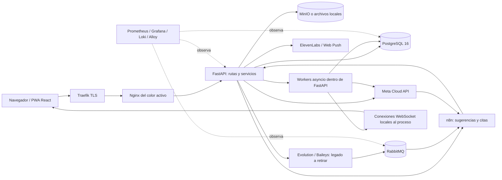
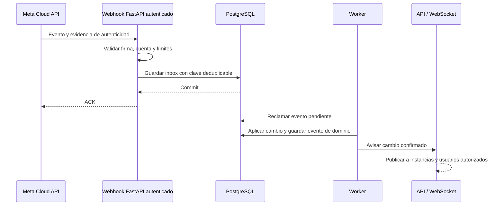

# Auditoría integral de sugerencias-chat

**Fecha:** 14 de septiembre de 2026.  
**Actualización de contexto:** 15 de septiembre de 2026: el responsable confirma la retirada de Evolution API y la conexión directa con Meta Cloud API como arquitectura objetivo.  
**Referencia Git:** `696052818fb5637161617428d8bfeace98b1d8cd`, más los cambios locales presentes durante la revisión.  
**Objeto:** lógica, algoritmos, arquitectura de software y sistemas, datos, caché, APIs, seguridad, infraestructura e integraciones.  
**Resultado:** diagnóstico y plan de corrección; este trabajo no modifica la implementación ni despliega cambios.

### Lectura rápida

- [Resumen ejecutivo](#1-resumen-ejecutivo)
- [Alcance y límites](#2-alcance-método-y-límites)
- [Arquitectura y tecnologías](#3-arquitectura-y-tecnologías-encontradas)
- [Pruebas ejecutadas](#4-resultados-de-las-verificaciones-locales)
- [33 hallazgos priorizados](#5-hallazgos-priorizados)
- [Buenas prácticas aplicadas](#6-buenas-prácticas-aplicadas-a-lógica-algoritmos-apis-y-caché)
- [Plan MinIO e infraestructura](#7-plan-concreto-para-completar-minio-e-infraestructura-externa)
- [Arquitectura objetivo](#8-arquitectura-objetivo-recomendada)
- [Mejoras ya confirmadas](#9-mejoras-anteriores-confirmadas-y-falsos-positivos-evitados)
- [Hoja de ruta](#10-hoja-de-ruta-y-criterios-de-cierre)
- [Fuentes oficiales](#11-fuentes-oficiales-consultadas)

## 1. Resumen ejecutivo

El proyecto es un CRM de conversaciones de WhatsApp con gestión de leads, tareas, citas, plantillas, archivos, sugerencias de IA y automatizaciones visuales. Tiene una base técnica aprovechable: transacciones SQLAlchemy, migraciones Alembic, una outbox persistente, pruebas, sesiones revocables, cifrado de secretos, despliegue blue-green y monitoreo declarado en archivos.

**Decisión de arquitectura:** WhatsApp se integrará directamente con **Meta Cloud API**. Evolution/Baileys se retira; sus dependencias presentes en el árbol son deuda de migración. La compatibilidad de lectura con mensajes históricos sigue siendo necesaria, pero no requiere mantener una conexión operativa a Evolution. La sección 8.3 detalla el cierre de esta transición.

**Los problemas de mayor impacto están en las fronteras entre componentes:** aceptar un mensaje externamente y registrar su resultado, revocar una sesión y cerrar sus conexiones, recibir un webhook y demostrar su autenticidad, o tener un backup y demostrar que restaura. Hay además errores reproducibles que impiden aprobar las pruebas y compilar el frontend actual.

Prioridades inmediatas:

1. Recuperar la compilación y resolver los fallos reproducidos de contactos e identidad WhatsApp.
2. Corregir la posibilidad de reenvío del outbox después de una aceptación externa.
3. Cerrar conexiones WebSocket al revocar sesiones y validar su origen.
4. Comprobar y proteger la entrada real de los webhooks de Meta; los exports locales no verifican firmas.
5. Restringir archivos activos y descargas de URLs arbitrarias.
6. Corregir la verificación de backups y serializar despliegues.
7. Completar la gestión reproducible de MinIO y de los workflows de n8n.
8. Completar el paso a Meta y retirar las llamadas, pantallas, credenciales y flujos de Evolution que aún aparecen en el código.

**Sobre MinIO:** hay aprovisionamiento imperativo parcial en `scripts/minio-setup.sh`. Por tanto, decir que no existe absolutamente ninguna infraestructura como código sería impreciso. Lo que falta es una definición completa y verificable del servidor, almacenamiento, TLS, políticas operativas, recuperación y estado deseado. El documento Terraform existente es un plan: no hay archivos `.tf` implementados.

## 2. Alcance, método y límites

### 2.1 Qué se revisó

- Inventario de código, configuración, migraciones, scripts, pruebas, documentación y exports locales de n8n.
- Análisis sintáctico de los archivos Python y lectura dirigida de rutas, servicios, modelos y flujos críticos.
- Seguimiento de autenticación, envío y recepción de mensajes, multimedia, trabajos diferidos, consultas y despliegue.
- Ejecución de pruebas existentes y comprobaciones aisladas con colaboradores simulados.
- Investigación en documentación oficial. Las fuentes se enlazan junto a las recomendaciones y se recopilan al final.

Magnitudes del árbol revisado, excluyendo dependencias, cachés y artefactos de compilación: **218 archivos Python, 67 TypeScript, 125 TSX y 31 SQL**; **88 archivos de pruebas de backend**, **33 tablas ORM** y **159 funciones de ruta HTTP/WebSocket** detectadas estáticamente. Estas cifras incluyen pruebas y migraciones cuando corresponde; no son porcentajes de cobertura.

### 2.2 Qué no demuestra este informe

No se consultó la base de producción ni se accedió a VPS, consolas de MinIO, n8n o Meta. No se enviaron mensajes reales. No se ejecutaron migraciones ni scripts de despliegue o restauración. El daemon local de Docker no estaba disponible, por lo que no se validó el stack completo ni SQL contra PostgreSQL real.

La revisión cubre todas las áreas del proyecto mediante inventario, búsqueda y análisis dirigido; **no equivale a verificar exhaustivamente cada combinación de negocio ni a una prueba de penetración de producción**. Los exports de n8n son archivos locales ignorados por Git: `active: true` dentro de un export no demuestra que esa versión esté desplegada.

El árbol ya contenía cambios sin commit, especialmente en plantillas Meta, outbox y contactos. Los hallazgos describen ese árbol; no se atribuyen automáticamente al commit de referencia ni a producción.

### 2.3 Cómo interpretar los hallazgos

| Etiqueta | Significado |
|---|---|
| Reproducido | Una prueba o comprobación local mostró el fallo descrito. |
| Confirmado en código | La implementación contiene la condición; el impacto se explica mediante un escenario concreto. |
| Riesgo condicionado | Depende de configuración, carga o controles de producción que no se pudieron verificar. |
| Deuda técnica | Limita mantenibilidad, reproducibilidad o capacidad de operación; no implica por sí sola un incidente. |

**P0:** contención inmediata si se confirma exposición. **P1:** corregir en el siguiente ciclo, antes de ampliar uso o despliegue. **P2:** mejora planificada. **P3:** optimización posterior, guiada por mediciones. La prioridad no es un puntaje CVSS.

### 2.4 Contexto de migración confirmado después de la auditoría

La decisión comunicada el 15 de septiembre es usar conexión directa con Meta Cloud API y dejar de usar Evolution API. Se actualizan las recomendaciones con ese destino. El inventario y los resultados de pruebas del día 14 conservan su valor como evidencia del árbol revisado; esta actualización documental no demuestra que la migración esté terminada ni que se hayan corregido aquellos fallos.

Las referencias a Evolution distinguen llamadas ejecutables pendientes de retirada, utilidades desactivadas, comentarios antiguos y datos históricos. No toda coincidencia textual representa una dependencia activa. n8n puede continuar con sugerencias, citas y automatizaciones; no se deduce su retirada. RabbitMQ debe conservarse solo si tiene una responsabilidad justificada en el diseño final, y las colas de ingreso exclusivas de Evolution deben drenarse o archivarse antes de retirarlas.

## 3. Arquitectura y tecnologías encontradas

### 3.1 Vista del árbol auditado, con dependencias heredadas



El gráfico combina la configuración versionada y los caminos de integración observados, incluidos exports locales; no certifica la topología real de producción ni representa la arquitectura objetivo. El ingreso Meta → n8n del export debe revisarse al establecer el webhook directo de Meta en el backend. Hay dos procesos de aplicación durante blue-green, pero los servicios persistentes conservan su ciclo de vida separado.

### 3.2 Inventario y criterio de uso

| Área | Tecnología declarada u observada | Evaluación / práctica aplicable |
|---|---|---|
| Backend | Python 3.12 en imagen/CI; FastAPI 0.115.0; Uvicorn 0.30.6 | Monolito viable; evitar trabajo bloqueante dentro del event loop y separar el ciclo operativo de workers. |
| Validación | Pydantic, pydantic-settings 2.5.2, enums y dataclasses | Validar límites y contratos en la entrada; usar tipos también entre servicios. |
| HTTP externo | HTTPX 0.27.2 declarado | Hay clientes reutilizables y timeouts; faltan controles homogéneos de URL, tamaño, reintentos y errores. |
| Persistencia | PostgreSQL 16.14 en Compose; SQLAlchemy 2.0.51; asyncpg 0.29.0 | Relaciones, JSONB, índices, paginación por cursor y locks son adecuados; falta validación de integración real. |
| Migraciones | Alembic 1.18.5 y SQL históricos | Una cadena autoritativa; comprobar creación desde cero, actualización y compatibilidad entre colores. |
| Identidad | Sesiones opacas en PostgreSQL, bcrypt 4.2.1, dispositivos/PIN | No es JWT. Conservar revocación y hashes; completar controles de acceso y protección contra abuso. |
| Secretos | cryptography 49.0.0 declarado, AES-GCM | Cifrado autenticado y AAD por setting son positivos; falta un procedimiento general de rotación y recuperación. |
| Archivos | SDK MinIO 7.2.20, urllib3, almacenamiento local alternativo | Bucket privado y streaming; completar IaC, validación de contenido y recuperación. |
| Multimedia | Pillow 11.1.0, FFmpeg, base64, Ogg/Opus | Limitar bytes, dimensiones, concurrencia y tiempo; no ejecutar tareas pesadas dentro de transacciones de lectura. |
| Frontend | React/ReactDOM 19.2.7, TypeScript ~6.0.2, Vite ^8.1.1 | Adaptadores de contratos, componentes por dominio y compilación obligatoria. |
| Datos de UI | TanStack Query, Table y Virtual; Axios | Separar estado remoto del estado de formularios; invalidar por identidad y evento; limitar memoria. |
| Formularios/UI | React Hook Form, Zod, Radix, Tailwind 4, CVA, clsx, tailwind-merge | Unificar validación y accesibilidad; no duplicar reglas críticas únicamente en el navegador. |
| Interacción | XYFlow, Motion, Recharts, Lucide, emoji-picker-react, react-easy-crop, html2canvas-pro | Separar editor visual, renderizado y operaciones de negocio; perfilar cargas grandes y accesibilidad. |
| Navegación/offline | React Router, vite-plugin-pwa / Workbox, Web Push / VAPID | El SW excluye APIs y multimedia; revisar caché HTTP, cambio de usuario y lifecycle de suscripciones. |
| Mensajería | RabbitMQ 4.1-management-alpine; outbox SQL | El broker ingiere eventos externos; no es actualmente el bus de todos los workers ni del WebSocket. Revisar su función tras retirar el ingreso Evolution. |
| WhatsApp | Meta Cloud API; restos de Evolution/Baileys | Meta es el único proveedor objetivo. Retirar dependencias operativas de Evolution y conservar lectura de datos históricos. |
| Automatización externa | n8n | Versionar contratos de sugerencias, citas y demás automatizaciones conservadas; separar esos flujos del transporte directo con Meta. |
| IA / RAG | Nodos n8n de OpenAI, Gemini, embeddings y vector store Supabase | Evidencia en export local; faltan infraestructura, corpus, evaluaciones y versiones desplegadas verificables. |
| Infraestructura | Docker Compose, Bash, Traefik 3.7.10, Nginx, WireGuard documentado | Compose es apropiado al alcance observado; recuperar hosts y proteger interfaces requiere más que contenedores. |
| Observabilidad | Prometheus, Alertmanager, Grafana, Loki, Alloy, node-exporter, cAdvisor, postgres-exporter | Existe instrumentación real; faltan sondeos externos y cobertura de algunos fallos silenciosos. |
| Calidad / entrega | pytest, pytest-asyncio, Vitest, Testing Library, Oxlint, Storybook, GitHub Actions | Muchas pruebas útiles; faltan DB/broker reales, escenarios E2E críticos y reproducibilidad de workflows. |
| Caché distribuida / IaC declarativa | Redis y Terraform aparecen en planes | No se encontraron como componentes runtime implementados. Su ausencia no es automáticamente un error. |

Los números anteriores provienen de manifests, no de `docker inspect`. No se infieren vulnerabilidades CVE simplemente por antigüedad. La edición y versión del **servidor** MinIO son desconocidas; la versión de su SDK no permite deducirlas.

## 4. Resultados de las verificaciones locales

| Verificación | Resultado |
|---|---|
| Análisis sintáctico de Python | No se reportaron errores de parseo en los archivos inventariados. |
| `npm.cmd run lint` | Sin diagnósticos en la salida observada. |
| `npm.cmd test -- --reporter=dot` | **239 aprobadas, 5 fallidas**; 30 archivos aprobados y 1 fallido. |
| `npm.cmd run build` | **Falla en TypeScript**, con 6 errores TS2559 en `message.test.ts`; Vite no llega a compilar el bundle. |
| `python -m pytest -p no:cacheprovider --basetemp=.audit-test-tmp` | **838 aprobadas, 2 fallidas, 4 omitidas**, 823 warnings; 27,15 s. |
| Outbox, proveedor simulado acepta y persistencia simulada falla | `_mark_failed` se invoca después de aceptar el mensaje: reproducido. |
| Carga SVG, guardado interceptado en memoria | `image/svg+xml` con elemento `script` es aceptado y conserva `.svg`: reproducido, sin subir archivos. |
| Docker | Cliente disponible; daemon inaccesible. No se ejecutaron pruebas de contenedores. |

**Entorno Python:** 3.14 local, diferente de 3.12 en CI. También difieren asyncpg (0.31.0 instalado / 0.29.0 declarado), HTTPX (0.28.1 / 0.27.2) y cryptography (48.0.0 / 49.0.0). Los fallos de constructor y contrato se explican directamente por el código, pero los resultados completos deben repetirse en el entorno fijado antes de usarlos como certificación de release. Muchos warnings proceden de APIs de asyncio deprecadas bajo Python 3.14.

Las pruebas se ejecutaron con URL de base local ficticia y valores de autenticación de prueba. No se utilizaron credenciales de producción para efectuar llamadas. Los dobles de prueba evitan los servicios externos; una suite con dobles no verifica los locks ni la semántica real de PostgreSQL.

## 5. Hallazgos priorizados

### H01 — Contrato de contactos roto; pruebas y build del frontend fallan

**P1 · Reproducido.** Evidencia: `frontend/src/utils/message.ts:801`, `:821`, `:835`; `frontend/src/utils/message.test.ts:390`.

`contacts` se declara como un objeto `Entries`, pero se fuerza con `as Entries[]` antes de ejecutar `.map()`. Si llega una cadena, falla en runtime. La implementación devuelve `name` y `phone: string[]`, mientras los casos de compatibilidad esperan `fullName` y un teléfono normalizado; además se perdió el parseo de vCard y de datos históricos. Los cinco fallos y los seis TS2559 corresponden a estas discrepancias. Un `console.log` imprime los contactos completos.

**Corrección:** definir un contrato canónico de contacto que soporte los números necesarios; normalizar payloads de Meta y registros históricos, validando arrays antes de iterar. La lectura de contactos antiguos de Evolution/vCard es compatibilidad de datos, sin un adaptador operativo a ese servicio. Actualizar consumidores y pruebas conforme al contrato decidido, conservando compatibilidad de datos existentes. Retirar el log de contactos.

**Aceptación:** pruebas con payload malformado, vCard, contacto histórico y varios teléfonos; renderizado del contacto y apertura del lead; `npm test` y `npm run build` aprobados. No basta con cambiar un cast o borrar las pruebas que fallan.

### H02 — `add_phone_jid` no completa la dataclass

**P1 · Reproducido.** Evidencia: `backend/services/whatsapp_identity_service.py:47`, `:122`; `backend/tests/test_whatsapp_identity.py:81`.

`ParsedWhatsAppIdentity` exige `username`, pero `add_phone_jid()` construye otra instancia sin ese campo: produce `TypeError`. En `backend/routers/webhooks.py:90` la llamada auxiliar está comentada; por tanto, no se afirma que la ruta activa falle hoy por este camino. Sí falla la utilidad y su prueba, y fallaría al reactivar el enriquecimiento.

**Corrección:** si la utilidad sigue siendo necesaria para identidades o datos históricos, conservar campos mediante `dataclasses.replace()` o pasar expresamente `username`. Si solo servía al enriquecimiento retirado de Evolution, eliminarla junto con sus dependencias y pruebas exclusivas. No reactivar consultas a Evolution para resolver este hallazgo. **Aceptación:** suite aprobada y conservación de atributos en las rutas de identidad que permanezcan; retirar una prueba solo cuando se haya retirado también la funcionalidad correspondiente.

### H03 — El outbox puede reenviar un mensaje ya aceptado por WhatsApp

**P1 · Reproducido con fallos simulados; condición confirmada.** Evidencia: `backend/services/message_outbox.py:413`, `:465`, `:627`.

`_process_job()` engloba envío externo y `_mark_sent()` en el mismo `try`. Si Meta acepta el mensaje y después falla el commit en PostgreSQL, el `except` llama a `_mark_failed()`, que puede devolverlo a `pending`. La recuperación de trabajos abandonados también desconoce si el proveedor ya lo aceptó. Tres intentos limitan repeticiones, pero no eliminan la duplicación.

**Corrección:** distinguir fallo previo al envío, rechazo conocido y resultado ambiguo; persistir correlación de intento y proveedor; reintentar la escritura del resultado por separado. Para resultados ambiguos, reconciliar mediante evidencia del proveedor o requerir resolución explícita antes de reenviar. Si el proveedor soporta una clave de idempotencia documentada para ese endpoint, emplearla; no asumir que un header inventado tiene efecto.

**Aceptación:** inyectar fallo después del HTTP exitoso y antes/durante el commit, timeout con aceptación remota y cancelación del worker. Ninguno debe producir un reenvío ciego. Un broker por sí solo no resuelve esta frontera; las confirmaciones y la deduplicación son responsabilidades distintas. [RabbitMQ: fiabilidad](https://www.rabbitmq.com/docs/reliability).

### H04 — WebSocket conserva acceso después de revocar o expirar la sesión

**P1 · Confirmado en código.** Evidencia: `backend/main.py:403`; `backend/services/ws_manager.py:9`; `backend/routers/auth.py:200`, `:214`, `:221`.

La autenticación ocurre una vez antes de `manager.connect()`. El bucle posterior solo lee mensajes/pings. El manager relaciona socket con usuario, no con sesión, y los métodos de revocación no cierran conexiones. Un cliente que conserve el socket puede seguir recibiendo eventos después de logout, revocación o desactivación. No hay validación de `Origin` en el handshake.

**Corrección:** asociar conexiones a sesiones; cerrar al revocar, revalidar periódicamente y fijar un máximo de vida. Aplicar una lista explícita de orígenes permitidos y límites de conexiones/mensajes. CORS HTTP no sustituye este control; `SameSite=Lax` ayuda, pero no cubre todos los orígenes del mismo sitio.

**Aceptación:** mantener abierto un socket, revocar desde otro cliente y comprobar cierre y ausencia de eventos; rechazar handshake de origen no permitido. [OWASP WebSocket](https://cheatsheetseries.owasp.org/cheatsheets/WebSocket_Security_Cheat_Sheet.html).

### H05 — Exports de webhooks externos sin autenticación de eventos

**P1 para verificar; P0 si están expuestos así · Confirmado en export local, riesgo condicionado en producción.** Evidencia: `webhook meta cloud api.json`, nodos `Meta eventos (POST)`, `responder 200 a Meta`, `normalizar eventos Meta`; `webhook msg deleted.json` y `webhook msg update.json`, nodos de entrada.

El export Meta valida un token en el GET de registro, pero el POST pasa directamente a responder 200 y normalizar. No aparece validación de `X-Hub-Signature-256`. Los exports de borrado/actualización tampoco configuran autenticación del nodo de entrada. El token del salto n8n → backend no demuestra quién originó el evento: n8n puede convertir una entrada no confiable en una llamada autorizada.

**Corrección:** inventariar la entrada realmente publicada y establecer el webhook directo Meta → backend. Verificar firma sobre los bytes originales antes de efectos secundarios, usando el App Secret separado del verify token de registro. Validar la cuenta WhatsApp Business y el `phone_number_id` destinatarios, deduplicar eventos y asegurar recepción durable antes del ACK HTTP. Retirar entradas y suscripciones heredadas de Evolution al completar el cambio; mientras alguna siga publicada, debe tener autenticación. Los exports locales son evidencia del flujo anterior, no una obligación de mantener n8n como ingreso Meta. No se verificó si n8n ya aporta durabilidad en producción.

**Aceptación:** firma ausente/incorrecta rechazada sin crear leads, cambiar estados ni enviar mensajes; evento válido procesado una vez al repetirse. El ejemplo oficial de Meta distingue GET de verificación y POST firmado. [Meta: ejemplo de validación de payload](https://github.com/fbsamples/whatsapp-api-examples/blob/main/signature-validation-with-webhooks-payloads/app.py). La página de documentación de Meta devolvió HTTP 429 durante esta investigación; se utilizó su repositorio oficial como fuente alternativa.

### H06 — Se aceptan SVG activos y se sirven desde el origen autenticado

**P1 · Aceptación reproducida; riesgo de ejecución condicionado a cómo se abra el archivo.** Evidencia: `backend/routers/media.py:79`, `:90`, `:174`.

La lista admite cualquier MIME `image/*`, incluido `image/svg+xml`; `mimetypes` asigna `.svg`. El GET devuelve ese MIME sin `Content-Disposition: attachment` salvo que el cliente pida `download`, y sin sandbox de contenido. `nosniff` no neutraliza JavaScript cuando el MIME real ya permite contenido activo. Un SVG abierto como documento en el mismo origen puede ejecutar contenido con el contexto de la aplicación; no se afirma que lo ejecute un simple ``.

**Corrección:** lista explícita de formatos pasivos y verificación del contenido real; rechazar SVG o rasterizarlo de forma aislada. Alternativamente, entregar contenido activo en un origen separado sin cookies de la app, con políticas restrictivas.

**Aceptación:** SVG con script rechazado o convertido; JPEG declarado con bytes de otro formato rechazado; pruebas del GET y navegación directa. [OWASP: cargas de archivos](https://cheatsheetseries.owasp.org/cheatsheets/File_Upload_Cheat_Sheet.html).

### H07 — Descarga de URLs sin frontera de red; límite aplicado después de descargar

**P1 · Confirmado en código; explotabilidad depende del control del payload.** Evidencia: `backend/services/ad_referral_service.py:31`, `:64`; `backend/routers/webhooks.py:153`.

`_needs_rehost()` solo comprueba `http://`/`https://`. HTTPX sigue redirecciones y descarga todo antes de revisar el límite de 5 MB. Una URL controlada desde la integración puede dirigir al backend a servicios internos; una respuesta grande consume memoria aunque luego se descarte. El token de webhook restringe quién llega a la ruta, pero no valida el destino indicado por sus datos.

**Corrección:** limitar destinos a los proveedores necesarios; bloquear direcciones privadas, loopback, link-local y redirecciones no validadas, considerando resolución DNS. Añadir controles de salida en red y streaming con corte por bytes. Aplicar una política equivalente al endpoint configurable de Web Push (`models/schemas.py:961`, `services/push_service.py:75`); allí también falta timeout explícito en la llamada a `webpush()`.

**Aceptación:** pruebas con redirect a loopback y respuesta sobredimensionada usando transporte simulado; verificar que no se efectúa la conexión prohibida. [OWASP SSRF](https://cheatsheetseries.owasp.org/cheatsheets/Server_Side_Request_Forgery_Prevention_Cheat_Sheet.html).

### H08 — La verificación del backup puede informar éxito ante un error

**P1 · Confirmado en código.** Evidencia: `scripts/db-backup.sh`, función `cmd_verify`.

La expresión `pg_restore --list ... | grep -c 'TABLE DATA' || true` suprime también un fallo de `pg_restore`, pese a `pipefail`. Luego imprime que el volcado está verificado, incluso con cero tablas. Leer el índice tampoco demuestra que todos los bloques de datos puedan restaurarse.

**Corrección:** propagar el código de error de `pg_restore`, validar el inventario esperado por separado y escribir el dump primero a un temporal. Añadir restauración programada en una base aislada, verificaciones de integridad y fecha del último backup válido.

**Aceptación:** dump truncado y comando fallido terminan con código no cero; restauración completa de una copia representativa aprobada. [PostgreSQL: pg_restore](https://www.postgresql.org/docs/16/app-pgrestore.html).

### H09 — Mensajes programados atascados solo se recuperan al arrancar

**P1 · Confirmado en código.** Evidencia: `backend/services/scheduled_message_service.py:130`, `:141`, `:236`.

`_claim_due()` hace commit del estado `processing`; `_recover_stale()` se llama una sola vez antes del bucle. Si el proceso muere y reinicia antes del umbral de antigüedad, o `_dispatch()` falla posteriormente, la fila puede permanecer `processing` indefinidamente sin un nuevo reinicio.

**Corrección:** recuperación periódica, con lease/propietario y límites de ejecución coherentes; supervisar antigüedad. **Aceptación:** provocar caída después del claim, reiniciar inmediatamente y demostrar recuperación al vencer el lease sin otro restart. El outbox general ya tiene recuperación periódica; el problema persiste en el scheduler.

### H10 — Recordatorio marcado como enviado antes de tener entrega durable

**P1 · Confirmado en código.** Evidencia: `backend/services/productivity_service.py:206`; `backend/services/task_reminder.py:10`.

Se hace commit de `reminder_sent_at` antes del WebSocket. Si el worker termina entre ambas operaciones, no hay reintento. Además, que `send_json()` complete solo demuestra escritura al transporte, no que el usuario lo recibió. El camino de `release_reminder()` cubre desconexión detectada, pero no el crash intermedio.

**Corrección:** crear una notificación persistente con clave única por tarea y vencimiento; usar WebSocket como aviso para consultar esa notificación. **Aceptación:** terminar el worker tras claim y comprobar que el recordatorio sigue disponible al reconectar, sin duplicarlo.

### H11 — Filtro SQL puede ocultar mensajes `unsupported` sin `original_type`

**P1 · Confirmado por lectura de expresión; pendiente integración PostgreSQL.** Evidencia: `backend/services/db_service.py:1822`; normalizador del export Meta.

El filtro usa `NOT (message_type = 'unsupported' AND payload['original_type'] IN (...))`. Si el tipo es `unsupported` pero esa clave falta, la extracción JSON devuelve SQL NULL, la expresión completa queda NULL y `WHERE` descarta la fila. El normalizador Meta crea `payload.meta_type`, no necesariamente `original_type`. También deben comprobarse registros históricos con tipo NULL.

**Corrección:** expresar que solo se excluyen coincidencias positivas, por ejemplo mediante `COALESCE(condición_de_álbum, false)` antes del NOT, o condiciones explícitas de NULL. **Aceptación:** probar matriz de tipo/JSON nulo, clave ausente, álbum real y tipo desconocido contra PostgreSQL real. [PostgreSQL: operadores JSON](https://www.postgresql.org/docs/16/functions-json.html).

### H12 — El GET del historial retiene la conexión SQL durante I/O multimedia

**P2 · Confirmado en código.** Evidencia: `backend/services/db_service.py:1764`, `:1842`, `:2464`.

La sesión ejecuta el SELECT y sigue abierta mientras `_fill_media_dimensions()` consulta archivos/MinIO. La concurrencia de mediciones está acotada, pero la conexión DB permanece ocupada hasta el update y commit. Además, un fallo temporal se persiste como `0/0`, igual que un archivo realmente no medible, evitando futuros reintentos.

**Corrección:** medir al ingerir o con un job independiente; si se conserva el backfill, cerrar la lectura antes del I/O y persistir en una transacción corta. Separar error transitorio de formato no soportado. **Aceptación:** MinIO lento no incrementa proporcionalmente conexiones SQL ocupadas, y una indisponibilidad temporal no deja dimensiones descartadas para siempre. [SQLAlchemy async](https://docs.sqlalchemy.org/en/20/orm/extensions/asyncio.html).

### H13 — bcrypt bloquea el event loop y el login no limita intentos

**P1 · Confirmado en código; impacto depende de concurrencia.** Evidencia: `backend/routers/auth.py:85`, `:171`; `backend/services/auth_service.py:17`; `backend/services/session_service.py:402`, `:476`; `backend/routers/users.py:52`.

Funciones async llaman directamente a bcrypt. FastAPI no desplaza automáticamente al threadpool una utilidad síncrona llamada por el código. La ruta de contraseña no tiene limitación de intentos en la aplicación ni en los proxies versionados; el bloqueo del PIN sí existe y no protege ese login. Las contraseñas solo se comprueban como no vacías al crear/restablecer usuarios.

**Corrección:** ejecutar bcrypt en un pool acotado; aplicar throttling por cuenta y origen, límites de longitud y política de contraseña explícita. Revisar el límite de bytes de bcrypt al aceptar contraseñas largas y contemplar evolución a un esquema de hash versionado. Mantener el mensaje genérico de credenciales incorrectas.

**Aceptación:** ráfaga de logins inválidos recibe limitación sin bloquear `/health`; PIN conserva su bloqueo; contraseñas UTF-8 largas no se truncan silenciosamente. [FastAPI: funciones auxiliares y async](https://fastapi.tiangolo.com/async/), [OWASP autenticación](https://cheatsheetseries.owasp.org/cheatsheets/Authentication_Cheat_Sheet.html).

### H14 — Caché de datos del usuario anterior tras un 401

**P1 · Confirmado en código; exposición depende del cambio de cuenta.** Evidencia: `frontend/src/api/client.ts:16`; `frontend/src/hooks/useAuth.ts:40`; `frontend/src/queryClient.ts:3`.

El logout explícito limpia la caché, pero el interceptor de 401 solo pone `['auth','me']` a null. El login posterior escribe el nuevo usuario sin limpiar las demás queries. Hay claves sin identidad de usuario y `gcTime` de 30 minutos: una expiración seguida de acceso con otra cuenta puede mostrar información residual, especialmente notificaciones, sesiones o plantillas personales, hasta revalidar.

**Corrección:** centralizar transición de identidad: cancelar peticiones y vaciar datos privados al perder/cambiar sesión; incluir identidad donde corresponda y prevenir que respuestas antiguas repueblen la caché. **Aceptación:** usuario A → 401 → usuario B en la misma pestaña, con red lenta y respuestas en vuelo, sin datos de A.

### H15 — Cachés backend locales sin invalidación entre procesos; sesiones sin tamaño máximo

**P2 · Confirmado en código.** Evidencia: `backend/services/settings_service.py:113`; `backend/services/session_service.py:107`, `:118`, `:134`; `backend/services/dashboard_service.py:13`.

Settings tiene TTL de 30 s y sesiones TTL configurable de 15 s. La invalidación ocurre solo en el proceso actual: otros workers/colores pueden conservar permisos o tokens antiguos hasta el TTL. El diccionario de sesiones solo elimina expirados al consultar esa clave o al invalidar; tokens que no vuelven a usarse pueden acumularse.

**Corrección:** explicitar el máximo retraso permitido por dato; usar caché limitada con expulsión y limpieza. Para revocación sensible, propagar invalidaciones o consultar una versión de sesión persistente. Redis no es requisito automático: elegirlo solo si simplifica un requisito de consistencia medido.

**Aceptación:** dos procesos, cambio de rol/token y medición de visibilidad; alta rotación de sesiones con memoria estabilizada. El TTL por sí solo no equivale a expulsión ni a invalidación inmediata.

### H16 — WebSocket y workers tienen estado local; blue-green no aísla efectos

**P1 antes de escalar · Confirmado en código.** Evidencia: `backend/main.py:270`; `backend/services/ws_manager.py:11`; `scripts/deploy-bluegreen.sh:195`, `:227`.

Cada proceso inicia todos los watchers. Las conexiones y señales de despertar viven en memoria. Durante blue-green ambos colores pueden ejecutar jobs, pero un evento dirigido al manager del color nuevo no llega a los usuarios del viejo. Apagar el color cancela tareas en vuelo; no existe un periodo de drenaje explícito coordinado con claims. `SKIP LOCKED` resuelve algunos claims, no la distribución de eventos a sockets ni la aceptación remota ambigua.

**Corrección:** entrypoints distintos para API y workers, con los mismos módulos de dominio; mecanismo compartido de publicación a instancias WebSocket y resincronización HTTP tras cortes. Diseñar drenaje: dejar de reclamar, terminar/reconciliar trabajos y luego detener.

**Aceptación:** dos instancias y clientes en ambas; cambios visibles en las dos, una ejecución de negocio por evento y despliegue con trabajos en vuelo verificado. [FastAPI: memoria y procesos](https://fastapi.tiangolo.com/deployment/concepts/).

### H17 — Despliegues simultáneos pueden competir sobre el mismo árbol y color

**P1 · Confirmado en configuración.** Evidencia: `.github/workflows/ci-cd.yml:126`, `:193`, `:247`, `:251`; `scripts/deploy-bluegreen.sh:187`.

No hay `concurrency` en el workflow ni lock operativo en el script. Dos pushes pueden desplegar sobre la misma carpeta, usar el mismo archivo temporal y elegir el mismo color. Además, el servidor hace fetch/reset a `origin/main`, no al SHA exacto que aprobó ese pipeline: puede desplegar un commit más reciente todavía no verificado. Las imágenes comprobadas en CI se reconstruyen después en producción.

**Corrección:** serializar despliegues con `concurrency` sin cancelar uno en su sección crítica y un lock en el servidor; desplegar el SHA autorizado y promover imágenes por digest. Mover el estado activo fuera de los archivos que `git reset` modifica; usar temporales en el mismo filesystem para reemplazos atómicos.

**Aceptación:** dos releases consecutivos/simultáneos no se intercalan; `/version` o metadatos de imagen identifican el SHA probado. [GitHub: concurrencia](https://docs.github.com/en/actions/how-tos/write-workflows/choose-when-workflows-run/control-workflow-concurrency), [Docker: builds reproducibles](https://docs.docker.com/build/building/best-practices/).

### H18 — MinIO tiene provisión parcial; faltan servidor y políticas recuperables

**P1 · Deuda técnica confirmada.** Evidencia: `scripts/minio-setup.sh`; `backend/config.py:72`; `docs/analisis/05-plan-infra-terraform-minio.md`; ausencia de implementación `.tf` o servicio MinIO en Compose.

No se declara dónde corre MinIO, imagen/edición, discos, TLS, configuración del servicio, actualización o reconstrucción del host. El script configura bucket, acceso anónimo e identidad; no configura versionado, lifecycle, cuotas, replicación/copia externa ni alertas del almacenamiento. No se concluye que esas funciones estén desactivadas en producción, sino que no son verificables/reproducibles desde este proyecto.

**Corrección:** completar el contrato de infraestructura descrito en la sección 7. Usar configuración versionada y validable para servidor y recursos, importando lo existente. Compose/Bash idempotente puede ser suficiente para una parte; Terraform/OpenTofu aporta plan y control de deriva si se adopta con estado protegido.

**Aceptación:** reconstrucción en entorno vacío, plan sin cambios después de aplicar, auditoría de permisos y recuperación de objetos borrados. Confirmar edición/versión antes de trasladar comandos de la documentación actual de AIStor al servidor existente. [MinIO: versionado](https://docs.min.io/aistor/administration/objects-and-versioning/versioning/), [Terraform: importación](https://developer.hashicorp.com/terraform/cli/import).

### H19 — El script MinIO confunde fallos de consulta con ausencia de usuario

**P1 · Confirmado en código; requiere fallo de red/autorización.** Evidencia: `scripts/minio-setup.sh`, bloques `admin user info`, cálculo de `APP_SECRET` y `policy attach`.

Cualquier fallo de `admin user info` se interpreta como `USER_EXISTS=false`. Si una consulta falla transitoriamente y el segundo contenedor sí conecta, se genera un secreto nuevo y `user add` puede actualizar al usuario existente. Por tanto, la rotación accidental normal ya se corrigió, pero queda este caso. `policy attach ... || true` también oculta errores distintos de «ya adjunta», y las comprobaciones finales imprimen `FALLA` sin fallar necesariamente el script.

**Corrección:** distinguir códigos/errores de inexistencia, red y permisos; abortar ante estado desconocido. Verificar el estado final sin suprimir errores generales. Fijar versión/digest de `minio/mc` y evitar imprimir secretos a logs persistentes.

**Aceptación:** simular fallo solo de la primera consulta: ninguna credencial cambia. Simular fallo de attach: salida no cero. La ejecución idempotente conserva acceso de la aplicación.

### H20 — Recuperación incompleta: copias locales y dependencias externas sin respaldo verificable

**P1 · Deuda confirmada; operación externa pendiente de inventario.** Evidencia: `scripts/db-backup.sh`; `compose.db.yml`; `README.md`, apartado de copias; ausencia de job de copia externa y restore automatizado en CI/configuración.

Se propone cron diario y retención de 14 días en el mismo host. El README pide copiar fuera, pero no implementa esa copia. No hay procedimiento único que recupere PostgreSQL, objetos, claves de cifrado, workflows/credenciales n8n y configuración de red. Si solo existiera el dump diario, la pérdida potencial sería del orden del intervalo entre copias; el RPO real no se puede afirmar sin revisar producción.

**Corrección:** acordar RPO (datos que se admite perder) y RTO (tiempo para recuperar), automatizar copia cifrada fuera del host y restauraciones periódicas. Evaluar PITR mediante WAL si el RPO necesita ser menor que el intervalo de dumps. Una réplica o volumen persistente no sustituye un backup recuperable. [PostgreSQL: estrategias de backup](https://www.postgresql.org/docs/16/backup.html).

### H21 — Privilegios SQL de ejecución no están separados de administración/migraciones

**P1 · Configuración documentada; verificar roles reales.** Evidencia: `compose.db.yml:37`; `README.md`, conexión con `POSTGRES_USER`; `backend/db/session.py:26`; `backend/migrations/001_lead_tags_activity.sql:45`.

El camino documentado usa para la app las mismas credenciales iniciales de PostgreSQL. No se encontró provisión de un rol runtime restringido ni otro específico para n8n; sí hay un rol separado para el exporter. El SQL histórico activa RLS en tres tablas, pero no define políticas, y no constituye una garantía de aislamiento para owners/superusuarios. Tampoco se encontró esa configuración RLS reproducida como política completa en Alembic.

**Corrección:** roles independientes para migraciones, aplicación, integraciones y monitoreo; permisos mínimos por esquema/operación. Si se decide usar RLS, definir políticas y probarlas con el rol real, no con el owner. **Aceptación:** runtime no puede crear/drop tablas ni acceder a datos fuera de su alcance; pruebas negativas de permisos. [PostgreSQL: RLS y bypass](https://www.postgresql.org/docs/16/ddl-rowsecurity.html).

### H22 — Adopción de Alembic mediante una única tabla testigo

**P2 · Confirmado en código.** Evidencia: `backend/scripts/migrate.py:43`, `:71`, `:97`; `backend/main.py:80`, `:112`; coexistencia de `backend/migrations/` y `backend/alembic/versions/`.

Si existe `users` y falta versión Alembic, el script marca la baseline sin comparar el resto del esquema. Una instalación parcial o diferente puede quedar etiquetada como compatible sin serlo. `_alembic_head()` suprime cualquier excepción y permite omitir la comparación si no logra leer el head. La verificación exige igualdad exacta: reiniciar un color anterior tras una migración aditiva puede bloquearlo aunque su código aún sea compatible.

**Corrección:** preflight explícito de adopción y revisión de drift; un único camino de migración mantenido. Fallar con diagnóstico si no se puede determinar el head y diseñar la compatibilidad admitida durante rollback. Mover backfills costosos de `backfill_automation_state()` fuera de cada arranque; hoy recorre ejecuciones y versiones históricas.

**Aceptación:** base vacía, base histórica completa, base parcial y rollback entre dos versiones sobre esquema expandido; pruebas reales, no solo búsqueda de cadenas SQL.

### H23 — TLS y configuración efectiva dependen del camino de despliegue

**P2 · Confirmado en archivos; estado vivo desconocido.** Evidencia: `backend/config.py:19`; `backend/db/session.py:31`; `.github/workflows/ci-cd.yml`, comprobación literal `DATABASE_SSL=require`; `compose.prod.yml:30`; overrides de Traefik y blue-green.

El valor por defecto del cliente DB sigue siendo `prefer`, que puede aceptar una conexión sin TLS. La base de producción del proyecto exige TLS, de modo que no se afirma que hoy viaje en claro por ese camino. El pipeline solo admite literalmente `require`, bloqueando también una mejora a `verify-full`. El Compose base de producción publica `8000:8000`; los overrides sí eliminan esa publicación, pero ejecutarlo solo evita el proxy y expone `/metrics` y la API directamente.

**Corrección:** defaults por entorno que fallen ante configuración insegura, validación de los modos TLS aceptados y ruta de CA verificable. Hacer privado el Compose de producción por defecto y publicar puertos solo en overrides de desarrollo. Validar la configuración combinada en CI sin imprimir secretos.

**Aceptación:** combinación de producción sin bind público del backend; `verify-full` funcional; despliegue erróneo rechazado antes de recrear servicios. [Docker: publicación de puertos](https://docs.docker.com/engine/network/port-publishing/).

### H24 — Contenedores sin presupuesto explícito; socket Docker con amplio alcance

**P2 · Confirmado en configuración; dimensionamiento pendiente.** Evidencia: `backend/Dockerfile`; `frontend/Dockerfile`; `compose.prod.yml`; `compose.monitoring.yml:130`; `traefik/reverse-proxy.docker-compose.yml:34`.

El backend no declara usuario no privilegiado y hereda root de su imagen. No se configuran límites de memoria/CPU/PIDs para los servicios de la app. FFmpeg y solicitudes multimedia compiten con la API y la base en el host. Traefik y Alloy montan el socket Docker; `:ro` no convierte la API del socket en una API de solo lectura.

**Corrección:** usuario runtime, capacidades mínimas, `no-new-privileges`, rutas temporales/multimedia escribibles explícitas y límites medidos. Reducir el acceso al socket mediante proxy con endpoints permitidos o retirar proveedores no usados. Fijar imágenes por digest y promover las comprobadas, con actualización automatizada y análisis de vulnerabilidades.

**Aceptación:** smoke test con usuario restringido y límites; cargas de multimedia no provocan OOM global. [Docker: seguridad del daemon](https://docs.docker.com/engine/security/), [buenas prácticas de imágenes](https://docs.docker.com/build/building/best-practices/).

### H25 — La DLQ de RabbitMQ elimina los mensajes más antiguos al llenarse

**P1 si se exige recuperar todos los eventos · Confirmado en configuración.** Evidencia: `mq/definitions.json`, cola `q.wsp.dlq`: `x-max-length: 10000`, `x-overflow: drop-head`.

Al superar el máximo se descartan los primeros mensajes de una cola cuyo objetivo es conservar fallos para resolverlos. No hay en ese recurso un destino adicional de archivo. El nodo es único y las colas no declaran replicación; durabilidad no significa alta disponibilidad. Las colas principales tampoco tienen un presupuesto explícito de bytes en el archivo.

**Corrección:** para las colas que permanezcan, definir una política de saturación y recuperación: alertar antes del límite, archivar fallos de forma durable o rechazar con tratamiento explícito del productor; revisar confirms, ack y reintentos de sus productores y consumidores reales. No cambiar `drop-head` por rechazo sin resolver qué hace el publicador ante ese rechazo. Si la cola solo servía al ingreso Evolution, drenar o archivar sus pendientes y retirar esa infraestructura; no mantener Evolution para justificar el broker.

**Aceptación:** prueba de saturación controlada y recuperación de todos los IDs esperados; caída del consumidor y reinicio del broker sin pérdidas dentro de la garantía acordada. [RabbitMQ: límites de colas](https://www.rabbitmq.com/docs/maxlength), [ack y confirms](https://www.rabbitmq.com/docs/confirms).

### H26 — Parte del comportamiento n8n no es reproducible desde Git y queda fuera de CI

**P1 · Deuda confirmada y un test local fallido.** Evidencia: `.gitignore`, patrones de exports; `backend/tests/test_n8n_workflow_identity.py:9`, `:78`; exports locales.

Ignorar exports con secretos evita publicarlos, pero también deja fuera código de negocio. La prueba del grafo se omite si no existe `rag.json`; en un checkout limpio no valida ese contrato. Localmente falla porque el trigger ahora pasa por `Backend URLs (EWT)`, mientras la prueba exige conexiones directas. Ese fallo prueba desalineación del test, no por sí solo pérdida de mensajes.

Se detectaron valores sensibles literales dentro de exports y datos fijados de ejemplo. **No están versionados actualmente según `git ls-files`; no se afirma una filtración a GitHub.** No se incluyen sus valores en este informe. Además, se invocan subworkflows que no tienen una definición completa disponible aquí.

**Corrección:** exports sanitizados y versionados, credenciales por referencias, `pinData` eliminado, contratos y fixtures sintéticos, y prueba del camino completo del grafo. Inventariar subworkflows, versiones, restauración de credenciales, retención de ejecuciones y configuración de la instancia n8n. Conservar contratos de las automatizaciones vigentes; migrar o retirar los de ingreso Evolution junto con sus flujos. El webhook directo de Meta debe tener sus propias pruebas de contrato en el backend.

**Aceptación:** un checkout limpio permite ejecutar todos los contratos y restaurar los workflows sin secretos incluidos. [n8n: auditoría de seguridad](https://docs.n8n.io/hosting/securing/security-audit/), [gestión de ejecuciones](https://github.com/n8n-io/n8n-docs/blob/main/docs/deploy/host-n8n/configure-n8n/scaling/manage-execution-data.md).

### H27 — CI amplio, pero sin validación real de DB, broker y flujo de navegador

**P2 · Deuda confirmada.** Evidencia: `.github/workflows/ci-cd.yml:27`; `backend/tests/conftest.py`; `frontend/vite.config.ts:56`; `monitoring/prometheus/alert-rules.test.yml`.

CI instala dependencias y ejecuta muchas pruebas, pero el propio workflow indica que no toca PostgreSQL real. No valida transacciones concurrentes, migración completa, JSONB/RLS, recuperación de jobs ni una sesión browser → proxy → API. Se valida sintaxis de alertas, pero no aparece ejecución de `promtool test rules` para el archivo de pruebas existente. No se encontró análisis de tipos/lint Python equivalente al frontend, lock transitivo con hashes, ni análisis de imágenes/dependencias en este workflow.

**Corrección:** añadir una suite pequeña de integración con PostgreSQL 16 y, si conserva responsabilidades en el sistema objetivo, RabbitMQ aislado; ejecutar pruebas de reglas; E2E de login, recepción/envío directo con Meta simulado, reconexión y archivos. Introducir tipado/lint Python gradualmente en interfaces de mayor riesgo y dependencias resueltas reproducibles.

**Aceptación:** los escenarios H03, H09, H11, H17 y H22 fallan si reaparece el defecto. Medir cobertura de comportamientos, no solo porcentaje de líneas.

### H28 — Observabilidad puede estar verde mientras el dominio o los workers fallan

**P2 · Confirmado en diseño.** Evidencia: `monitoring/prometheus/prometheus.yml`; `monitoring/alertmanager/alertmanager.yml:24`; `backend/main.py:388`; `backend/services/queue_metrics.py`.

Los targets observan principalmente loopback; no hay sondeo externo del recorrido DNS → TLS → Traefik → API. La alerta de ausencia de Traefik detecta contenedor desaparecido, pero no cubre todos los fallos de enrutamiento/certificado. El único receptor declarado depende de n8n. El readiness comprueba DB y storage, no que cada watcher siga vivo; fallos antes del bucle en algunos workers pueden dejar la API respondiendo sin procesar trabajos.

**Corrección:** monitor externo y canal de alerta independiente, heartbeat por worker, edad del trabajo más antiguo, disponibilidad y capacidad de MinIO, edad del backup verificado y expiración TLS. Añadir SLO de recepción/envío end-to-end y métricas de lag/event loop/pool.

**Aceptación:** simular proxy roto, worker terminado y n8n caído; cada caso produce una señal accionable aunque la API responda 200. [Prometheus: prácticas de alertado](https://prometheus.io/docs/practices/alerting/).

### H29 — Citas con efecto externo previo al registro y sin clave idempotente local

**P2 · Confirmado en código; duplicación externa por verificar.** Evidencia: `backend/routers/appointments.py:45`, `:88`, `:109`, `:142`.

La petición llama a n8n y luego guarda el registro. Un timeout puede ocurrir después de crear una cita fuera del CRM; un fallo al guardar puede perder su referencia local. Se interpreta `citaDuplicada` si n8n la devuelve, pero no hay clave idempotente de solicitud en este límite. La llamada tampoco usa la autenticación saliente utilizada por `n8n_service`; puede depender del secreto implícito de la URL o de controles externos.

**Corrección:** registrar intención y clave idempotente antes del efecto, contrato de resultado/reconsulta con n8n y autenticación explícita. **Aceptación:** mismo request repetido y timeout después de creación retornan la misma cita o un estado reconciliable, sin creación repetida.

### H30 — Acoplamiento y concentración de lógica elevan el coste de cambio

**P2 · Deuda confirmada.** Evidencia: `backend/services/automation_service.py` (4.086 líneas, 97 funciones de módulo); `backend/services/db_service.py` (3.013 líneas, 112 funciones); `backend/routers/chats.py` (1.213); `frontend/src/components/VisualFlowBuilder.tsx` (1.189); `frontend/src/hooks/useChats.ts` (779).

La longitud no demuestra por sí sola mala arquitectura. Aquí coincide con responsabilidades mezcladas: validación, persistencia, interpretación de flujos, envío, recuperación y notificación. `_run_visual_execution()` alcanza 424 líneas. Las rutas importan directamente clientes externos, DB y motores. `useChats.ts` contiene transporte WebSocket, parseo de eventos y muchas reglas de invalidación; el contrato vive repartido entre tipos manuales y normalizadores.

**Corrección:** modularizar por capacidades de negocio y extraer casos de uso con interfaces; separar normalización externa de modelos internos. Reutilizar el patrón ya existente `AutomationDeps`. En frontend, separar hook de transporte, parser y manejadores de eventos/queries. Generar tipos HTTP desde OpenAPI cuando sea viable, conservando validación runtime en fronteras no confiables.

**Aceptación:** cambiar un proveedor o una regla no exige editar rutas, parser y persistencia simultáneamente; pruebas del caso de uso sin monkeypatch global extenso. La dirección propuesta aparece en la sección 8.

### H31 — Datos privados en logs y retención sin contrato global

**P2 · Confirmado en código; alcance de almacenamiento por verificar.** Evidencia: `frontend/src/utils/message.ts:839`; `backend/logging_config.py:54`; `backend/services/n8n_service.py:53`, `:69`; exports con `pinData`.

Se imprimen contactos; el formatter copia mensajes, excepciones y extras sin redacción. Las instrucciones del asesor viajan en query string hacia n8n, susceptible de quedar en logs de HTTPX/proxies. Hay retención de Loki de 14 días, pero no un contrato conjunto para mensajes, adjuntos, outbox, sesiones, exports, prompts y ejecuciones externas.

**Corrección:** enviar contexto sensible en cuerpo cuando el contrato lo permita; redactar campos/URLs sensibles antes del logging; separar eventos operativos de contenido. Definir retención y borrado coordinado, incluyendo copias/versiones y proveedores. Esto es una recomendación técnica de minimización; no constituye una conclusión jurídica sobre cumplimiento.

**Aceptación:** revisar logs con marcadores sintéticos de teléfono, token e instrucción: no aparecen en claro; expiración y recuperación documentadas por clase de dato.

### H32 — Límites de bytes y coste aplicados demasiado tarde o solo por solicitud

**P2 · Confirmado en código; impacto depende de carga.** Evidencia: `backend/routers/media.py:104`; `backend/services/media_storage.py:318`; `frontend/nginx.conf:15`; `backend/services/tts_service.py:7`.

El JSON/base64 se materializa antes de medir bytes; video sobredimensionado puede disparar FFmpeg antes del rechazo final. Nginx limita a 50 MB por request, pero no controla el total simultáneo de decodificación, transcodificación y envíos. TTS limita caracteres, pero no hay cuotas de consumo por usuario/periodo. Las descargas Meta también cargan bytes completos.

**Corrección:** límites previos por tamaño codificado y contenido real; concurrencia/cola separada para transcodificación, límites de píxeles/duración y timeout total. Evaluar multipart/streaming para archivos grandes. Añadir presupuesto y métricas de coste de TTS/IA con protección contra reintentos que facturan varias veces.

**Aceptación:** mezcla de cargas grandes y pequeñas mantiene latencia/uso de memoria dentro del presupuesto acordado; sobrecarga responde con rechazo controlado, no OOM. [HTTPX: timeouts](https://www.python-httpx.org/advanced/timeouts/).

### H33 — La política de acceso a leads y archivos es global, no por vendedor/tenant

**P2 como definición de producto; P1 antes de introducir aislamiento · Confirmado en código.** Evidencia: `backend/main.py:354`, `:380`; `backend/services/db_service.py:465`; `backend/services/ws_manager.py:23`.

Estar autenticado permite consultar chats; el filtro `seller_id` es un criterio de búsqueda, no una política de autorización ligada al usuario. Los archivos se sirven por nombre después de comprobar sesión, sin comprobar relación con un lead permitido. Broadcast envía a todas las conexiones registradas. Esto puede ser correcto para un equipo que comparte todas las conversaciones: **no se declara un BOLA confirmado sin un requisito de restricción**. Sí impide prometer aislamiento por vendedor, clínica o tenant.

**Corrección:** documentar matriz de permisos por recurso y acción. Si se necesita aislamiento, aplicarlo en consultas, comandos, archivos, eventos y jobs, con identidad derivada de la sesión. No aceptar `tenant_id` del cliente como autoridad.

**Aceptación:** pruebas con dos usuarios y, cuando exista multi-tenant, dos organizaciones; acceso cruzado denegado también por ID directo y WebSocket.

## 6. Buenas prácticas aplicadas a lógica, algoritmos, APIs y caché

### 6.1 Python / FastAPI

- Mantener funciones puras para normalizar identidad, estados, números y condiciones de flujos. Dar entrada y salida tipadas; no depender de globals para el reloj, DB o proveedor cuando son necesarios para probar el comportamiento.
- Usar estados explícitos para envío: `pending`, `claimed`, `accepted`, `unknown`, `failed`, con transiciones verificadas. El resultado ambiguo es distinto de un rechazo recuperable.
- Una transacción debe proteger una invariante de negocio; no mantenerla mientras se espera a HTTP, MinIO o FFmpeg. Usar una sesión distinta por tarea SQL concurrente; no convertir la sesión compartida en un parámetro de `asyncio.gather()`.
- Reintentar solo operaciones seguras o reconciliables, con backoff, jitter, límites y respeto por `Retry-After` donde corresponda. No reintentar todos los 4xx ni asumir que un timeout significa que el proveedor no actuó.
- Validar settings antes de persistirlos. Hoy los valores se guardan como cadenas; campos numéricos de ElevenLabs se convierten con `float()` al usarlos. Una configuración inválida debería rechazarse al editarla, no durante una venta.
- Normalizar errores externos en códigos internos y devolver un `request_id`; conservar detalles técnicos redactados en logs. Evitar propagar íntegramente `response.text` o mensajes SQL.

Estas recomendaciones derivan de los límites concretos observados, no de exigir capas genéricas para cada función. [FastAPI async](https://fastapi.tiangolo.com/async/), [SQLAlchemy async](https://docs.sqlalchemy.org/en/20/orm/extensions/asyncio.html).

### 6.2 Algoritmos y consultas: medir antes de cambiar

| Operación | Situación observada | Mejora/experimento recomendado |
|---|---|---|
| Historial | Cursor `(sent_at, id)`, `limit + 1`, máximo de salto 1.000 | Conservar desempate; verificar índice compuesto y ordenar por tupla coherente. Corregir primero H11/H12. |
| Buscador de chats | Ranking, ILIKE/unaccent, subconsultas de mensajes y `LATERAL` | Capturar `EXPLAIN (ANALYZE, BUFFERS)` con datos sintéticos realistas; evaluar trigramas e índices existentes según planes reales. |
| Tags/citas de mensajes | Recuperación por lote en varios caminos | Conservar mapas por ID; no introducir una consulta por elemento. |
| Editor de flujos | Búsquedas `.find()` sobre nodos dentro de renderizado de conexiones | Construir `Map<id,node>` cuando el tamaño lo justifique; coste de lookup esperado constante tras construcción O(V). Validar referencias faltantes, evitando `!` como garantía de integridad. |
| Motor de flujos | Intérprete grande con waits, branches e invocación | Compilar/validar grafo al publicar: IDs únicos, referencias, límites, reglas de ciclos y llamadas recursivas; usar índices de adyacencia y presupuesto de pasos. |
| Dashboard | Agregaciones y búsqueda de siguiente respuesta por mensaje | Verificar planes y definición de métrica; una consulta correlacionada puede dominar el coste. Resúmenes incrementales solo tras medir. |
| Backfill al arrancar | Lectura completa de ejecuciones `TASK_DUE` y versiones en `backfill_automation_state()` | Migración/job acotado con checkpoint; que startup no crezca con todo el historial. |
| Watcher de mensajes | Cursor por `sent_at`, inicializado al último registro al arrancar | Es respaldo, no log durable de ingestión. Evaluar eventos tardíos y caídas; persistir inbox/evento de ingestión con recuperación si la garantía lo requiere. |
| Envío concurrente | Un lote espera `gather()` completo antes de tomar otro | Medir si un envío lento deja slots ociosos; evaluar workers que repongan slots y mantengan exclusión por chat. |

No se midió latencia ni volumen productivo; **no se atribuye O(N²) a una consulta solo por usar subconsultas**. Tampoco se propone particionado, PgBouncer o índices nuevos sin `EXPLAIN`, tasa de escritura, cardinalidad y presupuesto de conexiones.

Presupuesto inicial a calcular: `procesos × (pool_size + max_overflow) + migrador + integraciones + monitoreo`. Con los defaults de 10+20, dos colores pueden permitir hasta 60 conexiones de aplicación, antes del resto. Es capacidad potencial, no consumo medido.

### 6.3 React / TypeScript

- Separar estado remoto (TanStack Query), formulario y estado visual. Evitar copias completas del mismo lead en varios estados locales; derivar valores cuando sea posible.
- Canonicalizar eventos/contactos en el borde. Un `as` cambia lo que TypeScript cree, no transforma el JSON ni lo valida.
- Tipar payloads heterogéneos con uniones discriminadas y validación runtime; probar variantes antiguas y nuevas del proveedor.
- Separar transporte WebSocket de invalidación por dominio; centralizar claves de queries y probar cada evento relevante.
- Pasar cancelación a las peticiones cuando sea posible y configurar timeout por operación. Axios no tiene un timeout explícito en `api/client.ts`.
- Mantener virtualización y paginación para listas grandes; cargar pantallas pesadas de forma diferida cuando el perfil del bundle lo justifique. No introducir memoización indiscriminada.
- Verificar foco, teclado, labels, diálogos y gestos táctiles con escenarios reales; Radix y Storybook ayudan, pero no demuestran accesibilidad de la aplicación compuesta.

Radix proporciona manejo de foco, navegación de teclado y atributos ARIA en sus primitivas; labels y composición correcta siguen siendo responsabilidad de la aplicación. [Radix: accesibilidad](https://www.radix-ui.com/primitives/docs/overview/accessibility).

**Aclaración de versión:** no se reporta «TypeScript sin strict» porque no aparezca `strict: true`: el proyecto usa TypeScript 6, donde ese valor es verdadero por defecto. Puede declararse explícitamente para claridad, pero su ausencia no es una vulnerabilidad de tipado. [TypeScript 6.0](https://www.typescriptlang.org/docs/handbook/release-notes/typescript-6-0.html), [React: estructura del estado](https://react.dev/learn/choosing-the-state-structure).

### 6.4 Política de caché recomendada

| Dato | Política propuesta | Garantía que debe probarse |
|---|---|---|
| Sesión y rol | TTL corto, tamaño acotado e invalidación explícita | Revocación conocida y cierre WS; H04/H15. |
| Settings de integración | TTL con versión o evento de invalidación | Cambio de token/instancia visible en todos los procesos. |
| Dashboard | TTL aceptado por negocio; medir costo de agregación | Mostrar antigüedad si afecta decisiones. |
| Queries privadas frontend | Cancelar y limpiar al cambiar identidad | Ningún dato residual entre cuentas. |
| Multimedia HTTP | Política explícita de privacidad y acceso offline | `private, max-age=3600` permite reutilización local durante una hora aunque luego se cierre sesión; decidir si es admisible en equipos compartidos. |
| JS/CSS con hash | Cache larga e immutable | HTML y SW revalidan; no aplicar immutable a archivos públicos sin versión, como `push-sw.js`, durante cambios de comportamiento. |
| Resultado TTS/IA | Solo con criterio de privacidad y determinismo | Clave incluye modelo/parámetros; no reutilizar contenido entre usuarios fuera de permisos. |

`gcTime` decide cuándo se elimina una query inactiva; `staleTime` cuándo deja de considerarse fresca. Aumentar el primero no evita por sí solo refetch ni mejora consistencia. [TanStack Query: defaults](https://tanstack.com/query/latest/docs/framework/react/guides/important-defaults).

El precache del SW debe auditarse sobre el artefacto generado: patrones y tamaño máximo pueden excluir recursos. No se verificó un bundle nuevo porque el build actual falla antes de Vite. [Vite PWA: precache](https://vite-pwa-org.netlify.app/guide/service-worker-precache).

### 6.5 APIs y autenticación/autorización

Mantener sesiones opacas con cookies HttpOnly es razonable para este frontend. No es necesario migrar a JWT u OAuth para corregir los hallazgos. Sí se necesita una política consistente para sesión, dispositivos, revocación, CSRF y permisos de recursos.

Para mutaciones autenticadas por cookie, evaluar validación de Origin/Referer o tokens CSRF según los orígenes realmente soportados. `SameSite=Lax` y JSON reducen escenarios, pero no sustituyen una decisión explícita, particularmente entre subdominios del mismo sitio. El `Secure` de la cookie debería quedar forzado en producción y los headers de proxy solo deberían provenir de proxies confiables.

Contratos nuevos deberían incluir errores estables, paginación acotada, identificadores de correlación y compatibilidad entre versiones. La aceptación HTTP de un comando asíncrono debe significar «intención persistida», no «WhatsApp ya lo entregó». Mantener separados ID interno, ID del proveedor, identidad del lead y cuenta/instancia.

## 7. Plan concreto para completar MinIO e infraestructura externa

### 7.1 Contrato mínimo versionado

| Elemento | Definición que falta o debe verificarse |
|---|---|
| Servidor | Host/entorno, edición y versión, imagen/digest, proceso de instalación, usuario del servicio. |
| Persistencia | Discos/rutas, permisos, capacidad, monitorización y procedimiento de reemplazo/restauración. |
| Red/TLS | Endpoint interno/público, DNS, proxy, certificados, renovación, puertos permitidos. |
| Bucket | Nombre por entorno, prefijo, acceso privado, región compatible, cuotas. |
| Identidades | Cuenta de app restringida, administración separada, mecanismo de rotación con coexistencia temporal. |
| Protección de datos | Versionado y lifecycle acordados, multipart abandonado, copia externa, restore y borrado deliberado. |
| Verificación | Readiness de conectividad y prueba operativa separada de put/get/range/delete dentro del prefijo autorizado. |
| Cambios | Plan/revisión, importación de existentes, detección de deriva y rollback operativo. |
| Secretos/estado | Credenciales fuera de Git; estado y planes protegidos, copias recuperables, acceso mínimo. |

`check_media_storage()` comprueba existencia/acceso al bucket, pero no demuestra todos los permisos de escritura/borrado. Mantener el healthcheck económico y añadir un canario periódico controlado; no subir/borrar objetos en cada probe de Docker.

### 7.2 Secuencia de adopción

1. Inventariar el servidor real sin cambios: versión, discos, TLS, bucket, políticas, usuarios, objetos y copias.
2. Verificar acceso actual y una restauración de muestra. Conservar credenciales funcionales durante la transición.
3. Crear configuración sanitizada para servidor y recursos en `infra/`, con entornos separados. Decidir qué administra Compose/Ansible y qué, si se adopta, administra Terraform/OpenTofu.
4. Importar recursos existentes; obtener un plan sin destrucciones inesperadas. No recrear bucket ni usuario para «hacerlos coincidir».
5. Añadir protección/retención gradualmente. No elegir una expiración de objetos clínicos por conveniencia de espacio; debe acordarse con el responsable de los datos.
6. Introducir credencial nueva, validar aplicación y workers, y retirar la anterior después del periodo de coexistencia.
7. Ejecutar recuperación en un entorno aislado y registrar RPO/RTO obtenidos.
8. Activar validación y detección de deriva en CI, con serialización y permisos específicos.

El atributo `sensitive` de Terraform no elimina por sí mismo secretos del estado/plan; capacidades ephemeral/write-only dependen del recurso/provider. No publicar planes completos como comentarios ni suponer que recortarlos elimina secretos. Proteger y restringir artefactos. [HashiCorp: datos sensibles](https://developer.hashicorp.com/terraform/language/manage-sensitive-data).

El plan anterior `05-plan-infra-terraform-minio.md` contiene ejemplos a revisar antes de ejecutar: describe partes ya corregidas, incluye supuestos de versión/provider y excluye el servidor. No debe copiarse como implementación probada. La documentación actual de MinIO redirige a AIStor: validar compatibilidad y disponibilidad de funciones en la edición realmente instalada.

### 7.3 Resto de dependencias

- **n8n:** instancia, versión, almacenamiento propio, claves de cifrado, workflows sanitizados de las automatizaciones conservadas, contratos de entrada/salida, reintentos y rutas de recuperación.
- **Evolution/Baileys, retirada:** inventariar dependencias y pendientes, preservar los datos necesarios, desactivar rutas y workflows heredados y revocar credenciales cuando se compruebe el cambio. No construir nueva infraestructura permanente para este servicio.
- **WireGuard:** inventario de peers, rutas y firewall, recuperación de host y gestión de claves fuera de Git; verificar la configuración viva frente al documento.
- **Supabase/vector store:** esquema, función de búsqueda, permisos, embeddings/modelo/dimensión y proceso de reconstrucción del índice; el export demuestra uso, no configuración reproducible.
- **OpenAI/Gemini/ElevenLabs:** modelos y parámetros registrados, límites de coste, datos enviados y retención, evaluaciones sintéticas y fallback operativo. No se efectuaron llamadas ni se evaluó la calidad de las respuestas de IA.
- **Meta Cloud API directa:** registrar cuenta, número, versión de Graph API y configuración reproducible sin secretos. Gestionar credenciales, permisos, suscripciones, rotación y monitoreo. Conservar el origen y los IDs de mensajes históricos sin reinterpretarlos como IDs Meta; las acciones disponibles deben corresponder al contrato de Meta verificado para la versión elegida, sin fallback a Evolution.

## 8. Arquitectura objetivo recomendada

**Transporte WhatsApp:** backend → Meta Cloud API para operaciones salientes y Meta → webhook autenticado del backend para eventos entrantes. n8n queda como integración de automatizaciones de negocio donde siga siendo necesaria. Evolution/Baileys queda fuera del runtime objetivo.

### 8.1 Software: monolito modular con workers separables

```text
backend/
  domains/
    identity/        # leads, alias, asignación
    messaging/       # mensajes, comandos, estado e idempotencia
    automations/     # grafo, validación, ejecución y waits
    productivity/    # tareas, citas y notificaciones
    media/           # metadatos y permisos de archivos
    access/          # usuarios, sesiones y permisos
  application/       # casos de uso y transacciones
  adapters/
    postgres/
    meta/
    n8n/
    object_storage/
  entrypoints/
    api.py
    worker.py
```

Estructura orientativa, no obligación de crear una clase por archivo. El criterio es que cada regla tenga un dueño y que proveedores/HTTP no definan el modelo de negocio. Migrar por caso de uso, comenzando por envío e identidad; no mover todo el árbol en un único cambio.

En frontend, agrupar por funcionalidad (`chat`, `templates`, `automations`, `access`) con componentes de presentación, hooks de casos de uso y adaptadores de API. Mantener el sistema UI común y reducir los archivos centrales conforme se extraen responsabilidades.

### 8.2 Sistemas: recepción durable y entrega observable



Es una propuesta, no la descripción del flujo actualmente garantizado. Puede implementarse con PostgreSQL como inbox/outbox y usar RabbitMQ donde aporte valor; la conexión directa a Meta no exige conservar el broker heredado. Para salida, el worker procesa el outbox mediante el adaptador Meta y trata resultados ambiguos conforme a H03. Las automatizaciones n8n consumen eventos o contratos internos autorizados después de validar el origen. Un bus efímero para avisos UI requiere siempre una forma de resincronización; un evento de negocio que no puede perderse necesita persistencia y confirmación.

Blue-green reduce cortes durante releases; no elimina el punto único de fallo de VPS, PostgreSQL o broker. Añadir alta disponibilidad solo después de definir objetivos y probar recuperación; de lo contrario se multiplican componentes sin una garantía operativa clara.

### 8.3 Cierre de la migración Evolution → Meta Cloud API

**Deuda de transición confirmada en código; completar antes de declarar finalizada la migración.** Hay envío directo implementado en `backend/services/meta_service.py`, pero aún aparecen caminos operativos de Evolution. Esta sección ajusta el destino de los 33 hallazgos originales; no afirma haber ejecutado ni completado la migración.

| Evidencia en el árbol revisado | Acción para el destino Meta |
|---|---|
| `backend/routers/chats.py:94`, `:362`, `:578`, `:1112`, `:1137`: importación y llamadas de consulta de números, capacidades, edición y borrado mediante Evolution. | Resolver cada capacidad contra la API Meta elegida; implementar la equivalencia verificada o retirar/deshabilitar la acción de producto con explicación clara. No enviar IDs Meta a operaciones Evolution. |
| `backend/routers/whatsapp.py:3`: rutas de sesión que importan el servicio Evolution. | Sustituir el flujo de conexión de sesión por configuración y diagnóstico de cuenta/número Meta; retirar endpoints y consumidores exclusivos de Evolution. |
| `frontend/src/hooks/useEvolutionHistory.ts:26`, `:43`: consulta de historial y disponibilidad del servicio heredado. | Retirar su dependencia remota; conservar acceso al historial ya almacenado y definir cualquier importación adicional como proceso explícito. |
| `backend/routers/webhooks.py:76`: enriquecimiento LID comentado; otras referencias aparecen en comentarios y formatos heredados. | Separar código inactivo de contratos aún consumidos. Mantener lectura de alias históricos sin consultas a Evolution ni conversión especulativa de un LID en teléfono. |
| Exports locales de ingreso y colas de RabbitMQ ligadas al transporte anterior. | Identificar lo desplegado, cambiar el ingreso a Meta directo y drenar o archivar pendientes antes de retirar suscripciones, colas y credenciales heredadas. |

**Secuencia de implementación:**

1. Elaborar una matriz de capacidades del producto: texto, multimedia, contactos, plantillas, estados, reacciones, edición/borrado, consulta de números, historial y configuración de conexión. Para cada una, registrar contrato, permisos y restricciones comprobados en documentación oficial de la versión Meta adoptada. Los comentarios del código sobre lo que Meta permite o no permite no sustituyen esa comprobación.
2. Definir contratos internos independientes del formato del proveedor. Usar normalización Meta para nuevos eventos y lectura compatible para mensajes históricos. Preservar IDs, alias, relaciones y adjuntos existentes; no borrar historia como parte de retirar la integración.
3. Completar el webhook directo con firma, cuenta/número esperados, inbox durable, deduplicación y procesamiento tolerante a repeticiones y desorden. Completar envío/outbox, descargas y estados mediante Meta, cubriendo H01, H03 y H05.
4. Adaptar pantallas y endpoints a las capacidades verificadas. Una acción sin equivalencia aprobada debe quedar fuera del flujo disponible; no mantener botones que fallen por falta de credenciales Evolution ni fallback silencioso a ese servicio.
5. Preparar el cambio operativo: identificar emisor/consumidor autoritativo, evitar doble procesamiento, resolver trabajos pendientes y documentar recuperación antes de desactivar la entrada anterior. Conservar n8n y RabbitMQ solo para las responsabilidades que permanezcan.
6. Retirar clientes, configuración, secretos, rutas, hooks, jobs y pruebas exclusivos de Evolution. Actualizar ejemplos, comentarios y documentación vigentes, manteniendo identificable la evidencia histórica. Revocar credenciales después de comprobar que ningún proceso las necesita.

**Criterios de cierre:**

- La aplicación arranca y los flujos acordados funcionan sin URL, clave ni instancia Evolution; las pruebas de red fallan si algún flujo intenta contactar ese servicio.
- Entrada y salida WhatsApp usan Meta directamente; repetir y reordenar webhooks no duplica mensajes ni degrada estados. Las pruebas cubren firma inválida, cuenta/número ajenos, error remoto y aceptación ambigua.
- Los mensajes y contactos históricos siguen siendo legibles, sin colisiones de identidad ni referencias multimedia rotas.
- Las funciones visibles tienen soporte Meta verificado o una alternativa de producto definida; la conexión del número no depende de la sesión Evolution.
- No quedan suscripciones activas, colas pendientes sin resolver ni credenciales vigentes exclusivas de Evolution. El inventario de infraestructura, CI y procedimientos de recuperación corresponde al destino Meta.

## 9. Mejoras anteriores confirmadas y falsos positivos evitados

| Tema | Estado observado en esta revisión |
|---|---|
| Webhook backend con token vacío | Falla cerrado con 503 y comprobación de arranque. No se repite como vulnerabilidad pendiente. |
| Contraseñas en JWT/localStorage | No corresponde al diseño actual: sesiones opacas con cookies HttpOnly y hashes en DB. |
| Cifrado de settings | AES-GCM, nonce aleatorio y AAD por key; secretos enmascarados en API. |
| Multimedia pública | GET exige sesión; bucket preparado como privado; headers `private` y `nosniff`. Persiste H06, no acceso anónimo general demostrado. |
| MinIO sin timeouts | Ya existe pool urllib3 con timeouts configurables. |
| Media local perdida en cada blue-green | `compose.prod.yml` monta un directorio compartido entre colores. |
| Outbox zombie solo recuperado al iniciar | Corregido para `message_outbox`; sigue pendiente en `scheduled_message_service`. |
| `create_all()` masivo en lifespan | Ya se sustituyó por migrador separado y control de versión; queda backfill de automatizaciones en startup. |
| PostgreSQL sin TLS en Compose productivo | Configurado `ssl=on` y HBA restrictivo; revisar cliente/CA y caminos alternativos, H23. |
| Ausencia de pruebas/observabilidad | Falso: existen cientos de pruebas e infraestructura de monitoreo. Las brechas son de escenarios y garantías. |
| Broadcasting secuencial ilimitado | El manager ya entrega concurrentemente con timeout de 2 s. Persisten sesión, distribución y confirmación durable. |
| Ausencia de Redis/Kubernetes/microservicios | No se considera deuda por sí misma; no hay evidencia de volumen que los haga obligatorios. |
| TypeScript sin strict explícito | TypeScript 6 lo habilita por defecto. |

## 10. Hoja de ruta y criterios de cierre

Las fases indican orden/dependencias, no estimaciones de calendario. El destino del proveedor ya está decidido: Meta Cloud API directa. La sección 8.3 es transversal a estas fases y debe cerrarse antes de declarar terminada la migración; el esfuerzo depende de las capacidades de producto y del entorno efectivo.

| Fase | Trabajo | Dependencia / resultado exigido |
|---|---|---|
| 0: release verificable | H01, H02, H26; inventario de dependencias Evolution y matriz Meta de 8.3; repetir pruebas en Python 3.12 | Build y suites verdes; contratos Meta y de automatizaciones n8n conservadas ejecutados en CI; utilidades heredadas corregidas o retiradas según uso. |
| 1: contención | H04–H08, H13, H17 | Entrada autenticada, archivos seguros, sesión revocable, backup que detecta fallo y deploy serializado. |
| 2: integridad de procesos | H03, H09–H11, H16, H29 | Pruebas de crash/timeout y ausencia de reenvío ciego; notificaciones durables. |
| 3: recuperación e infraestructura | H18–H25, H28; retirada operativa Evolution de 8.3 | Entorno Meta reconstruible, roles restringidos, restore probado y alertas independientes; pendientes heredados resueltos y credenciales retiradas. H25 aplica a las colas conservadas o durante su drenaje. |
| 4: mantenibilidad y rendimiento | H12, H14–H15, H27, H30–H33 | Módulos con contratos; caché aislada por sesión; carga y permisos medidos. |

### Pruebas de aceptación transversales

1. Crear una base vacía y actualizar una copia sintética de la versión anterior hasta head.
2. Repetir y reordenar eventos; mantener una sola identidad y estado coherente.
3. Aceptación remota seguida de timeout/caída DB: resultado reconciliable, sin reenvío automático inseguro.
4. Terminar un worker después de claim y comprobar recuperación sin intervención manual.
5. Dos instancias de API, revocación y cambio de usuario: ningún acceso residual HTTP/WS/caché.
6. Un upload malformado o excesivo no ejecuta contenido activo ni agota el host.
7. Dos despliegues simultáneos no se intercalan y el SHA servido coincide con el probado.
8. Restore completo de DB y muestra de objetos en otro entorno; recuperación de claves e integraciones demostrada.
9. Caída de Traefik, MinIO, n8n o un watcher produce la alerta correspondiente sin depender únicamente del componente caído.
10. Ejecutar los flujos WhatsApp acordados sin Evolution disponible ni configurado; comprobar Meta directo y lectura de historia conforme a 8.3.

### Información de producción necesaria para cerrar riesgos condicionados

- Compose realmente combinado, imágenes/digests, puertos y reglas de firewall efectivos.
- Roles/grants/RLS de PostgreSQL, conexiones máximas, tablas/índices reales y tiempos de consulta.
- Endpoint/edición/topología de MinIO, versionado, lifecycle, espacio, copias y resultados de restore.
- Cuenta/número Meta, versión Graph API, permisos y suscripciones efectivas; destino real del webhook y validación de firma.
- Workflows efectivamente activos y protección de su entrada; ack/confirms/prefetch/reintentos del broker si permanece; pendientes e integraciones Evolution por retirar.
- Objetivos de acceso por vendedor/organización, retención, RPO/RTO y carga pico.

Estas comprobaciones quedan como trabajo operativo posterior; no se sustituyen por afirmaciones derivadas de los archivos locales.

## 11. Fuentes oficiales consultadas

Consultadas el 14 de septiembre de 2026. Se contrastó la versión del proyecto cuando era relevante; páginas «latest» y AIStor deben volver a cotejarse al implementar.

| Tema | Fuente |
|---|---|
| Async Python / FastAPI | [Concurrency and async](https://fastapi.tiangolo.com/async/) · [Deployment concepts](https://fastapi.tiangolo.com/deployment/concepts/) |
| Sesiones SQL async | [SQLAlchemy 2.0 asyncio](https://docs.sqlalchemy.org/en/20/orm/extensions/asyncio.html) |
| Configuración y multimedia | [Pydantic Settings](https://docs.pydantic.dev/latest/concepts/pydantic_settings/) · [Pillow: Image y protección por tamaño](https://pillow.readthedocs.io/en/stable/reference/Image.html) · [FFmpeg: opciones de ejecución](https://ffmpeg.org/ffmpeg.html) |
| PostgreSQL | [RLS](https://www.postgresql.org/docs/16/ddl-rowsecurity.html) · [JSON](https://www.postgresql.org/docs/16/functions-json.html) · [Backup](https://www.postgresql.org/docs/16/backup.html) · [pg_restore](https://www.postgresql.org/docs/16/app-pgrestore.html) |
| Frontend | [React: estructura del estado](https://react.dev/learn/choosing-the-state-structure) · [TypeScript 6.0](https://www.typescriptlang.org/docs/handbook/release-notes/typescript-6-0.html) · [TanStack Query defaults](https://tanstack.com/query/latest/docs/framework/react/guides/important-defaults) |
| UI y PWA | [Radix: accesibilidad](https://www.radix-ui.com/primitives/docs/overview/accessibility) · [Vite PWA: precache](https://vite-pwa-org.netlify.app/guide/service-worker-precache) |
| Autenticación y archivos | [OWASP Authentication](https://cheatsheetseries.owasp.org/cheatsheets/Authentication_Cheat_Sheet.html) · [WebSocket](https://cheatsheetseries.owasp.org/cheatsheets/WebSocket_Security_Cheat_Sheet.html) · [File Upload](https://cheatsheetseries.owasp.org/cheatsheets/File_Upload_Cheat_Sheet.html) |
| Fronteras de red | [OWASP SSRF](https://cheatsheetseries.owasp.org/cheatsheets/Server_Side_Request_Forgery_Prevention_Cheat_Sheet.html) · [CSRF](https://cheatsheetseries.owasp.org/cheatsheets/Cross-Site_Request_Forgery_Prevention_Cheat_Sheet.html) · [HTTPX timeouts](https://www.python-httpx.org/advanced/timeouts/) |
| Meta | [Ejemplo oficial de validación de firma](https://github.com/fbsamples/whatsapp-api-examples/blob/main/signature-validation-with-webhooks-payloads/app.py) |
| n8n | [Security audit](https://docs.n8n.io/hosting/securing/security-audit/) · [Ejecuciones y pruning, repositorio oficial](https://github.com/n8n-io/n8n-docs/blob/main/docs/deploy/host-n8n/configure-n8n/scaling/manage-execution-data.md) |
| RabbitMQ | [Reliability](https://www.rabbitmq.com/docs/reliability) · [Acknowledgements/confirms](https://www.rabbitmq.com/docs/confirms) · [Queue length limit](https://www.rabbitmq.com/docs/maxlength) |
| MinIO | [Versionado AIStor](https://docs.min.io/aistor/administration/objects-and-versioning/versioning/) · [Requisitos de replicación](https://docs.min.io/aistor/administration/replication/bucket-replication/bucket-replication-requirements/) |
| Terraform | [Import](https://developer.hashicorp.com/terraform/cli/import) · [Sensitive data](https://developer.hashicorp.com/terraform/language/manage-sensitive-data) |
| Docker / entrega | [Build best practices](https://docs.docker.com/build/building/best-practices/) · [Engine security](https://docs.docker.com/engine/security/) · [Port publishing](https://docs.docker.com/engine/network/port-publishing/) · [GitHub concurrency](https://docs.github.com/en/actions/how-tos/write-workflows/choose-when-workflows-run/control-workflow-concurrency) |
| Observabilidad | [Prometheus alerting practices](https://prometheus.io/docs/practices/alerting/) |

## 12. Conclusión

La prioridad es cerrar garantías de integridad, acceso y recuperación que ya necesita el CRM. La arquitectura actual puede evolucionar mediante módulos claros, workers con lifecycle independiente, contratos versionados y pruebas de fallos. El principal trabajo de infraestructura es convertir dependencias y procedimientos externos en un estado reproducible, verificable y recuperable, empezando por MinIO, n8n y backups.

La arquitectura objetivo usa exclusivamente Meta Cloud API para WhatsApp. Los restos operativos de Evolution/Baileys deben cerrarse como deuda de migración, conservando la historia del CRM y ajustando las funciones a capacidades Meta verificadas. Este cambio de contexto no resuelve por sí mismo los hallazgos de integridad, autenticación o infraestructura.

Este informe identifica **33 hallazgos** con distinto grado de evidencia. Su cierre debe basarse en los criterios de aceptación y en comprobaciones del entorno efectivo, no solo en actualizar documentación o introducir otra herramienta.
